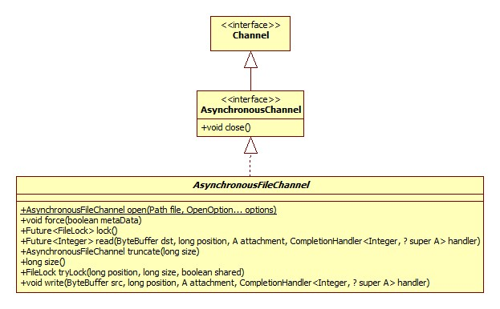
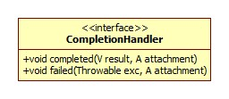

异步的文件通道，FileChannel属于"同步非阻塞"，AsynchronousFileChannel才是真正的异步。



从主要方法read/write的返回值为Future可以看出其"异步"的端倪。

# open

```java
public static AsynchronousFileChannel open(Path file,
                                           Set<? extends OpenOption> options,
                                           ExecutorService executor,
                                           FileAttribute<?>... attrs) {
    FileSystemProvider provider = file.getFileSystem().provider();
    return provider.newAsynchronousFileChannel(file, options, executor, attrs);
}
```

另外一个重载的简化方法声明如下:

```java
public static AsynchronousFileChannel open(Path file, OpenOption... options) {}
```

所做的处理便是将可变参数options手动转为Set，executor为null，文件属性为NO_ATTRIBUTES，其实就是一个空的数组。

忽略调用关系，对于Linux来说最终由sun.nio.ch.SimpleAsynchronousFileChannelImpl的open方法实现:

```java
public static AsynchronousFileChannel open(FileDescriptor fdo,
                                               boolean reading,
                                               boolean writing,
                                               ThreadPool pool) {
    // Executor is either default or based on pool parameters
    ExecutorService executor = (pool == null) ? DefaultExecutorHolder.defaultExecutor : pool.executor();
    return new SimpleAsynchronousFileChannelImpl(fdo, reading, writing, executor);
}
```

默认情况下pool参数为null，ThreadPool位于sun.nio.ch包下，其实是对Java线程池ExecutorService的一层包装。DefaultExecutorHolder是SimpleAsynchronousFileChannelImpl的嵌套类，这其实是一个单例模式:

```java
private static class DefaultExecutorHolder {
    static final ExecutorService defaultExecutor = ThreadPool.createDefault().executor();
}
```

createDefault方法:

```java
static ThreadPool createDefault() {
    int initialSize = getDefaultThreadPoolInitialSize();
    if (initialSize < 0)
        initialSize = Runtime.getRuntime().availableProcessors();
    ThreadFactory threadFactory = getDefaultThreadPoolThreadFactory();
    if (threadFactory == null)
        threadFactory = defaultThreadFactory;
    ExecutorService executor = Executors.newCachedThreadPool(threadFactory);
    return new ThreadPool(executor, false, initialSize);
}
```

## 初始大小

提供AIO操作的线程池初始大小由环境变量`java.nio.channels.DefaultThreadPool.initialSize`决定，不过从源码来看，此参数只是被保存到了ThreadPool内部，没有看到其真正发挥作用的地方。

## 线程工厂

默认的线程工厂如下:

```java
private static final ThreadFactory defaultThreadFactory = new ThreadFactory() {
     @Override
     public Thread newThread(Runnable r) {
         Thread t = new Thread(r);
         t.setDaemon(true);
         return t;
    }
 };
```

采用了守护线程。我们可以通过参数`java.nio.channels.DefaultThreadPool.threadFactory`自定义使用的线程工厂，参数的值为线程工厂的完整类名，getDefaultThreadPoolThreadFactory使用反射的方法将其初始化。

# 异步的奥秘

我们以读为例，实现位于SimpleAsynchronousFileChannelImpl.implRead(简略版):

```java
@Override
<A> Future<Integer> implRead(final ByteBuffer dst,
                             final long position,
                             final A attachment,
                             final CompletionHandler<Integer,? super A> handler) {
    //创建Future
    final PendingFuture<Integer,A> result = (handler == null) ?
        new PendingFuture<Integer,A>(this) : null;
    Runnable task = new Runnable() {
        public void run() {
            int n = 0;
            Throwable exc = null;
            int ti = threads.add();
            try {
                begin();
                do {
                    n = IOUtil.read(fdObj, dst, position, nd);
                } while ((n == IOStatus.INTERRUPTED) && isOpen());
                if (n < 0 && !isOpen())
                    throw new AsynchronousCloseException();
            } catch (IOException x) {
                if (!isOpen())
                    x = new AsynchronousCloseException();
                exc = x;
            } finally {
                end();
                threads.remove(ti);
            }
            if (handler == null) {
                result.setResult(n, exc);
            } else {
                //调用回调函数
                Invoker.invokeUnchecked(handler, attachment, n, exc);
            }
        }
    };
    executor.execute(task);
    return result;
}
```

很简单，就是使用线程池去执行IO操作，执行完毕后再通过Future或回调函数通知我们。

回调接口类图如下:

