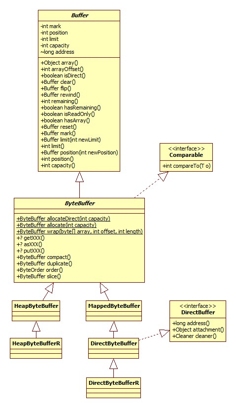
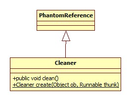

# Buffer

说到nio就离不开Buffer体系，类图:



这里以ByteBuffer为例，其实**对于布尔类型的其它所有基本类型，都与一种Buffer与之对应，比如还有ShortBuffer**。

图中的getXXX指的是获得各种数据类型的便利方法，比如getChar，getInt，putXXX也是一样。asXXX指到其它类型Buffer的转换方法，比如asCharBuffer。

注意，只有ByteBuffer才拥有getXXX, putXXX, asXXX等向其它类型转换的方法，也只有ByteBuffer可以获取direct类型的buffer。

## 获取

### allocate

得到heap buffer，源码:

```java
public static ByteBuffer allocate(int capacity) {
    return new HeapByteBuffer(capacity, capacity);
}
```

HeapByteBuffer构造器:

```java
HeapByteBuffer(int cap, int lim) { 	
    super(-1, 0, lim, cap, new byte[cap], 0);
}
```

可以看出，heap buffer的底层其实就是byte数组，构造完成之后各属性的状态如下:

- mark: 0
- pos: 0
- limit: capacity
- offset: 0

### allocateDirect

获取direct buffer，只有ByteBuffer才可以:

```java
public static ByteBuffer allocateDirect(int capacity) {
    return new DirectByteBuffer(capacity);
}
```

DirectByteBuffer构造器:

```java
DirectByteBuffer(int cap) { 
    super(-1, 0, cap, cap);
    boolean pa = VM.isDirectMemoryPageAligned();
    int ps = Bits.pageSize();
    long size = Math.max(1L, (long)cap + (pa ? ps : 0));
    Bits.reserveMemory(size, cap);
    long base = 0;
    try {
        base = unsafe.allocateMemory(size);
    } catch (OutOfMemoryError x) {
        Bits.unreserveMemory(size, cap);
        throw x;
    }
    unsafe.setMemory(base, size, (byte) 0);
    if (pa && (base % ps != 0)) {
        // Round up to page boundary
        address = base + ps - (base & (ps - 1));
    } else {
        address = base;
    }
    cleaner = Cleaner.create(this, new Deallocator(base, size, cap));
    att = null;
}
```

#### 内存对齐

VM.isDirectMemoryPageAligned()用以判断JVM是否需要对堆外内存进行对齐，什么是内存页，什么是对齐参考:

[内存分页大小对性能的提升原理](http://blog.csdn.net/chluknight/article/details/6689323)

[内存对齐详解](http://blog.csdn.net/sdwuyulunbi/article/details/8510401)

此参数可以通过-Dsun.nio.PageAlignDirectMemory进行指定，默认是关闭的，在64位Windows JDK上实践证明-XX:[+|-]PageAlignDirectMemory不能用，提示未识别的参数。

#### 最大堆外内存

VM.saveAndRemoveProperties部分源码:

```java
public static void saveAndRemoveProperties(Properties props) {
    String s = (String)props.remove("sun.nio.MaxDirectMemorySize");
    if (s != null) {
        if (s.equals("-1")) {
            // -XX:MaxDirectMemorySize not given, take default
            directMemory = Runtime.getRuntime().maxMemory();
        } else {
            long l = Long.parseLong(s);
            if (l > -1)
                directMemory = l;
        }
    }
}
```

可以看出，我们可以通过参数-XX:MaxDirectMemorySize或-Dsun.nio.MaxDirectMemorySize进行指定，那么默认大小又是多少呢?

Runtime.maxMemory为native实现，注意以字节为单位。源码:

```c
JNIEXPORT jlong JNICALL
Java_java_lang_Runtime_maxMemory(JNIEnv *env, jobject this) {
    return JVM_MaxMemory();
}
```

JVM_MaxMemory为JVM源码，位于hotspot\src\share\vm\prims\jvm.cpp中:

```c++
JVM_ENTRY_NO_ENV(jlong, JVM_MaxMemory(void))
  JVMWrapper("JVM_MaxMemory");
  size_t n = Universe::heap()->max_capacity();
  return convert_size_t_to_jlong(n);
JVM_END
```

- [ ] 再往下深入需要自己搭建JVM源码环境，这里留个坑

#### 内存页大小

Bits.pageSize:

```java
static int pageSize() {
    if (pageSize == -1)
        pageSize = unsafe().pageSize();
    return pageSize;
}
```

Unsafe的pageSize为native方法，最终由os_solaris.cpp中的vm_page_size方法实现:

```c++
int os::vm_page_size() {
  assert(page_size != -1, "must call os::init");
  return page_size;
}
```

可以看出，此参数由init方法提供，相关源码:

```c++
void os::init(void) {
    page_size = sysconf(_SC_PAGESIZE);
    init_page_sizes((size_t) page_size);
}
```

- [ ] 再留个坑

#### 内存预留

Bits.reserveMemory方法用以记录JVM当前direct内存的占用情况，注意这里只是记录，而不是真正的分配。源码:

```java
static void reserveMemory(long size, int cap) {
    if (!memoryLimitSet && VM.isBooted()) {
        maxMemory = VM.maxDirectMemory();
        memoryLimitSet = true;
    }
    // optimist!
    if (tryReserveMemory(size, cap)) {
        return;
    }
    final JavaLangRefAccess jlra = SharedSecrets.getJavaLangRefAccess();

    // retry while helping enqueue pending Reference objects
    // which includes executing pending Cleaner(s) which includes
    // Cleaner(s) that free direct buffer memory
    while (jlra.tryHandlePendingReference()) {
        if (tryReserveMemory(size, cap)) {
            return;
        }
    }
    // trigger VM's Reference processing
    System.gc();

    // a retry loop with exponential back-off delays
    // (this gives VM some time to do it's job)
    boolean interrupted = false;
    try {
        long sleepTime = 1;
        int sleeps = 0;
        while (true) {
            if (tryReserveMemory(size, cap)) {
                return;
            }
            if (sleeps >= MAX_SLEEPS) {
                break;
            }
            if (!jlra.tryHandlePendingReference()) {
                try {
                    Thread.sleep(sleepTime);
                    sleepTime <<= 1;
                    sleeps++;
                } catch (InterruptedException e) {
                    interrupted = true;
                }
            }
        }

        // no luck
        throw new OutOfMemoryError("Direct buffer memory");

    } finally {
        if (interrupted) {
            // don't swallow interrupts
            Thread.currentThread().interrupt();
        }
    }
}
```

tryReserveMemory方法负责真正的预留工作:

```java
 private static boolean tryReserveMemory(long size, int cap) {
    long totalCap;
    while (cap <= maxMemory - (totalCap = totalCapacity.get())) {
        if (totalCapacity.compareAndSet(totalCap, totalCap + cap)) {
            reservedMemory.addAndGet(size);
            count.incrementAndGet();
            return true;
        }
    }
    return false;
}
```

maxMemory表示最大可分配的堆外内存，totalCapacity表示当前已分配的内存，这里使用了CAS，直到操作(分配)成功为止。但是如果堆外空余内存不够了，怎么办?JVM会尝试进行堆外内存的回收工作，参见内存回收一节，可以总结为以下三步:

- 手动调用ReferenceHandler的tryHandlePending方法，处理可能存在的处于pending状态的非强类型的引用(特别是Cleaner)。

- 尝试手动触发垃圾回收，注意正是因为这个原因，如果使用了堆外内存，谨慎设置JVM 

  -XX:+DisableExplicitGC。

- 自旋+睡眠等待(可能的垃圾回收完成)，共自旋9次，每次睡眠1ms。

#### 内存分配

相关代码:

```java
long size = Math.max(1L, (long)cap + (pa ? ps : 0))
long base = 0;
try {
    base = unsafe.allocateMemory(size);
} catch (OutOfMemoryError x) {
    Bits.unreserveMemory(size, cap);
    throw x;
}
unsafe.setMemory(base, size, (byte) 0);
//内存裁剪
if (pa && (base % ps != 0)) {
    // Round up to page boundary
    address = base + ps - (base & (ps - 1));
} else {
    address = base;
}
```

allocateMemory为native方法，通过malloc实现。setMemory方法的作用为将分配的内存区块的值全部设为0(最后一个参数便是要填充的值)，因为malloc分配的内存的值实际上是上一次使用的值，即垃圾。

setMemory的实现位于JVM copy.cpp的fill_to_memory_atomic方法:

```c++
void Copy::fill_to_memory_atomic(void* to, size_t size, jubyte value) {
  address dst = (address) to;
  uintptr_t bits = (uintptr_t) to | (uintptr_t) size;
  if (bits % sizeof(jlong) == 0) {
    jlong fill = (julong)( (jubyte)value ); // zero-extend
    if (fill != 0) {
      fill += fill << 8;
      fill += fill << 16;
      fill += fill << 32;
    }
    //Copy::fill_to_jlongs_atomic((jlong*) dst, size / sizeof(jlong));
    for (uintptr_t off = 0; off < size; off += sizeof(jlong)) {
      *(jlong*)(dst + off) = fill;
    }
  //忽略int，short整倍数的情况
  } else {
    // Not aligned, so no need to be atomic.
    Copy::fill_to_bytes(dst, size, value);
  }
}
```

可以看出，如果申请的内存是long长度的整倍数，那么使用手动逐一赋值的方式，否则使用系统调用memset(hotspot\src\cpu\x86\vm\copy_x86.hpp)。为什么手动逐一赋值就能保证原子性呢?

如果设置了内存对齐，系统实际上比需要的内存多申请一个页的大小，即如果我们需要 4100的内存，而页大小是4096(64位Windows便是这个大小)，实际申请了4100 + 4096 = 8196字节的内存，这么做是为了后续的对齐，对齐的关键代码:

```java
address = base + ps - (base & (ps - 1));
```

这样的结果就是起始的内存地址是一个页的起始地址，好处便是CPU在读取内存可以少读一个内存页。

#### 内存回收

由于direct buffer位于堆外，所以JVM垃圾回收自然无法对齐进行回收。一个完整的堆外内存由两部分组成:

- 堆内的DirectBuffer对象，持有堆外内存的地址。
- 堆外内存("冰山"内存)。

所以一旦DirectBuffer对象被JVM回收，就没有其它对象知道与之对应的堆外内存的地址，也就造成了内存泄漏。这一问题的解决方法就是当DirectBuffer对象不再被需要(即可以进行回收)时由GC线程进行通知，通知我们可以回收掉堆外内存。那如何得到通知呢?

这便是Java里面Reference和ReferenceQueue的用途了，这一部分可以参考:

[Java Reference 源码分析](http://www.cnblogs.com/jabnih/p/6580665.html)

[深入分析Object.finalize方法的实现原理](http://www.jianshu.com/p/9d2788fffd5f)

DirectByteBuffer构造器相关源码:

```java
DirectByteBuffer(int cap) {
    cleaner = Cleaner.create(this, new Deallocator(base, size, cap));
}
```

Cleaner负责堆外内存的回收，这是Java中一种代替finalize方法的方式，类图:



既然是代替，那么它必然解决了finalize的缺点:

- 如果一个类重写了finalize()方法，那么JVM会将其包装成为java.lang.ref.Finalizer对象，由JVM维护其多余的状态，这无疑加重了JVM的负担。
- finalize()方法由Finalizer.FinalizerThread线程负责调用，而**此线程是一个优先级非常低的线程**，这就导致Finalizer可能永远无法被回收。

Cleaner的实现特点:

- 由Reference.ReferenceHandler线程负责调用其clean方法，其run方法源码:

  ```java
  public void run() {
    while (true) {
        tryHandlePending(true);
    }
  }
  ```

  tryHandlePending部分源码:

  ```java
  static boolean tryHandlePending(boolean waitForNotify) {
    synchronized (lock) {
        if (pending != null) {
            r = pending;
            c = r instanceof Cleaner ? (Cleaner) r : null;
          }
      }
      // Fast path for cleaners
    if (c != null) {
        c.clean();
        return true;
    }
  }
  ```

  而ReferenceHandler是一个优先级较高的线程，这就保证了清理的及时性。

和普通的Java对象一样，如果DirectByteBuffer对象晋升到了老年代，那么除非发生Full GC，否则其对应的堆外内存将会一直存在，因为Cleaner的清理发生在引用处理阶段，即JVM将其状态标记为pending时，这样就有可能耗尽系统内存(JVM heap内存反而有剩余)。参考:

[JVM源码分析之堆外内存完全解读](https://yq.aliyun.com/articles/2948?spm=5176.100238.yqhn2.9.cpdyiE)

[finalization-and-phantom](https://dzone.com/articles/finalization-and-phantom)

##### 回收

Cleaner的clean方法其实是对Cleaner.create的第二个参数run方法的调用，所以真正清理的载体是DirectByteBuffer的内部类Deallocator，其实现了Runnable接口:

```java
public void run() {
    unsafe.freeMemory(address);
    address = 0;
    Bits.unreserveMemory(size, capacity);
}
```

由函数free实现。

##### 手动回收

从类图可以看出，堆外内存实现了sun.nio.ch.DirectBuffer接口，而此接口定义了cleaner方法以获取与之对应的清理器，所以我们可以在这里手动调用其clean方法。

### wrap

ByteBuffer.wrap:

```java
public static ByteBuffer wrap(byte[] array, int offset, int length) {
    try {
        return new HeapByteBuffer(array, offset, length);
    } catch (IllegalArgumentException x) {
        throw new IndexOutOfBoundsException();
    }
}
```

**wrap得到的buffer只能是heap buffer**。

## 数据读取

我们以HeapByteBuffer的getInt(int i)方法为例:

```java
public int getInt(int i) {
    //默认是大端
    return Bits.getInt(this, ix(checkIndex(i, 4)), bigEndian);
}
```

checkIndex用于检查在当前位置是否还有4字节的数据可读。

ix是在当前位置(i)的基础上加上偏移:

```java
protected int ix(int i) {
    return i + offset;
}
```

为什么需要偏移呢?因为ByteBuffer允许我们以byte数组为基础创建buffer，当然指定一个偏移也就是清理之中了。

Bits.getInt:

```java
static int getInt(ByteBuffer bb, int bi, boolean bigEndian) {
    return bigEndian ? getIntB(bb, bi) : getIntL(bb, bi) ;
}
```

以大端getIntB为例:

```java
static int getIntB(ByteBuffer bb, int bi) {
    return makeInt(bb._get(bi),bb._get(bi + 1),bb._get(bi + 2),bb._get(bi + 3));
}
static private int makeInt(byte b3, byte b2, byte b1, byte b0) {
    return (((b3) << 24) | ((b2 & 0xff) << 16) | ((b1 & 0xff) <<  8) | ((b0 & 0xff)));
}
```

很容易理解了，高位在左边。

## 视图

我们可以在一个Buffer之上创建一个视图，视图和之前的buffer使用同一份数据(即视图的写原生buffer也能看见)，但拥有自己的属性，比如position, limit。

我们以HeapByteBuffer的asIntBuffer为例:

```java
public IntBuffer asIntBuffer() {
    //int buffer的数据长度为byte buffer除以4
    int size = this.remaining() >> 2;
    int off = offset + position();
    return (bigEndian
            ? (IntBuffer)(new ByteBufferAsIntBufferB(this,-1,0,size,size,off))
            : (IntBuffer)(new ByteBufferAsIntBufferL(this,-1,0,size,size,off)));
}
```

构造器只是属性的拷贝，不再赘述。我们来看一下数据的读取，以大端的int读取为例:

```java
public int get(int i) {
    return Bits.getIntB(bb, ix(checkIndex(i)));
}
```

和ByteBuffer的实现基本一致，唯一的区别是ix方法，ByteBufferAsIntBufferB.ix:

```java
protected int ix(int i) {
    return (i << 2) + offset;
}
```

乘以4再加偏移。

## 压缩整理

compact方法允许我们将内容拷贝至数组开头，比如我们有一段数据从4-9，compact之后便是从0-5.HeapByteBuffer.compact:

```java
public ByteBuffer compact() {
    System.arraycopy(hb, ix(position()), hb, ix(0), remaining());
    position(remaining());
    limit(capacity());
    discardMark();
    return this;
}
```

很简单，就是一个数组拷贝再重新设置属性的过程。

## 复制

duplicate方法可以返回一个buffer的拷贝，拷贝与原buffer共享一份存储，拥有自己的属性(但初始时和原buffer完全一致)。

## slice

和复制、视图一样，这货也是在共享数据存储的情况下搞出一个新的buffer来，**相当于compact和duplicate两个过程的组合**，HeapByteBuffer.slice:

```java
public ByteBuffer slice() {
    return new HeapByteBuffer(hb,-1,0,this.remaining(),
        this.remaining(),this.position() + offset);
}
```

