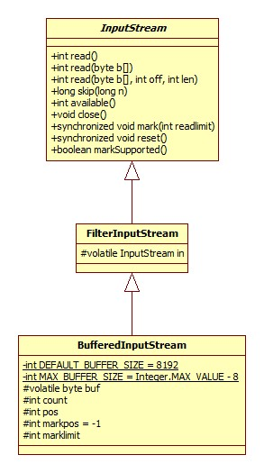

# 概览



BufferedInputStream的主要方法均为线程安全，其内部的byte数组的最大值为int的最大值减去8，这样做的原因是在Java中数组是一个对象，而一个对象最大拥有8字节的对象头。至于为什么是int的最大值而不是long的最大值，需要同时支持32位和64位虚拟机吧。

字段count的取值范围为[0, buf.length]，意义为[0, count)范围内的字节都是可读的，字段pos的取值范围为[0, count)，即读指针的位置。

# read

```java
public synchronized int read() throws IOException {
    if (pos >= count) {
        fill();
        if (pos >= count)
            return -1;
    }
    return getBufIfOpen()[pos++] & 0xff;
}
```

`pos >= count`说明缓冲区中已没有可读的字节，此时需要调用fill方法从依赖的输入流中真正地读取数据。

```java
private void fill() throws IOException {
    //如果内部依赖的输入流已经关闭，那么getBufIfOpen会抛出异常
    byte[] buffer = getBufIfOpen();
    if (markpos < 0)
        pos = 0; //markpos为负数，说明我们并未设置标记位置，即不需要再次读取标记处的数据，所以整个缓冲区直接覆盖写入即可
    else if (pos >= buffer.length)
        if (markpos > 0) {
             //markpos为正数，说明缓冲区中尚有可以利用的空间(因为此时pos为buf的长度)，所以这里要做的就是整理缓冲区: 将被标记的数据([markpos, pos))
             //拷贝至缓冲区开头
            int sz = pos - markpos;
            System.arraycopy(buffer, markpos, buffer, 0, sz);
            pos = sz;
            markpos = 0;
        } else if (buffer.length >= marklimit) {
            //此时markpos为0，且标记的内容长度超过了marklimit限制，直接丢弃
            markpos = -1;
            pos = 0;
        } else if (buffer.length >= MAX_BUFFER_SIZE) {
            throw new OutOfMemoryError("Required array size too large");
        } else {
             //到达这里的前提是markpos为0，pos已达到缓冲区长度，且缓冲区长度未超过marklimit，即我们已没有可用的空间以供进一步的数据读取
             //所以需要对缓冲区进行扩容
            int nsz = (pos <= MAX_BUFFER_SIZE - pos) ?
                    pos * 2 : MAX_BUFFER_SIZE;
            //将缓冲区大小降低为marklimit，以减轻内存压力?
            if (nsz > marklimit)
                nsz = marklimit;
            byte nbuf[] = new byte[nsz];
            System.arraycopy(buffer, 0, nbuf, 0, pos);
            if (!bufUpdater.compareAndSet(this, buffer, nbuf)) {
                 //fill方法是在当前线程持有锁的情况下被调用的，所以这里CAS失败的唯一原因就是close方法已经被调用(close方法没有加锁)，这也是对buf的
                 //操作还需要通过CAS来完成的原因
                throw new IOException("Stream closed");
            }
            buffer = nbuf;
        }
    count = pos;
    //调用底层输入流进行读取
    int n = getInIfOpen().read(buffer, pos, buffer.length - pos);
    if (n > 0)
        count = n + pos;
}
```

所以，如果当前底层输入流中没有可读的数据，那么fill方法将会阻塞直到:

- 有数据可读。
- 流被关闭。
- EOF.

# read(byte b[], int off, int len)

简略版源码:

```java
public synchronized int read(byte b[], int off, int len) throws IOException {
    int n = 0;
    for (;;) {
      int nread = read1(b, off + n, len - n);
      if (nread <= 0)
          return (n == 0) ? nread : n;
      n += nread;
      if (n >= len)
          return n;
      // if not closed but no bytes available, return
      InputStream input = in;
      if (input != null && input.available() <= 0)
          return n;
    }
}
```

此方法的核心逻辑其实是一个do...while循环，即首先进行一次读(并不一定会进行真正的读操作，下面read1方法源码中可以看出)，所以此read方法仍有可能被阻塞。

```java
private int read1(byte[] b, int off, int len) throws IOException {
    int avail = count - pos;
    if (avail <= 0) {
         //如果需要的数据大小大于缓冲区大小且没有进行标记，那么直接返回读取的结果，可避免一次内存拷贝，为什么要没有进行标记才行呢?
         //因为被标记意味着此部分数据需要被再次读取
        if (len >= getBufIfOpen().length && markpos < 0) {
            return getInIfOpen().read(b, off, len);
        }
        fill();
        avail = count - pos;
        if (avail <= 0) return -1;
    }
    int cnt = (avail < len) ? avail : len;
    //内存拷贝
    System.arraycopy(getBufIfOpen(), pos, b, off, cnt);
    pos += cnt;
    return cnt;
}
```

## 不会被阻塞的available

这里有一个很有意思的问题，之前在Socket部分没有注意到，read方法的下面一行:

```java
if (input != null && input.available() <= 0)
```

available方法定义在InputStream中，返回输入流中当前可读的字节数，最主要的是即使在阻塞模式下的Socket输入流中这个方法也是非阻塞的，所以这就给我们提供了避免读阻塞(没有可读数据时)的机会。其在Windows下的native实现如下:

```c
JNIEXPORT jint JNICALL Java_java_net_DualStackPlainSocketImpl_available0(JNIEnv *env, jclass clazz, jint fd) {
    jint available = -1;
    if ((ioctlsocket(fd, FIONREAD, &available)) == SOCKET_ERROR) {
        NET_ThrowNew(env, WSAGetLastError(), "socket available");
    }
    return available;
}
```

ioctlsocket函数为系统调用，可用于设置或读取socket相关信息，第二个参数为执行的命令，FIONREAD的含义如下(摘自MSDN):

>Use to determine the amount of data pending in the network's input buffer that can be read from sockets. The argp parameter points to an unsigned long value in which ioctlsocket stores the result. FIONREAD returns the amount of data that can be read in a single call to the recv function, which may not be the same as the total amount of data queued on the socket. If s is message oriented (for example, type SOCK_DGRAM), FIONREAD still returns the amount of pending data in the network buffer, however, the amount that can actually be read in a single call to the recv function is limited to the data size written in the send or sendto function call.

# skip

```java
public synchronized long skip(long n) throws IOException {
    getBufIfOpen(); // Check for closed stream
    if (n <= 0) {
        return 0;
    }
    long avail = count - pos;
    if (avail <= 0) {
        // If no mark position set then don't keep in buffer
        if (markpos <0)
            return getInIfOpen().skip(n);
        // Fill in buffer to save bytes for reset
        fill();
        avail = count - pos;
        if (avail <= 0)
            return 0;
    }
    long skipped = (avail < n) ? avail : n;
    pos += skipped;
    return skipped;
}
```

逻辑一目了然，不过注意下面这一行:

```java
return getInIfOpen().skip(n);
```

这里调用的是父类InputStream的同名方法，其实现非常简单粗暴: 直接读出需要跳过的数目的字节就好了。但是可以想象，对于文件输入流一定不是这样的实现，FileInputStream的源码证明了这一点:

```java
public native long skip(long n) throws IOException;
```

因为文件支持文件指针，直接移动文件指针便可以达到跳过字节的效果。

# close

```java
public void close() throws IOException {
    byte[] buffer;
    while ( (buffer = buf) != null) {
        if (bufUpdater.compareAndSet(this, buffer, null)) {
            InputStream input = in;
            in = null;
            if (input != null)
                input.close();
            return;
        }
        // Else retry in case a new buf was CASed in fill()
    }
}
```

无锁情况下的CAS重试。

