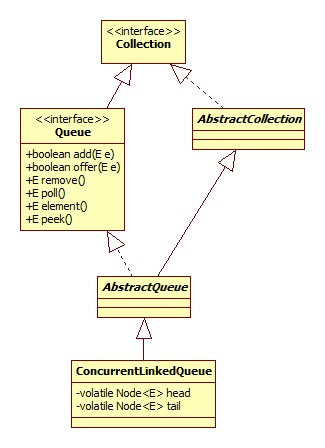
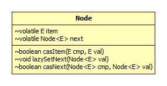
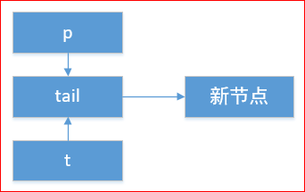

内部类Node的类图如下:



# 算法

此类的实现基于算法Michael & Scott algorithm，论文:

[Simple, Fast, and Practical Non-Blocking and Blocking Concurrent Queue Algorithms](https://www.research.ibm.com/people/m/michael/podc-1996.pdf)

# offer

```java
public boolean offer(E e) {
    //如果元素为null，那么抛出NPE
    checkNotNull(e);
    final Node<E> newNode = new Node<E>(e);
    for (Node<E> t = tail, p = t;;) {
        //volatile读
        Node<E> q = p.next;
        if (q == null) {
            // p is last node
            if (p.casNext(null, newNode)) {
                if (p != t) // hop two nodes at a time
                    casTail(t, newNode);  // Failure is OK.
                return true;
            }
            //casNext竞争失败，再次读取p.next，此时(即q)不为空
        }
        else if (p == q)
            // We have fallen off list.  If tail is unchanged, it
            // will also be off-list, in which case we need to
            // jump to head, from which all live nodes are always
            // reachable.  Else the new tail is a better bet.
            p = (t != (t = tail)) ? t : head;
        else
            //每插入两个新节点时才会重新设置尾节点
            p = (p != t && t != (t = tail)) ? t : q;
    }
}
```

注意，由于ConcurrentLinkedQueue为无界队列，所以offer方法永远返回true。为什么说插入两个节点之后才会尝试重新设置尾节点呢?

假设我们的线程执行casNext失败，那么说明此时tail/p指针的next指向必定不为空(即另外一个线程已经插入了一个节点)，节点状态可用下图来表示:



在下面的代码中将p指向新节点或重新读取tail:

```java
p = (p != t && t != (t = tail)) ? t : q;
```

那么为什么不能每插入一个节点便更新一次tail指针呢，因为出于降低CAS线程竞争(空转)的考虑。

# 结尾

此类不再向下继续展开，直接参考"Java并发编程实战"一书的272页内容即可，书中对其使用的算法进行了一针见血的说明。

# 问题

在debug的过程中发现了一个非常奇怪的问题，所以提出了知乎上的这个问题:

[Java ConcurrentLinkedQueue疑问?](https://www.zhihu.com/question/59241701)

但是没有得到回答，在Stack Overflow上也有一个同样的问题:

[What exactly UNSAFE.compareAndSwapObject does?](https://link.zhihu.com/?target=http%3A//stackoverflow.com/questions/22076083/what-exactly-unsafe-compareandswapobject-does)

但是同样没有回答。

