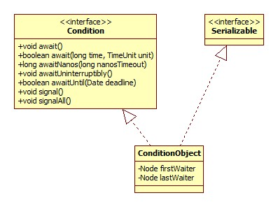

# Condition

## 类图



ConditionObject是AbstractQueuedSynchronizer的内部类。

## 创建

创建是通过Lock.newCondition()来完成的。

ReentrantLock.newCondition:

```java
public Condition newCondition() {
    return sync.newCondition();
}
```

Sync.newCondition:

```java
final ConditionObject newCondition() {
    return new ConditionObject();
}
```

## await

ConditionObject.await:

```java
public final void await() throws InterruptedException {
    if (Thread.interrupted())
        throw new InterruptedException();
    Node node = addConditionWaiter();
    int savedState = fullyRelease(node);
    int interruptMode = 0;
    while (!isOnSyncQueue(node)) {
        LockSupport.park(this);
        if ((interruptMode = checkInterruptWhileWaiting(node)) != 0)
            break;
    }
    if (acquireQueued(node, savedState) && interruptMode != THROW_IE)
        interruptMode = REINTERRUPT;
    if (node.nextWaiter != null) // clean up if cancelled
        unlinkCancelledWaiters();
    if (interruptMode != 0)
        reportInterruptAfterWait(interruptMode);
}
```

### 条件队列

addConditionWaiter用于向Lock的锁队列的条件队列添加新的等待节点，什么是锁队列参见ReentrantLock。

```java
private Node addConditionWaiter() {
    Node t = lastWaiter;
    // If lastWaiter is cancelled, clean out.
    if (t != null && t.waitStatus != Node.CONDITION) {
        unlinkCancelledWaiters();
        t = lastWaiter;
    }
    Node node = new Node(Thread.currentThread(), Node.CONDITION);
    if (t == null)
        firstWaiter = node;
    else
        t.nextWaiter = node;
    lastWaiter = node;
    return node;
}
```

一目了然。

### 锁释放

**调用Condition.await方法的前提是拥有锁，await会释放锁**。

AbstractQueuedSynchronizer.fullyRelease:

```java
final int fullyRelease(Node node) {
    boolean failed = true;
    try {
        int savedState = getState();
        if (release(savedState)) {
            failed = false;
            return savedState;
        } else {
            throw new IllegalMonitorStateException();
        }
    } finally {
        if (failed)
            node.waitStatus = Node.CANCELLED;
    }
}
```

可以看出，不管有多少次重入，都会被一次性释放。fullyRelease方法返回的是锁释放之前的重入次数。

### 阻塞

锁释放后，便会将当前线程阻塞直到被signal或中断。

```java
while (!isOnSyncQueue(node)) {
    LockSupport.park(this);
    if ((interruptMode = checkInterruptWhileWaiting(node)) != 0)
        break;
}
```

isOnSyncQueue用以判断节点是否在锁队列(SyncQueue)上，源码:

```java
final boolean isOnSyncQueue(Node node) {
    if (node.waitStatus == Node.CONDITION || node.prev == null)
        return false;
    if (node.next != null) // If has successor, it must be on queue
        return true;
    return findNodeFromTail(node);
}
```

可见，只要满足waitStatus是CONDITION或prev/next为空，那么就不在锁队列上，因为条件队列是用nextWaiter连接的，而不是prev/next。

那么是么时候会spin到锁队列中去呢，应该是在signal中。

#### 先中断 or 先唤醒

checkInterruptWhileWaiting方法用以判断中断是发生在被signal之前还是之后。

ConditionObject.checkInterruptWhileWaiting:

```java
private int checkInterruptWhileWaiting(Node node) {
    //THROW_IE: -1，先中断
    //REINTERRUPT: 1，先唤醒
    return Thread.interrupted() ?
        (transferAfterCancelledWait(node) ? THROW_IE : REINTERRUPT) : 0;
}
```

AbstractQueuedSynchronizer.transferAfterCancelledWait:

```java
final boolean transferAfterCancelledWait(Node node) {
    if (compareAndSetWaitStatus(node, Node.CONDITION, 0)) {
        enq(node);
        return true;
    }
    //等待signal线程完成到锁队列的转换工作
    while (!isOnSyncQueue(node))
        Thread.yield();
    return false;
}
```

可见，对先中断和先唤醒的区分是通过状态是不是CONDITION完成的，如果是先中断，那么将其状态设为0并将节点加入到锁队列。

节点的状态被设为0的原因后面会提到。

### 重新获得锁

由于当前线程本来是拥有锁的，所以从阻塞中恢复(被中断或唤醒)之后，需要恢复到最初的状态，才能继续执行后续的操作。

恢复是通过acquireQueued方法完成的:

```java
if (acquireQueued(node, savedState) && interruptMode != THROW_IE)
    interruptMode = REINTERRUPT;
```

从这里也可以看出保存最初的锁状态(savedState)的原因。

acquireQueued方法在ReentrantLock中已经说过了，在此不再赘述，只是注意一点:

AbstractQueuedSynchronizer.shouldParkAfterFailedAcquire:

```java
private static boolean shouldParkAfterFailedAcquire(Node pred, Node node) {
    int ws = pred.waitStatus;
    if (ws == Node.SIGNAL)
        return true;
    if (ws > 0) {
        do {
            node.prev = pred = pred.prev;
        } while (pred.waitStatus > 0);
        pred.next = node;
    } else {
        //here
        compareAndSetWaitStatus(pred, ws, Node.SIGNAL);
    }
    return false;
}
```

可以看出，0状态被设为了SIGNAL，这就解释了上面被中断后为什么要将状态设为0了。

### 是否取消

获得锁之后，首先会对整个条件队列进行扫描，如果有被取消的节点，那么将其从队列中移除。

ConditionObject.unlinkCancelledWaiters:

```java
private void unlinkCancelledWaiters() {
    Node t = firstWaiter;
    Node trail = null;
    while (t != null) {
        Node next = t.nextWaiter;
        if (t.waitStatus != Node.CONDITION) {
            t.nextWaiter = null;
            if (trail == null)
                firstWaiter = next;
            else
                trail.nextWaiter = next;
            if (next == null)
                lastWaiter = trail;
        }
        else
            trail = t;
        t = next;
    }
}
```

就是一个喜闻乐见的链表操作。

### 中断报告

ConditionObject.reportInterruptAfterWait:

```java
private void reportInterruptAfterWait(int interruptMode) throws InterruptedException {
    if (interruptMode == THROW_IE)
        throw new InterruptedException();
    else if (interruptMode == REINTERRUPT)
        //重新设置中断标志位
        selfInterrupt();
}
```

## signalAll

ConditionObject.signalAll:

```java
public final void signalAll() {
    //检查当前线程是不是拥有锁
    if (!isHeldExclusively())
        throw new IllegalMonitorStateException();
    Node first = firstWaiter;
    if (first != null)
        doSignalAll(first);
}
```

doSignalAll:

```java
private void doSignalAll(Node first) {
    lastWaiter = firstWaiter = null;
    do {
        Node next = first.nextWaiter;
        first.nextWaiter = null;
        transferForSignal(first);
        first = next;
    } while (first != null);
}
```

可见，这里所做的就是**将节点从条件队列转移到锁队列中去**。

### 节点转移

AbstractQueuedSynchronizer.transferForSignal:

```java
final boolean transferForSignal(Node node) {
    if (!compareAndSetWaitStatus(node, Node.CONDITION, 0))
        return false;
    Node p = enq(node);
    int ws = p.waitStatus;
    //将状态设为SIGNAL
    if (ws > 0 || !compareAndSetWaitStatus(p, ws, Node.SIGNAL))
        LockSupport.unpark(node.thread);
    return true;
}
```

### CAS

既然await和signal操作都是在有锁的情况下调用的，那么为什么还是存在大量CAS调用?

推测是这样的，await有一段代码是在没有锁的情况下执行的:

```java
while (!isOnSyncQueue(node)) {
    LockSupport.park(this);
    if ((interruptMode = checkInterruptWhileWaiting(node)) != 0)
        break;
}
```

与这段代码的交互需要CAS。

### 总结

唤醒操作(signal/signalAll)并不会使线程马上获得锁，而是使之拥有获得锁的资格。

