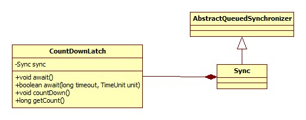

# CountDownLatch

## 类图

CountDownLatch本身没有任何父类或是实现任何接口，只含有一个内部类Sync.



## await

CountDownLatch.await:

```java
public void await() throws InterruptedException {
    sync.acquireSharedInterruptibly(1);
}
```

AbstractQueuedSynchronizer.acquireSharedInterruptibly:

```java
public final void acquireSharedInterruptibly(int arg) throws InterruptedException {
    if (Thread.interrupted()) throw new InterruptedException();
    if (tryAcquireShared(arg) < 0)
        doAcquireSharedInterruptibly(arg);
}
```

这个套路已经见过很多次了，关键的逻辑便是Sync.tryAcquireShared:

```java
protected int tryAcquireShared(int acquires) {
    return (getState() == 0) ? 1 : -1;
}
```

可以看出，**await成功的条件是当前读锁(共享锁)不再被其它线程持有**。

## countDown

```java
public void countDown() {
    sync.releaseShared(1);
}
```

AbstractQueuedSynchronizer.releaseShared:

```java
public final boolean releaseShared(int arg) {
    if (tryReleaseShared(arg)) {
        doReleaseShared();
        return true;
    }
    return false;
}
```

还是一样的套路，Sync.tryReleaseShared:

```java
protected boolean tryReleaseShared(int releases) {
    // Decrement count; signal when transition to zero
    for (;;) {
        int c = getState();
        if (c == 0)
            return false;
        int nextc = c-1;
        if (compareAndSetState(c, nextc))
            return nextc == 0;
    }
}
```

可以看出，countDown真正的逻辑其实是将读锁的持有数减一。

## 构造器

```java
public CountDownLatch(int count) {
    this.sync = new Sync(count);
}
```

Sync构造器:

```java
Sync(int count) {
    setState(count);
}
```

关键便在这里了: **AbstractQueuedSynchronizer的初始状态(即锁的持有数)不为零**。

## 总结

CountDownLatch的原理是:

构造一个初始状态(锁持有数)不为零的AbstractQueuedSynchronizer，每一次countDown方法的执行会导致锁的持有次数减一，而await方法便是一直等待直到锁的持有数为0为止。
