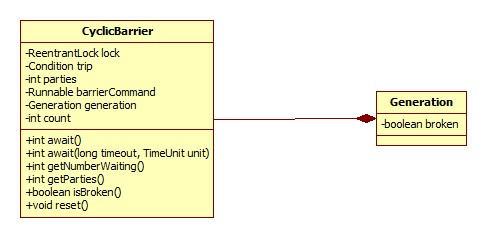

# CyclicBarrier

此类可管理一组线程，当所有线程都到达"检查点"时执行特定的动作(Runnable)，示例直接看其源码便好。

## 类图

和CountDownLatch类似，此类同样没有任何父类(除了Object)或是实现任何接口。



## await

整个类的核心便是此方法:

```java
public int await() {
    return dowait(false, 0L);
}
```

doWait方法简略版源码:

```java
private int dowait(boolean timed, long nanos) {
    final ReentrantLock lock = this.lock;
    lock.lock();
    try {
        final Generation g = generation;
        // 未到达(检查点)数减一
        int index = --count;
         // 已达到检查点，执行给定的任务
        if (index == 0) {
            boolean ranAction = false;
            try {
                final Runnable command = barrierCommand;
                if (command != null)
                    command.run();
                ranAction = true;
                nextGeneration();
                return 0;
            } finally {
                if (!ranAction)
                    breakBarrier();
            }
        }

        // 尚有线程未到达检查点
        for (;;) {
            try {
                 // 等待
                if (!timed)
                    trip.await();
                else if (nanos > 0L)
                    nanos = trip.awaitNanos(nanos);
            } catch (InterruptedException ie) {
                if (g == generation && ! g.broken) {
                    breakBarrier();
                    throw ie;
                } else {
                    Thread.currentThread().interrupt();
                }
            }

            if (g.broken)
                throw new BrokenBarrierException();

            if (g != generation)
                return index;

            if (timed && nanos <= 0L) {
                breakBarrier();
                throw new TimeoutException();
            }
        }
    } finally {
        lock.unlock();
    }
}
```

一目了然，但是有一个疑问，当未到达数减为0时，已经阻塞的线程是在哪里唤醒的呢?

答案便是nextGeneration方法:

```java
private void nextGeneration() {
    // signal completion of last generation
    trip.signalAll();
    // set up next generation
    count = parties;
    generation = new Generation();
}
```

