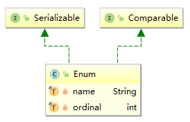

# 说明

对枚举这一看似平常的东西单开一节的目的是要探究一下为什么说枚举是最好的实现单例的方式。

# 从例子开始

假设有这么一个简单的枚举:

```java
public enum Test {

    SOMEONE,

    ANOTHER_ONE

}
```

首先对其进行编译，然后使用命令`javap -verbose Test.class`对其反编译，得到如下部分:

```java
public final class Test extends java.lang.Enum<Test> {}
```

所以，对于Java来说，枚举是一个语法糖。

# Why

Enum的类图:



## finalize

Enum中将finalize方法直接定义为final，这就从根本上上避免了枚举类对此方法的实现:

```java
protected final void finalize() { }
```

### 序列化

以如下代码示例对枚举类型的序列化:

```java
File file = new File("C:/Users/xsdwe/Desktop/test");
ObjectOutputStream out = new ObjectOutputStream(new FileOutputStream(file));
out.writeObject(Person.EVIL);
out.writeObject(Person.JACK);
out.flush();
out.close();
```

限制其实是在ObjectOutputStream的writeObject0方法中进行控制的，相关源码:

```java
private void writeObject0(Object obj, boolean unshared) throws IOException {
    //...
    if (obj instanceof String) {
        writeString((String) obj, unshared);
    } else if (cl.isArray()) {
        writeArray(obj, desc, unshared);
    } else if (obj instanceof Enum) {
        writeEnum((Enum<?>) obj, desc, unshared);
    }
    //...
}
```

可以看出，对于枚举类型，这里使用了专门的方法writeEnum进行序列化:

```java
private void writeEnum(Enum<?> en, ObjectStreamClass desc, boolean unshared) {
    bout.writeByte(TC_ENUM);
    ObjectStreamClass sdesc = desc.getSuperDesc();
    writeClassDesc((sdesc.forClass() == Enum.class) ? desc : sdesc, false);
    handles.assign(unshared ? null : en);
    writeString(en.name(), false);
}
```

这里**只对枚举的名称进行了序列化**。

### 反序列化

反序列化的控制由ObjectInputStream的readEnum方法完成，简略版源码:

```java
private Enum<?> readEnum(boolean unshared) throws IOException {
    //...
    String name = readString(false);
    return Enum.valueOf((Class)cl, name);
}
```

这样就保证了枚举的设计目标: 在**一个JVM中一个枚举值只能有一个实例**。
这里还有一个细节，序列化之后对象都以字节的形式存在，反序列化时Java是如何识别出这是一个枚举的呢?

其实从上面序列化方法writeEnum中可以看出，方法再将枚举名写入之前，首先写入了一个字节(0X7E, 126)的标志，然后写入了一串这东西:
`mq.Person: static final long serialVersionUID = 0L`，mq.Person是测试枚举Person的完整类名。

# 总结

至于单例模式中的初始化线程安全这一点，是由JVM虚拟机的类加载机制决定的，我们无需担心。