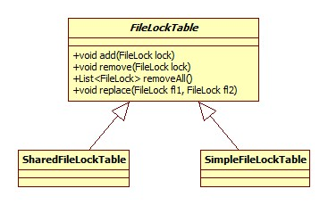
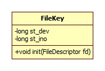

我们以FileOutputStream的getChannel为例:

```java
public FileChannel getChannel() {
    synchronized (this) {
        if (channel == null) {
            channel = FileChannelImpl.open(fd, path, false, true, append, this);
        }
        return channel;
    }
}
```

FileChannel类图:


有几点值得注意:

- InputStream和OutputStream不是线程安全的，而通道(Channel)是线程安全的。
- Channel根据注释的解释，是一组IO操作的联结。
- GatheringByteChannel，顾名思义就是将一组ByteBuffer的数据收集/组合起来，所以它继承自WritableByteChannel。
- ScatteringByteChannel，即将一个通道的数据分散到多个ByteBuffer之中。

其实FileChannelImpl便是FileChannel的子类，位于包sun.nio.ch中，其源码可以从openjdk的jdk\src\share\classes\sun\nio\ch目录找到，open方法源码:

```java
public static FileChannel open(FileDescriptor fd, String path, boolean readable, boolean writable,
    boolean append, Object parent) {
    return new FileChannelImpl(fd, path, readable, writable, append, parent);
}
```

可以看出，getChannel的原理就是构造了一个FileChannelImpl对象，此对象中保存有对应的流的是否可读、追加、文件描述符等属性。

从这里也可以看出，从输出流获取的通道由于**readable被设为false，所以这个通道也就变成了不可读的**。

# 写

FileChannelImpl.write简略版源码:

```java
public int write(ByteBuffer src) throws IOException {
    ensureOpen();
    synchronized (positionLock) {
        int n = 0;
        int ti = -1;
        try {
            begin();
            ti = threads.add();
            if (!isOpen())
                return 0;
            do {
                n = IOUtil.write(fd, src, -1, nd);
            } while ((n == IOStatus.INTERRUPTED) && isOpen());
            return IOStatus.normalize(n);
        } finally {
            threads.remove(ti);
            end(n > 0);
            assert IOStatus.check(n);
        }
    }
}
```

实际上从这里我们可以看出通道的可中断是怎样实现的(IO流并不可以被中断)。begin方法在父类AbstractInterruptibleChannel中实现:

```java
protected final void begin() {
    if (interruptor == null) {
        interruptor = new Interruptible() {
                public void interrupt(Thread target) {
                    synchronized (closeLock) {
                        if (!open)
                            return;
                        open = false;
                        interrupted = target;
                        try {
                            AbstractInterruptibleChannel.this.implCloseChannel();
                        } catch (IOException x) { }
                    }
                }};
    }
    blockedOn(interruptor);
    Thread me = Thread.currentThread();
    if (me.isInterrupted())
        interruptor.interrupt(me);
}
```

blockedOn实际上调用的是Thread的blockedOn方法:

```java
void blockedOn(Interruptible b) {
    synchronized (blockerLock) {
        blocker = b;
    }
}
```

当所在线程被中断时，blocker对象的interrupt方法将会被调用，结合上面begin方法的实现，即当发生中断时，blocker将会关闭通道，这样也就退出了阻塞。Interruptible接口定义在sun.nio.ch中，从Thread的blocker对象的注释中可以看出，此对象是专门为实现可中断的IO而设置的。

IOUtil.write的调用全部发生在sun包内，我们忽略复杂的调用关系，看一下本质: FileDispatcherImpl.c的Java_sun_nio_ch_FileDispatcherImpl_write0方法实现(简略版):

```c
JNIEXPORT jint JNICALL
Java_sun_nio_ch_FileDispatcherImpl_write0(JNIEnv *env, jclass clazz, jobject fdo,
    jlong address, jint len, jboolean append) {
    result = WriteFile(h,           /* File handle to write */
                  (LPCVOID)address, /* pointers to the buffers */
                  len,              /* number of bytes to write */
                  &written,         /* receives number of bytes written */
                  lpOv);            /* overlapped struct */
    return convertReturnVal(env, (jint)written, JNI_FALSE);
}
```

所以，通过FileOutputStream还是FileChannel进行数据的写入，在系统层面都是一样的。

但是要注意，不同于OutputStream的write方法，这里的返回值是int。也就是说，**通道的write方法并不保证一定将我们给定的数据一次性写出**，正确的写姿势应该是这样的:

```java
while (buf.hasRemaining()) {
    channel.write(buf);
}
```

那么问题来了，既然通道和OutputStream是使用的同一个系统级API，那么后者是怎么实现的?

玄机在于jdk\src\share\native\java\io\io_util.c的writeBytes方法其实已经帮我们实现了循环过程，关键源码:

```c
while (len > 0) {
    fd = GET_FD(this, fid);
    if (fd == -1) {
        JNU_ThrowIOException(env, "Stream Closed");
        break;
    }
    if (append == JNI_TRUE) {
        n = IO_Append(fd, buf+off, len);
    } else {
        n = IO_Write(fd, buf+off, len);
    }
    if (n == -1) {
        JNU_ThrowIOExceptionWithLastError(env, "Write error");
        break;
    }
    off += n;
    len -= n;
}
```

# 读

IOUtil.read源码:

```java
static int read(FileDescriptor fd, ByteBuffer dst, long position, NativeDispatcher nd) {
    if (dst instanceof DirectBuffer)
        return readIntoNativeBuffer(fd, dst, position, nd);
    // Substitute a native buffer
    ByteBuffer bb = Util.getTemporaryDirectBuffer(dst.remaining());
    try {
        int n = readIntoNativeBuffer(fd, bb, position, nd);
        bb.flip();
        if (n > 0)
            dst.put(bb);
        return n;
    } finally {
        Util.offerFirstTemporaryDirectBuffer(bb);
    }
}
```

从这里可以看到一个有意思的问题，如果传入的Buffer不是direct buffer，那么先将数据读取到一个direct buffer，再全部拷贝到给定的buffer中，写其实也是这样的，这么做是为了填jvm实现的坑，参考知乎R大的回答:

[Java NIO中，关于DirectBuffer，HeapBuffer的疑问？](https://www.zhihu.com/question/57374068/answer/152691891)

FileDispatcherImpl.c的Java_sun_nio_ch_FileDispatcherImpl_read0关键源码:

```c
JNIEXPORT jint JNICALL
Java_sun_nio_ch_FileDispatcherImpl_read0(JNIEnv *env, jclass clazz, jobject fdo,
                                      jlong address, jint len) {
    DWORD read = 0;
    result = ReadFile(h,          /* File handle to read */
                      (LPVOID)address,    /* address to put data */
                      len,        /* number of bytes to read */
                      &read,      /* number of bytes read */
                      NULL);      /* no overlapped struct */
    return convertReturnVal(env, (jint)read, JNI_TRUE);
}
```

虽然没有展开FileInputStream的源码，但是可以想到和写一样，其实都是对Windows API ReadFile的调用。

# position

当前文件位置的读取和设置其实是通过一个方法完成的，FileChannelImpl.position0:

```java
private native long position0(FileDescriptor fd, long offset);
```

如果offset为-1，即表示读。实现位于FileChannelImpl.c中:

```c
JNIEXPORT jlong JNICALL
Java_sun_nio_ch_FileChannelImpl_position0(JNIEnv *env, jobject this,
                                          jobject fdo, jlong offset) {
    DWORD lowPos = 0;
    long highPos = 0;
    HANDLE h = (HANDLE)(handleval(env, fdo));
    if (offset < 0) {
        lowPos = SetFilePointer(h, 0, &highPos, FILE_CURRENT);
    } else {
        lowPos = (DWORD)offset;
        highPos = (long)(offset >> 32);
        lowPos = SetFilePointer(h, lowPos, &highPos, FILE_BEGIN);
    }
    return (((jlong)highPos) << 32) | lowPos;
}
```

SetFilePointer便是Windows API。

使用position时注意两点:

- 如果将位置设置在文件结束符之后，然后试图从文件通道中读取数据，读方法将返回-1 —— 文件结束标志。
- 如果将位置设置在文件结束符之后，然后向通道中写数据，文件将撑大到当前位置并写入数据。这可能导致“文件空洞”，磁盘上物理文件中写入的数据间有空隙。

# 文件裁剪/truncate

方法声明:

```java
public abstract FileChannel truncate(long size) throws IOException;
```

此方法的效果是size后面的部分都会被删除，同时position也会被设置到新的位置。

native实现位于FileDispatcherImpl.c:

```c
JNIEXPORT jint JNICALL
Java_sun_nio_ch_FileDispatcherImpl_truncate0(JNIEnv *env, jobject this,
                                             jobject fdo, jlong size) {
    lowPos = SetFilePointer(h, lowPos, &highPos, FILE_BEGIN);
    result = SetEndOfFile(h);
    return 0;
}
```

API SetEndOfFile的意思 是将当前位置(position)设为文件的末尾，这样就可以理解了。

# 强制刷新

方法声明:

```java
public abstract void force(boolean metaData) throws IOException;
```

此方法会导致被操作系统缓存在内存中的数据强制刷新到磁盘，参数metaData表示是否需要同时将元信息(比如权限信息)刷新至磁盘。

底层实现其实是对Windows API FlushFileBuffers的调用。

# transferTo/transferFrom

这就是所谓的零拷贝技术，主要运用在从磁盘读取数据并通过网络进行发送这一场景，可将内存拷贝次数从4次(含两次内核空间和用户空间的相互拷贝)减少到2次。参考:

[JAVA Zero Copy的相关知识](https://my.oschina.net/cloudcoder/blog/299944)

我们以transferTo为例进行说明，FileChannelImpl.transferTo的实现很有意思:

```java
public long transferTo(long position, long count,WritableByteChannel target) {
    // Attempt a direct transfer, if the kernel supports it
    if ((n = transferToDirectly(position, icount, target)) >= 0)
        return n;
    // Attempt a mapped transfer, but only to trusted channel types
    if ((n = transferToTrustedChannel(position, icount, target)) >= 0)
        return n;
    // Slow path for untrusted targets
    return transferToArbitraryChannel(position, icount, target);
}
```

可以看出，将首先尝试进行零拷贝，一旦出错了(即返回错误的值)就表示内核不支持。transferToDirectly的native实现位于FileChannelImpl的transferTo0函数，Windows版的实现十分简单粗暴:

```c
JNIEXPORT jlong JNICALL
Java_sun_nio_ch_FileChannelImpl_transferTo0(JNIEnv *env, jobject this,
                                            jint srcFD,
                                            jlong position, jlong count,
                                            jint dstFD)
{
    return IOS_UNSUPPORTED;
}
```

就是不支持。来看看隔壁Linux的实现:

```c
JNIEXPORT jlong JNICALL
Java_sun_nio_ch_FileChannelImpl_transferTo0(JNIEnv *env, jobject this,
                                            jint srcFD,
                                            jlong position, jlong count,
                                            jint dstFD){
#if defined(__linux__)
    off64_t offset = (off64_t)position;
    jlong n = sendfile64(dstFD, srcFD, &offset, (size_t)count);
    if (n < 0) {
        if (errno == EAGAIN)
            return IOS_UNAVAILABLE;
        if ((errno == EINVAL) && ((ssize_t)count >= 0))
            return IOS_UNSUPPORTED_CASE;
        if (errno == EINTR) {
            return IOS_INTERRUPTED;
        }
        JNU_ThrowIOExceptionWithLastError(env, "Transfer failed");
        return IOS_THROWN;
    }
    return n;
#elif
//忽略solaris, mac等版本
}
```

sendfile64便是linux的底层实现了。

从transferTo源码可以看出，如果内核不支持零拷贝，Java将尝试利用map实现，map是个什么东西，参加下面。

如果map也不支持，transferToArbitraryChannel所做的便是最low的方式: 先把数据从一个通道拷贝出来，再写到另一个通道，说的就是你，Windows。

# 内存映射

方法声明:

```java
public abstract MappedByteBuffer map(MapMode mode, long position, long size);
```

能够将一个文件映射到内存中，从而加快数据的读取速度，注意，如果只需要对一个文件进行少数据量(KB级)的读写，那么直接读写的性能其实更好，内存映射只有在数据量大、多次读写的情况下才能表现出来。MapMode共有三种取值:

- READ_ONLY，只读
- READ_WRITE，读写，任何写操作的结果都会被同步到磁盘
- PRIVATE，可读写，类似于copy on write，一个线程进行写操作会导致创建一个副本，而其它线程看不到当前线程的修改

Java中共有三个类可以获取到FileChannel，分别是FileOutputStream, FileInputStream和RandomAccessFile，考虑到它们分别是可写的，可读的和可读写的，所以每各类获得的通道分别可以使用哪些MapMode有一定的限制，总结如下:

| 类名      | FileOutputStream | FileInputStream | RandomAccessFile |
| ------- | ---------------- | --------------- | ---------------- |
| MapMode | 无                | READ_ONLY       | 全部               |

map的Java实现位于FileChannelImpl中，下面分部分进行说明.

## 规则检查

此部分对应上表的map规则，相应源码:

```java
if ((mode != MapMode.READ_ONLY) && !writable)
    throw new NonWritableChannelException();
if (!readable)
    throw new NonReadableChannelException();
```

## 大小检查

```java
long filesize;
do {
    filesize = nd.size(fd);
} while ((filesize == IOStatus.INTERRUPTED) && isOpen());
if (!isOpen())
    return null;
//如果需要的大小大于实际的文件大小，那么对文件进行虚扩大
if (filesize < position + size) { // Extend file size
    if (!writable) {
        throw new IOException("Channel not open for writing " +
            "- cannot extend file to required size");
    }
    int rv;
    do {
        rv = nd.truncate(fd, position + size);
    } while ((rv == IOStatus.INTERRUPTED) && isOpen());
    if (!isOpen())
        return null;
}
//需要的大小为0，返回一个逗你玩的buffer
if (size == 0) {
    addr = 0;
    // a valid file descriptor is not required
    FileDescriptor dummy = new FileDescriptor();
    if ((!writable) || (imode == MAP_RO))
        return Util.newMappedByteBufferR(0, 0, dummy, null);
    else
        return Util.newMappedByteBuffer(0, 0, dummy, null);
}
```

## 映射

```java
int pagePosition = (int)(position % allocationGranularity);
long mapPosition = position - pagePosition;
long mapSize = size + pagePosition;
addr = map0(imode, mapPosition, mapSize);
FileDescriptor mfd = nd.duplicateForMapping(fd);
int isize = (int)size;
Unmapper um = new Unmapper(addr, mapSize, isize, mfd);
if ((!writable) || (imode == MAP_RO)) {
    return Util.newMappedByteBufferR(isize,
                                     addr + pagePosition,
                                     mfd,
                                     um);
} else {
    return Util.newMappedByteBuffer(isize,
                                    addr + pagePosition,
                                    mfd,
                                    um);
}
```

map0的linux实现由系统调用mmap完成，返回映射文件的内存地址。duplicateForMapping用于复制句柄，在Windows上需要这么做，但在linux上不需要。

Util.newMappedByteBuffer(R)方法实际上是构造了一个direct buffer，buffer的起始地址便是mmap返回的内存地址。

# 文件锁

我们以方法:

```java
public abstract FileLock lock(long position, long size, boolean shared);
```

为例，参数position和size的作用是**lock方法允许我们针对文件的某一部分进行锁定**，shared参数用以控制获取的是**共享锁还是排它锁**，默认锁定(即无参数lock方法)全部文件、排它锁。

**文件锁是针对进程(即一个JVM虚拟机)而言的，**所以如果当前JVM已拥有文件的锁，而此JVM的另一个线程又尝试获取锁(同一个文件，有重复的区域)，那么会抛出OverlappingFileLockException(共享锁、排它锁都会抛出)，这是符合逻辑的，因为同一个JVM内的多个线程之间安全性**应该由程序自己维护，而不是文件锁**。

以上提到的特性很容易利用以下代码进行验证，假设有线程如下:

```java
private static class GETLock implements Runnable {
    private final FileChannel channel;
    private final int start;
    private final int end;
    private GETLock(FileChannel channel, int start, int end) {
        this.channel = channel;
        this.start = start;
        this.end = end;
    }
    @Override
    public void run() {
        FileLock lock = channel.lock(start, end, true);
        System.out.println(Thread.currentThread().getName() + "获得锁");
        Thread.sleep(2000);
        lock.release();
    }
}
```

验证代码:

```java
File file = new File("test");
FileChannel channel = new RandomAccessFile(file, "rw").getChannel();
new Thread(new GETLock(channel, 0, 2)).start();
new Thread(new GETLock(channel, 1, 3)).start();
```

只要文件区域出现重复，便会抛出异常。

FileLock位于nio包，类图:


Java层面的实现位于FileChannelImpl.lock，下面对其进行分部分说明。

## 逻辑验证

```java
if (shared && !readable)
    throw new NonReadableChannelException();
if (!shared && !writable)
    throw new NonWritableChannelException();
```

很容易理解，共享锁即读锁，如果获取到的通道不能读那么共享锁也就没有意义了 ，每种通道分别可以获得何种锁整理如下表:

| 类名    | FileInputStream | FileOutputStream | RandomAccessFile |
| ----- | --------------- | ---------------- | ---------------- |
| 可获得的锁 | 共享锁             | 排它锁              | 全部               |

## FileLockTable

如上文所述，**文件锁的作用域为整个虚拟机**，也就是说，两个channel如果对同一个文件的重复区域进行加锁，势必会导致OverlappingFileLockException，那么Java是如何在整个虚拟机范围(全局)进行检查的呢?答案便是FileLockTable。

其位于sun.nio.ch下，类图:



相关源码:

```java
FileLockImpl fli = new FileLockImpl(this, position, size, shared);
FileLockTable flt = fileLockTable();
flt.add(fli);
```

fileLockTable方法决定采用FileLockTable的哪一个实现类:

```java
private FileLockTable fileLockTable() throws IOException {
    if (fileLockTable == null) {
        synchronized (this) {
            if (fileLockTable == null) {
                if (isSharedFileLockTable()) {
                    fileLockTable = FileLockTable.newSharedFileLockTable(this, fd);
                } else {
                    fileLockTable = new SimpleFileLockTable();
                }
            }
        }
    }
    return fileLockTable;
}
```

这里使用了一个双重检查，当然fileLockTable是volatile的。核心在于isSharedFileLockTable方法:

```java
private static boolean isSharedFileLockTable() {
    if (!propertyChecked) {
        synchronized (FileChannelImpl.class) {
            if (!propertyChecked) {
                String value = AccessController.doPrivileged(
                    new GetPropertyAction(
                        "sun.nio.ch.disableSystemWideOverlappingFileLockCheck"));
                isSharedFileLockTable = ((value == null) || value.equals("false"));
                propertyChecked = true;
            }
        }
    }
    return isSharedFileLockTable;
}
```

可以看出，这里其实是根据属性disableSystemWideOverlappingFileLockCheck来决定是否采用全局模式，当然value默认为null.

那么SharedFileLockTable又是如何保证的呢?玄机就在于其保存文件锁的载体:

```java
private static ConcurrentHashMap<FileKey, List<FileLockReference>> lockMap =
        new ConcurrentHashMap<FileKey, List<FileLockReference>>();
```

静态。map的key为FileKey对象，由SharedFileLockTable的构造器创建:

```java
SharedFileLockTable(Channel channel, FileDescriptor fd) {
    this.channel = channel;
    this.fileKey = FileKey.create(fd);
}
```

FileKey是平台相关的，我们来看一下Linux的实现，类图:



st_dev是所在设备的ID，st_ino是文件的inode号，静态方法create完成了native方法init的调用:

```c
JNIEXPORT void JNICALL
Java_sun_nio_ch_FileKey_init(JNIEnv *env, jobject this, jobject fdo) {
    struct stat64 fbuf;
    int res;
    RESTARTABLE(fstat64(fdval(env, fdo), &fbuf), res);
    if (res < 0) {
        JNU_ThrowIOExceptionWithLastError(env, "fstat64 failed");
    } else {
        //设置st_dev和st_ino
        (*env)->SetLongField(env, this, key_st_dev, (jlong)fbuf.st_dev);
        (*env)->SetLongField(env, this, key_st_ino, (jlong)fbuf.st_ino);
    }
}
```

fstat64就是fstat函数，为Linux下的系统调用，用以获得文件的相关信息。

map的value中FileLockReference为对FileLock的弱引用。

到这里SharedFileLockTable的add方法的逻辑就很容易想到了: 如果map中不存在此文件的记录，添加之，如果存在，检查是否有区域重复。

重复性检查由SharedFileLockTable的checkList完成，源码:

```java
private void checkList(List<FileLockReference> list, long position, long size) {
    for (FileLockReference ref: list) {
        FileLock fl = ref.get();
        if (fl != null && fl.overlaps(position, size))
            throw new OverlappingFileLockException();
    }
}
```

FileLock.overlaps:

```java
public final boolean overlaps(long position, long size) {
    if (position + size <= this.position)
        return false;               // That is below this
    if (this.position + this.size <= position)
        return false;               // This is below that
    return true;
}
```

一目了然。

## 加锁

native方法Java_sun_nio_ch_FileDispatcherImpl_lock0完成，linux实现由函数fcntl完成，可以参考:

[linux 文件记录锁详解](http://www.cnblogs.com/xuyh/p/3278881.html)

# size

用以获取文件的大小，Linux实现和FileKey的init方法一样，由fstat完成，注意File的length方法的Linux实现由stat完成。而stat和fstat的主要区别是后者的第一个参数为文件描述符(只有打开了文件才会有)，而前者的第一个参数是绝对的路径，不要求打开文件，这就和Java里两者的区别很好的印证。

# 关闭

FileChannel继承自AbstractInterruptibleChannel，通道关闭有此类实现，包括Socket通道也是如此:

```java
public final void close() {
    synchronized (closeLock) {
        if (!open)
            return;
        open = false;
        implCloseChannel();
    }
}
```

implCloseChannel方法由FileChannelImpl实现:

```java
protected void implCloseChannel() throws IOException {
    // Release and invalidate any locks that we still hold
    if (fileLockTable != null) {
        for (FileLock fl: fileLockTable.removeAll()) {
            synchronized (fl) {
                if (fl.isValid()) {
                    nd.release(fd, fl.position(), fl.size());
                    ((FileLockImpl)fl).invalidate();
                }
            }
        }
    }
    threads.signalAndWait();
    if (parent != null) {
        ((java.io.Closeable)parent).close();
    } else {
        nd.close(fd);
    }
}
```

分为如下几步:

- 线程唤醒, 在Linux上如果有线程阻塞在一个文件描述符上，那么即使此文件描述符(FD)被关闭，被阻塞的线程也不会被唤醒，

  ```java
  threads.signalAndWait();
  ```

  正是用于将这些线程手动唤醒，threads是一个NativeThreadSet类型，在任何IO操作(比如write方法)前被加入，这一点可以在第一节"写"中得到验证。

- 清除文件锁表

- 调用依赖的资源的close方法。


关于唤醒线程安全这一点，其实有一个隐含的线程安全的问题，结合read方法源码:

```java
public int read(ByteBuffer dst) throws IOException {
    ensureOpen();
    if (!readable)
        throw new NonReadableChannelException();
    synchronized (positionLock) {
        int n = 0;
        int ti = -1;
        try {
            begin();
            ti = threads.add();
            if (!isOpen())
                return 0;
            //here!
            do {
                n = IOUtil.read(fd, dst, -1, nd);
            } while ((n == IOStatus.INTERRUPTED) && isOpen());
            return IOStatus.normalize(n);
        } finally {
            threads.remove(ti);
            end(n > 0);
            assert IOStatus.check(n);
        }
    }
}
```

如果进行通道关闭的线程唤醒被阻塞的线程、关闭文件描述符这一过程在读线程的最后一次isOpen检查和read调用之间完成(即上面源码中here处)完成，由于内核会对文件描述符进行回收(重用)，这样完全会导致**read操作读取的是一个全新的文件描述符!**

JDK解决的办法在于NativeThreadSet.signalAndWait中(简略版):

```java
void signalAndWait() {
    synchronized (this) {
        while (used > 0) {
            try {
                wait();
            } catch (InterruptedException e) {
                interrupted = true;
            }
        }
    }
}
```

used表示正在进行读写的线程数，可以看出，**只要尚有线程正在进行读写操作，关闭线程就会阻塞**。那什么时候被唤醒呢?remove方法源码:

```java
void remove(int i) {
    synchronized (this) {
        elts[i] = 0;
        used--;
        if (used == 0 && waitingToEmpty)
            notifyAll();
    }
}
```

这就保证了**当进行实际的文件描述符关闭时，一定没有正在读写的线程**，这就杜绝了上述情况的发生。