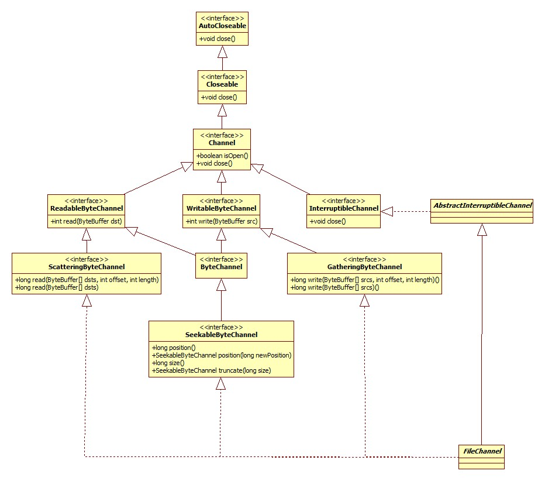

接下来扒一扒java的IO包。

# File

类图:


其实观察File里面多数方法的实现，其实是通过委托给属性fs完成的。

## FileSystem

在 File中的初始化代码:

```java
private static final FileSystem fs = DefaultFileSystem.getFileSystem();
```

在Windows下的类图:


那DefaultFileSystem又是个什么东西呢?这东西是从JDK8加入的 ，全部的源码如下:

```java
class DefaultFileSystem {
    public static FileSystem getFileSystem() {
        return new WinNTFileSystem();
    }
}
```

可以想象，在Linux上一定是不同的实现。

## 文件创建

我们来看看创建文件时到底发生了什么，以代码:

```java
File file = new File("test");
System.out.println(file.getAbsolutePath());
```

File构造器:

```java
public File(String pathname) {
    this.path = fs.normalize(pathname);
    this.prefixLength = fs.prefixLength(this.path);
}
```

### normalize

这一步是将文件分隔符、路径分隔符转换成系统特定的，比如对于windows平台，就将/转为\。转换的过程不再赘述，来看一下系统特定的分隔符是从哪来的，WinNTFileSystem构造器:

```java
public WinNTFileSystem() {
    slash = AccessController.doPrivileged(new GetPropertyAction("file.separator")).charAt(0);
    semicolon = AccessController.doPrivileged(new GetPropertyAction("path.separator")).charAt(0);
    altSlash = (this.slash == '\\') ? '/' : '\\';
}
```

其实就是System.getProperty。

## 绝对路径获取

File.getAbsolutePath:

```java
public String getAbsolutePath() {
    return fs.resolve(this);
}
```

resolve遵从下面的逻辑:

- 如果给定的路径已经是绝对路径，那么直接返回。
- 获取系统变量user.dir，将文件指向此目录，而user.dir默认便是java程序执行的路径。

到这里并未涉及到任何系统层面的API操作。

## 文件/目录判断

其实是一样的套路:

```java
public boolean isDirectory() {
    return ((fs.getBooleanAttributes(this) & FileSystem.BA_DIRECTORY != 0);
}
            
public boolean isFile() {
    return ((fs.getBooleanAttributes(this) & FileSystem.BA_REGULAR) != 0);
}
```

getBooleanAttributes为native实现。位于WinNTFileSystem_md.c，核心源码:

```java
JNIEXPORT jint JNICALL
Java_java_io_WinNTFileSystem_getBooleanAttributes(JNIEnv *env, jobject this, jobject file) {
    jint rv = 0;
    jint pathlen;
    WCHAR *pathbuf = fileToNTPath(env, file, ids.path);
    DWORD a = getFinalAttributes(pathbuf);
    rv = (java_io_FileSystem_BA_EXISTS
        | ((a & FILE_ATTRIBUTE_DIRECTORY)
        ? java_io_FileSystem_BA_DIRECTORY : java_io_FileSystem_BA_REGULAR)
        | ((a & FILE_ATTRIBUTE_HIDDEN) ? java_io_FileSystem_BA_HIDDEN : 0));
    return rv;
}
```

getFinalAttributes即Windows API，其实此函数可以返回更多的属性信息，而源码中的一系列与或操作将很多属性屏蔽了，只保留以下:

- 是否存在
- 文件还是目录 
- 是否是隐藏文件/目录

FileSystem.BA_REGULAR等属性定义在抽象类FileSystem中:

```java
@Native public static final int ACCESS_READ    = 0x04;
@Native public static final int ACCESS_WRITE   = 0x02;
@Native public static final int ACCESS_EXECUTE = 0x01;
```

即：每一个属性用int中的一位来存储。

## 可读/可写/可执行

File.canRead:

```java
public boolean canRead() {
    return fs.checkAccess(this, FileSystem.ACCESS_READ);
}
```

写也是一样的。checkAccess为native实现:

```c++
JNIEXPORT jboolean
JNICALL Java_java_io_WinNTFileSystem_checkAccess(JNIEnv *env, jobject this, jobject file, jint access) {
    DWORD attr;
    WCHAR *pathbuf = fileToNTPath(env, file, ids.path);
    // Windows函数
    attr = GetFileAttributesW(pathbuf);
    attr = getFinalAttributesIfReparsePoint(pathbuf, attr);
    switch (access) {
    case java_io_FileSystem_ACCESS_READ:
    case java_io_FileSystem_ACCESS_EXECUTE:
        return JNI_TRUE;
    case java_io_FileSystem_ACCESS_WRITE:
        /* Read-only attribute ignored on directories */
        if ((attr & FILE_ATTRIBUTE_DIRECTORY) ||
            (attr & FILE_ATTRIBUTE_READONLY) == 0)
            return JNI_TRUE;
        else
            return JNI_FALSE;
    default:
        assert(0);
        return JNI_FALSE;
    }
}
```

从这里可以看出，对于读和执行权限，只要路径存在且合法，直接返回true，而可写的条件是: 路径是一个目录或非只读文件。

## list

此方法用以列出一个目录下的所有子文件(夹)。使用WinNTFileSystem的同名native方法实现，源码较长，在此不再贴出，实现的原理便是利用Windows的FindFirstFileW和FindNextFileW，两个函数的W结尾表示Unicode编码，参考:

[FindNextFile function](https://msdn.microsoft.com/en-us/library/windows/desktop/aa364428(v=vs.85).aspx)

[使用FindFirstFile,FindNextFile遍历一个文件夹](http://www.cnblogs.com/chenkunyun/archive/2012/03/24/2415727.html)

## mkdir(s)

mkdir实现:

```java
public boolean mkdir() {
    return fs.createDirectory(this);
}
```

而mkdirs使用mkdir实现:

```java
public boolean mkdirs() {
    File parent = getCanonicalFile().getParentFile();
    return (parent != null && (parent.mkdirs() || parent.exists()) &&
            canonFile.mkdir());
}
```

createDirectory为native实现，对应Windows CreateDirectoryW函数。

## 文件删除

native由removeFileOrDirectory函数完成，源码:

```c
static int removeFileOrDirectory(const jchar *path) {
    /* Returns 0 on success */
    DWORD a;
    SetFileAttributesW(path, FILE_ATTRIBUTE_NORMAL);
    a = GetFileAttributesW(path);
    if (a == INVALID_FILE_ATTRIBUTES) {
        return 1;
    } else if (a & FILE_ATTRIBUTE_DIRECTORY) {
        //删除目录
        return !RemoveDirectoryW(path);
    } else {
        return !DeleteFileW(path);
    }
}
```

# FileOutputStream

类图:


## 构造器

以File参数构造器为例:

```java
public FileOutputStream(File file, boolean append) {
    String name = (file != null ? file.getPath() : null);
    this.fd = new FileDescriptor();
    fd.attach(this);
    this.append = append;
    this.path = name;
    open(name, append);
}
```

第二个参数为是否追加写，默认false。

open调用了native实现的open0:

```c
JNIEXPORT void JNICALL Java_java_io_FileOutputStream_open0(JNIEnv *env, jobject this, jstring path, jboolean append) {
    fileOpen(env, this, path, fos_fd,
        O_WRONLY | O_CREAT | (append ? O_APPEND : O_TRUNC));
}
```

fileOpen最终调用Windows API CreateFileW函数，我们在这里只关注一下参数:

```c
O_WRONLY | O_CREAT | (append ? O_APPEND : O_TRUNC)
```

O_WRONLY表示写文件，O_CREAT为创建文件，O_TRUNC 表示若文件存在，则长度被截为0，属性不变，参考:

[open()参数宏的意义 O_TRUNC](http://www.cnblogs.com/leaven/archive/2010/05/26/1744274.html)

##  写文件

实际上，所有的写操作都是通过此方法实现的:

```java
private native void writeBytes(byte b[], int off, int len, boolean append);
```

最终的写入由Windows函数WriteFile完成，io_util_md.c，writeInternal函数部分源码:

```c
static jint writeInternal(FD fd, const void *buf, jint len, jboolean append) {
    result = WriteFile(h,                /* File handle to write */
                       buf,              /* pointers to the buffers */
                       len,              /* number of bytes to write */
                       &written,         /* receives number of bytes written */
                       lpOv);            /* overlapped struct */
    return (jint)written;
}
```

## 通道获取

这里其实是nio包的内容了。getChannel:

```java
public FileChannel getChannel() {
    synchronized (this) {
        if (channel == null) {
            channel = FileChannelImpl.open(fd, path, false, true, append, this);
        }
        return channel;
    }
}
```

FileChannel类图:



有几点值得注意:

- InputStream和OutputStream不是线程安全的，而通道(Channel)是线程安全的。
- Channel根据注释的解释，是一组IO操作的联结。
- GatheringByteChannel，顾名思义就是将一组ByteBuffer的数据收集/组合起来，所以它继承自WritableByteChannel。
- ScatteringByteChannel，即将一个通道的数据分散到多个ByteBuffer之中。

其实FileChannelImpl便是FileChannel的子类，位于包sun.nio.ch中，其源码可以从openjdk的jdk\src\share\classes\sun\nio\ch目录找到，open方法源码:

```java
public static FileChannel open(FileDescriptor fd, String path, boolean readable, boolean writable,
    boolean append, Object parent) {
    return new FileChannelImpl(fd, path, readable, writable, append, parent);
}
```

可以看出，getChannel的原理就是构造了一个FileChannelImpl对象，此对象中保存有对应的流的是否可读、追加、文件描述符等属性。

### 写

FileChannelImpl.write简略版源码:

```java
public int write(ByteBuffer src) throws IOException {
    ensureOpen();
    synchronized (positionLock) {
        int n = 0;
        int ti = -1;
        try {
            begin();
            ti = threads.add();
            if (!isOpen())
                return 0;
            do {
                n = IOUtil.write(fd, src, -1, nd);
            } while ((n == IOStatus.INTERRUPTED) && isOpen());
            return IOStatus.normalize(n);
        } finally {
            threads.remove(ti);
            end(n > 0);
            assert IOStatus.check(n);
        }
    }
}
```

实际上从这里我们可以看出通道的可中断是怎样实现的(IO流并不可以被中断)。begin方法在父类AbstractInterruptibleChannel中实现:

```java
protected final void begin() {
    if (interruptor == null) {
        interruptor = new Interruptible() {
                public void interrupt(Thread target) {
                    synchronized (closeLock) {
                        if (!open)
                            return;
                        open = false;
                        interrupted = target;
                        try {
                            AbstractInterruptibleChannel.this.implCloseChannel();
                        } catch (IOException x) { }
                    }
                }};
    }
    blockedOn(interruptor);
    Thread me = Thread.currentThread();
    if (me.isInterrupted())
        interruptor.interrupt(me);
}
```

blockedOn实际上调用的是Thread的blockedOn方法:

```java
void blockedOn(Interruptible b) {
    synchronized (blockerLock) {
        blocker = b;
    }
}
```

当所在线程被中断时，blocker对象的interrupt方法将会被调用，结合上面begin方法的实现，即当发生中断时，blocker将会关闭通道，这样也就退出了阻塞。Interruptible接口定义在sun.nio.ch中，从Thread的blocker对象的注释中可以看出，此对象是专门为实现可中断的IO而设置的。

IOUtil.write的调用全部发生在sun包内，我们忽略复杂的调用关系，看一下本质: FileDispatcherImpl.c的Java_sun_nio_ch_FileDispatcherImpl_write0方法实现(简略版):

```c
JNIEXPORT jint JNICALL
Java_sun_nio_ch_FileDispatcherImpl_write0(JNIEnv *env, jclass clazz, jobject fdo,
    jlong address, jint len, jboolean append) {
    result = WriteFile(h,           /* File handle to write */
                  (LPCVOID)address, /* pointers to the buffers */
                  len,              /* number of bytes to write */
                  &written,         /* receives number of bytes written */
                  lpOv);            /* overlapped struct */
    return convertReturnVal(env, (jint)written, JNI_FALSE);
}
```

所以，通过FileOutputStream还是FileChannel进行数据的写入，在系统层面都是一样的。

但是要注意，不同于OutputStream的write方法，这里的返回值是int。也就是说，**通道的write方法并不保证一定将我们给定的数据一次性写出**，正确的写姿势应该是这样的:

```java
while (buf.hasRemaining()) {
    channel.write(buf);
}
```

那么问题来了，既然通道和OutputStream是使用的同一个系统级API，那么后者是怎么实现的?

玄机在于jdk\src\share\native\java\io\io_util.c的writeBytes方法其实已经帮我们实现了循环过程，关键源码:

```c
while (len > 0) {
    fd = GET_FD(this, fid);
    if (fd == -1) {
        JNU_ThrowIOException(env, "Stream Closed");
        break;
    }
    if (append == JNI_TRUE) {
        n = IO_Append(fd, buf+off, len);
    } else {
        n = IO_Write(fd, buf+off, len);
    }
    if (n == -1) {
        JNU_ThrowIOExceptionWithLastError(env, "Write error");
        break;
    }
    off += n;
    len -= n;
}
```

### 读

IOUtil.read源码:

```java
static int read(FileDescriptor fd, ByteBuffer dst, long position, NativeDispatcher nd) {
    if (dst instanceof DirectBuffer)
        return readIntoNativeBuffer(fd, dst, position, nd);
    // Substitute a native buffer
    ByteBuffer bb = Util.getTemporaryDirectBuffer(dst.remaining());
    try {
        int n = readIntoNativeBuffer(fd, bb, position, nd);
        bb.flip();
        if (n > 0)
            dst.put(bb);
        return n;
    } finally {
        Util.offerFirstTemporaryDirectBuffer(bb);
    }
}
```

从这里可以看到一个有意思的问题，如果传入的Buffer不是direct buffer，那么先将数据读取到一个direct buffer，再全部拷贝到给定的buffer中，写其实也是这样的，这么做是为了填jvm实现的坑，参考知乎R大的回答:

[Java NIO中，关于DirectBuffer，HeapBuffer的疑问？](https://www.zhihu.com/question/57374068/answer/152691891)

FileDispatcherImpl.c的Java_sun_nio_ch_FileDispatcherImpl_read0关键源码:

```c
JNIEXPORT jint JNICALL
Java_sun_nio_ch_FileDispatcherImpl_read0(JNIEnv *env, jclass clazz, jobject fdo,
                                      jlong address, jint len) {
    DWORD read = 0;
    result = ReadFile(h,          /* File handle to read */
                      (LPVOID)address,    /* address to put data */
                      len,        /* number of bytes to read */
                      &read,      /* number of bytes read */
                      NULL);      /* no overlapped struct */
    return convertReturnVal(env, (jint)read, JNI_TRUE);
}
```

虽然没有展开FileInputStream的源码，但是可以想到和写一样，其实都是对Windows API ReadFile的调用。

### position

当前文件位置的读取和设置其实是通过一个方法完成的，FileChannelImpl.position0:

```java
private native long position0(FileDescriptor fd, long offset);
```

如果offset为-1，即表示读。实现位于FileChannelImpl.c中:

```c
JNIEXPORT jlong JNICALL
Java_sun_nio_ch_FileChannelImpl_position0(JNIEnv *env, jobject this,
                                          jobject fdo, jlong offset) {
    DWORD lowPos = 0;
    long highPos = 0;
    HANDLE h = (HANDLE)(handleval(env, fdo));
    if (offset < 0) {
        lowPos = SetFilePointer(h, 0, &highPos, FILE_CURRENT);
    } else {
        lowPos = (DWORD)offset;
        highPos = (long)(offset >> 32);
        lowPos = SetFilePointer(h, lowPos, &highPos, FILE_BEGIN);
    }
    return (((jlong)highPos) << 32) | lowPos;
}
```

SetFilePointer便是Windows API。

使用position时注意两点:

- 如果将位置设置在文件结束符之后，然后试图从文件通道中读取数据，读方法将返回-1 —— 文件结束标志。
- 如果将位置设置在文件结束符之后，然后向通道中写数据，文件将撑大到当前位置并写入数据。这可能导致“文件空洞”，磁盘上物理文件中写入的数据间有空隙。

### 文件裁剪/truncate

方法声明:

```java
public abstract FileChannel truncate(long size) throws IOException;
```

此方法的效果是size后面的部分都会被删除，同时position也会被设置到新的位置。

native实现位于FileDispatcherImpl.c:

```c
JNIEXPORT jint JNICALL
Java_sun_nio_ch_FileDispatcherImpl_truncate0(JNIEnv *env, jobject this,
                                             jobject fdo, jlong size) {
    lowPos = SetFilePointer(h, lowPos, &highPos, FILE_BEGIN);
    result = SetEndOfFile(h);
    return 0;
}
```

API SetEndOfFile的意思 是将当前位置(position)设为文件的末尾，这样就可以理解了。

### 强制刷新

方法声明:

```java
public abstract void force(boolean metaData) throws IOException;
```

此方法会导致被操作系统缓存在内存中的数据强制刷新到磁盘，参数metaData表示是否需要同时将元信息(比如权限信息)刷新至磁盘。

底层实现其实是对Windows API FlushFileBuffers的调用。

### transferTo/transferFrom

这就是所谓的零拷贝技术，主要运用在从磁盘读取数据并通过网络进行发送这一场景，可将内存拷贝次数从4次(含两次内核空间和用户空间的相互拷贝)减少到2次。参考:

[JAVA Zero Copy的相关知识](https://my.oschina.net/cloudcoder/blog/299944)

我们以transferTo为例进行说明，FileChannelImpl.transferTo的实现很有意思:

```java
public long transferTo(long position, long count,WritableByteChannel target) {
    // Attempt a direct transfer, if the kernel supports it
    if ((n = transferToDirectly(position, icount, target)) >= 0)
        return n;
    // Attempt a mapped transfer, but only to trusted channel types
    if ((n = transferToTrustedChannel(position, icount, target)) >= 0)
        return n;
    // Slow path for untrusted targets
    return transferToArbitraryChannel(position, icount, target);
}
```

可以看出，将首先尝试进行零拷贝，一旦出错了(即返回错误的值)就表示内核不支持。transferToDirectly的native实现位于FileChannelImpl的transferTo0函数，Windows版的实现十分简单粗暴:

```c
JNIEXPORT jlong JNICALL
Java_sun_nio_ch_FileChannelImpl_transferTo0(JNIEnv *env, jobject this,
                                            jint srcFD,
                                            jlong position, jlong count,
                                            jint dstFD)
{
    return IOS_UNSUPPORTED;
}
```

就是不支持。来看看隔壁Linux的实现:

```c
JNIEXPORT jlong JNICALL
Java_sun_nio_ch_FileChannelImpl_transferTo0(JNIEnv *env, jobject this,
                                            jint srcFD,
                                            jlong position, jlong count,
                                            jint dstFD){
#if defined(__linux__)
    off64_t offset = (off64_t)position;
    jlong n = sendfile64(dstFD, srcFD, &offset, (size_t)count);
    if (n < 0) {
        if (errno == EAGAIN)
            return IOS_UNAVAILABLE;
        if ((errno == EINVAL) && ((ssize_t)count >= 0))
            return IOS_UNSUPPORTED_CASE;
        if (errno == EINTR) {
            return IOS_INTERRUPTED;
        }
        JNU_ThrowIOExceptionWithLastError(env, "Transfer failed");
        return IOS_THROWN;
    }
    return n;
#elif
//忽略solaris, mac等版本
}
```

sendfile64便是linux的底层实现了。

从transferTo源码可以看出，如果内核不支持零拷贝，Java将尝试利用map实现，map是个什么东西，参加下面。

如果map也不支持，transferToArbitraryChannel所做的便是最low的方式: 先把数据从一个通道拷贝出来，再写到另一个通道，说的就是你，Windows。


