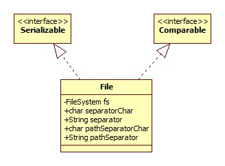
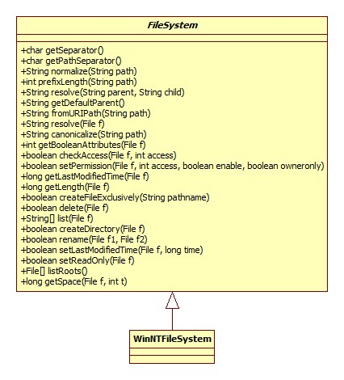
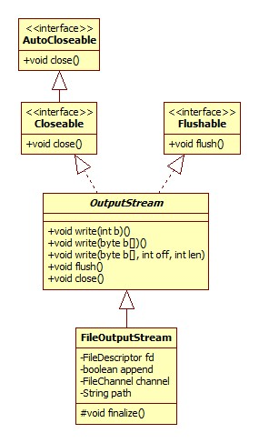
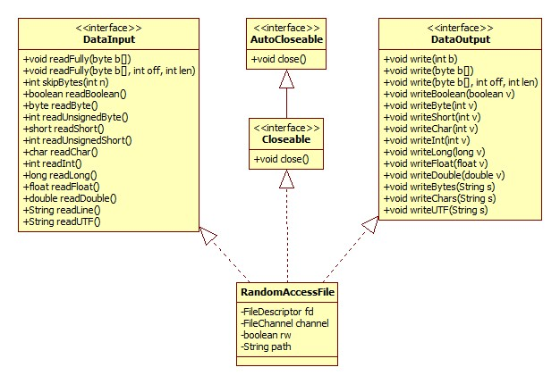
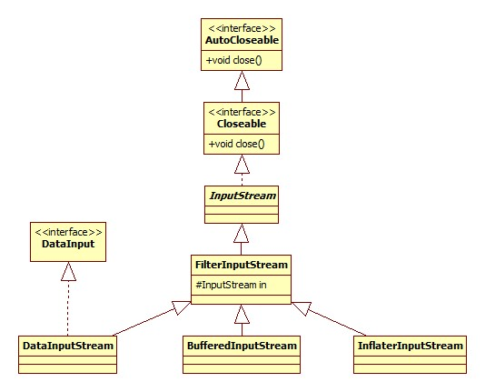
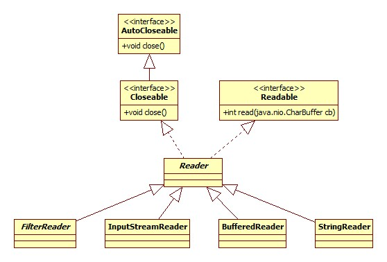

# File

类图:



其实观察File里面多数方法的实现，其实是通过委托给属性fs完成的。

## FileSystem

在 File中的初始化代码:

```java
private static final FileSystem fs = DefaultFileSystem.getFileSystem();
```

在Windows下的类图:



那DefaultFileSystem又是个什么东西呢?这东西是从JDK8加入的 ，全部的源码如下:

```java
class DefaultFileSystem {
    public static FileSystem getFileSystem() {
        return new WinNTFileSystem();
    }
}
```

可以想象，在Linux上一定是不同的实现。

## 文件创建

我们来看看创建文件时到底发生了什么，以代码:

```java
File file = new File("test");
System.out.println(file.getAbsolutePath());
```

File构造器:

```java
public File(String pathname) {
    this.path = fs.normalize(pathname);
    this.prefixLength = fs.prefixLength(this.path);
}
```

### normalize

这一步是将文件分隔符、路径分隔符转换成系统特定的，比如对于windows平台，就将/转为\。转换的过程不再赘述，来看一下系统特定的分隔符是从哪来的，WinNTFileSystem构造器:

```java
public WinNTFileSystem() {
    slash = AccessController.doPrivileged(new GetPropertyAction("file.separator")).charAt(0);
    semicolon = AccessController.doPrivileged(new GetPropertyAction("path.separator")).charAt(0);
    altSlash = (this.slash == '\\') ? '/' : '\\';
}
```

其实就是System.getProperty。

## 绝对路径获取

File.getAbsolutePath:

```java
public String getAbsolutePath() {
    return fs.resolve(this);
}
```

resolve遵从下面的逻辑:

- 如果给定的路径已经是绝对路径，那么直接返回。
- 获取系统变量user.dir，将文件指向此目录，而user.dir默认便是java程序执行的路径。

到这里并未涉及到任何系统层面的API操作。

## 文件/目录判断

其实是一样的套路:

```java
public boolean isDirectory() {
    return ((fs.getBooleanAttributes(this) & FileSystem.BA_DIRECTORY != 0);
}
            
public boolean isFile() {
    return ((fs.getBooleanAttributes(this) & FileSystem.BA_REGULAR) != 0);
}
```

getBooleanAttributes为native实现。位于WinNTFileSystem_md.c，核心源码:

```java
JNIEXPORT jint JNICALL
Java_java_io_WinNTFileSystem_getBooleanAttributes(JNIEnv *env, jobject this, jobject file) {
    jint rv = 0;
    jint pathlen;
    WCHAR *pathbuf = fileToNTPath(env, file, ids.path);
    DWORD a = getFinalAttributes(pathbuf);
    rv = (java_io_FileSystem_BA_EXISTS
        | ((a & FILE_ATTRIBUTE_DIRECTORY)
        ? java_io_FileSystem_BA_DIRECTORY : java_io_FileSystem_BA_REGULAR)
        | ((a & FILE_ATTRIBUTE_HIDDEN) ? java_io_FileSystem_BA_HIDDEN : 0));
    return rv;
}
```

getFinalAttributes即Windows API，其实此函数可以返回更多的属性信息，而源码中的一系列与或操作将很多属性屏蔽了，只保留以下:

- 是否存在
- 文件还是目录 
- 是否是隐藏文件/目录

FileSystem.BA_REGULAR等属性定义在抽象类FileSystem中:

```java
@Native public static final int ACCESS_READ    = 0x04;
@Native public static final int ACCESS_WRITE   = 0x02;
@Native public static final int ACCESS_EXECUTE = 0x01;
```

即：每一个属性用int中的一位来存储。

## 可读/可写/可执行

File.canRead:

```java
public boolean canRead() {
    return fs.checkAccess(this, FileSystem.ACCESS_READ);
}
```

写也是一样的。checkAccess为native实现:

```c++
JNIEXPORT jboolean
JNICALL Java_java_io_WinNTFileSystem_checkAccess(JNIEnv *env, jobject this, jobject file, jint access) {
    DWORD attr;
    WCHAR *pathbuf = fileToNTPath(env, file, ids.path);
    // Windows函数
    attr = GetFileAttributesW(pathbuf);
    attr = getFinalAttributesIfReparsePoint(pathbuf, attr);
    switch (access) {
    case java_io_FileSystem_ACCESS_READ:
    case java_io_FileSystem_ACCESS_EXECUTE:
        return JNI_TRUE;
    case java_io_FileSystem_ACCESS_WRITE:
        /* Read-only attribute ignored on directories */
        if ((attr & FILE_ATTRIBUTE_DIRECTORY) ||
            (attr & FILE_ATTRIBUTE_READONLY) == 0)
            return JNI_TRUE;
        else
            return JNI_FALSE;
    default:
        assert(0);
        return JNI_FALSE;
    }
}
```

从这里可以看出，对于读和执行权限，只要路径存在且合法，直接返回true，而可写的条件是: 路径是一个目录或非只读文件。

## list

此方法用以列出一个目录下的所有子文件(夹)。使用WinNTFileSystem的同名native方法实现，源码较长，在此不再贴出，实现的原理便是利用Windows的FindFirstFileW和FindNextFileW，两个函数的W结尾表示Unicode编码，参考:

[FindNextFile function](https://msdn.microsoft.com/en-us/library/windows/desktop/aa364428(v=vs.85).aspx)

[使用FindFirstFile,FindNextFile遍历一个文件夹](http://www.cnblogs.com/chenkunyun/archive/2012/03/24/2415727.html)

## mkdir(s)

mkdir实现:

```java
public boolean mkdir() {
    return fs.createDirectory(this);
}
```

而mkdirs使用mkdir实现:

```java
public boolean mkdirs() {
    File parent = getCanonicalFile().getParentFile();
    return (parent != null && (parent.mkdirs() || parent.exists()) &&
            canonFile.mkdir());
}
```

createDirectory为native实现，对应Windows CreateDirectoryW函数。

## 文件删除

native由removeFileOrDirectory函数完成，源码:

```c
static int removeFileOrDirectory(const jchar *path) {
    /* Returns 0 on success */
    DWORD a;
    SetFileAttributesW(path, FILE_ATTRIBUTE_NORMAL);
    a = GetFileAttributesW(path);
    if (a == INVALID_FILE_ATTRIBUTES) {
        return 1;
    } else if (a & FILE_ATTRIBUTE_DIRECTORY) {
        //删除目录
        return !RemoveDirectoryW(path);
    } else {
        return !DeleteFileW(path);
    }
}
```

## 移动/重命名

由Windows函数_wrename实现。

## length

用以获取文件的大小，Linux实现由stat函数完成。

# FileOutputStream

类图:



## 构造器

以File参数构造器为例:

```java
public FileOutputStream(File file, boolean append) {
    String name = (file != null ? file.getPath() : null);
    this.fd = new FileDescriptor();
    fd.attach(this);
    this.append = append;
    this.path = name;
    open(name, append);
}
```

第二个参数为是否追加写，默认false。

open调用了native实现的open0:

```c
JNIEXPORT void JNICALL Java_java_io_FileOutputStream_open0(JNIEnv *env, jobject this, jstring path, jboolean append) {
    fileOpen(env, this, path, fos_fd,
        O_WRONLY | O_CREAT | (append ? O_APPEND : O_TRUNC));
}
```

fileOpen最终调用Windows API CreateFileW函数，我们在这里只关注一下参数:

```c
O_WRONLY | O_CREAT | (append ? O_APPEND : O_TRUNC)
```

O_WRONLY表示写文件，O_CREAT为创建文件，O_TRUNC 表示若文件存在，则长度被截为0，属性不变，参考:

[open()参数宏的意义 O_TRUNC](http://www.cnblogs.com/leaven/archive/2010/05/26/1744274.html)

##  写文件

实际上，所有的写操作都是通过此方法实现的:

```java
private native void writeBytes(byte b[], int off, int len, boolean append);
```

最终的写入由Windows函数WriteFile完成，io_util_md.c，writeInternal函数部分源码:

```c
static jint writeInternal(FD fd, const void *buf, jint len, jboolean append) {
    result = WriteFile(h,                /* File handle to write */
                       buf,              /* pointers to the buffers */
                       len,              /* number of bytes to write */
                       &written,         /* receives number of bytes written */
                       lpOv);            /* overlapped struct */
    return (jint)written;
}
```

## 通道获取

隔壁 FileChannel。

## 关闭

FileOutputStream.close:

```java
public void close() throws IOException {
  	//设置状态
	synchronized (closeLock) {
		if (closed) {
			return;
		}
		closed = true;
	}
  	//关闭通道
	if (channel != null) {
		channel.close();
	}
	fd.closeAll(new Closeable() {
		public void close() throws IOException {
		   close0();
	   }
	});
}
```

close0为native实现，关闭其对应的文件句柄。

# RandomAccessFile

老规矩，类图:



可见，这货与File, 输入输出流半毛钱的关系都没有。

## 模式

支持的读写模式整理如下表:

| Mode | 意义                       |
| ---- | ------------------------ |
| r    | 只读                       |
| rw   | 读写                       |
| rws  | 任何对文件内容或元信息的写会被立即同步刷新至磁盘 |
| rwd  | 对文件内容的写会被立即同步刷新至磁盘       |

可以看出，rws和rwd两个模式的作用和FileChannel的force方法是一样的。

## 构造器

简略版源码:

```java
public RandomAccessFile(File file, String mode) {
    String name = (file != null ? file.getPath() : null);
    int imode = -1;
    fd = new FileDescriptor();
    fd.attach(this);
    path = name;
    open(name, imode);
}
```

open方法调用了native方法open0，此方法的实现位于src\share\native\java\io\RandomAccessFile.c:

```c
JNIEXPORT void JNICALL
Java_java_io_RandomAccessFile_open0(JNIEnv *env,
                                    jobject this, jstring path, jint mode) {
    int flags = 0;
    if (mode & java_io_RandomAccessFile_O_RDONLY)
        flags = O_RDONLY;
    else if (mode & java_io_RandomAccessFile_O_RDWR) {
        flags = O_RDWR | O_CREAT;
        if (mode & java_io_RandomAccessFile_O_SYNC)
            flags |= O_SYNC;
        else if (mode & java_io_RandomAccessFile_O_DSYNC)
            flags |= O_DSYNC;
    }
    fileOpen(env, this, path, raf_fd, flags);
}
```

结合FileOutputStream的open方法便可以发现，**两者的open操作其实使用了相同的系统级实现，只不过RandomAccessFile支持更多的参数**。

## seek

seek允许我们自己设定当前文件的指针(偏移)。注意，系统允许设置的偏移大于文件的真实长度，但这并不改变文件的大小，只有当在新的偏移写入数据之后才会改变。

由native方法seek0调用Windows函数SetFilePointerEx实现，与之比对，FileChannel的position方法采用的是SetFilePointer函数，两者的区别是**SetFilePointer将新的文件指针存放在两个long中，而SetFilePointerEX只需要一个long**，至于两者为什么要采用不同的实现，不得而知。

## skipBytes

用seek方法实现。

## length

获取文件的大小，不同于File的length方法，此处使用seek来实现，RandomAccessFile.c相关源码(简略):

```c
JNIEXPORT jlong JNICALL
Java_java_io_RandomAccessFile_length(JNIEnv *env, jobject this) {
    FD fd;
    jlong cur = jlong_zero;
    jlong end = jlong_zero;
    fd = GET_FD(this, raf_fd);
    end = IO_Lseek(fd, 0L, SEEK_END);
    return end;
}
```

IO_Lseek对应linux上的lseek，windows上的SetFilePointer，关于为什么可以利用seek取得文件大小，参考:

[Linux 通过lseek()来实现文件大小的设置](http://blog.csdn.net/xiaobai1593/article/details/7419784)

## setLength

此方法可以实现文件裁剪的效果，和FileChannel的truncate方法效果相同。native实现:

```c
JNIEXPORT void JNICALL
Java_java_io_RandomAccessFile_setLength(JNIEnv *env, jobject this, jlong newLength) {
    FD fd;
    jlong cur;
    fd = GET_FD(this, raf_fd);
    if ((cur = IO_Lseek(fd, 0L, SEEK_CUR)) == -1) goto fail;
    //here
    if (IO_SetLength(fd, newLength) == -1) goto fail;
    //重设指针
    if (cur > newLength) {
        if (IO_Lseek(fd, 0L, SEEK_END) == -1) goto fail;
    } else {
        if (IO_Lseek(fd, cur, SEEK_SET) == -1) goto fail;
    }
    return;
}
```

IO_SetLength在Windows上的真正函数是SetFilePointer，这和FileChannel的truncate是一样的，在Linux上是ftruncate函数。

## 读方法

虽然RandomAccessFile和InputStream在继承上没有关系，但很多API是一样的。

### 读取一个字节

方法声明:

```java
private native int read0();
```

注意返回值是int，即范围为0-255,。如果我们将byte值-1写入到文件，再读出来就成了255，如要转为-1强转为byte就行了。

底层对应Windows的ReadFile，Linux的read函数。

### readFully

```java
public final void readFully(byte b[]) throws IOException {
    readFully(b, 0, b.length);
}
```

顾名思义，**此方法会在所有要求的字节读完之前阻塞**，其实就是替我们做了循环判断的过程:

```java
 public final void readFully(byte b[], int off, int len) {
    int n = 0;
    do {
        int count = this.read(b, off + n, len - n);
        if (count < 0)
            throw new EOFException();
        n += count;
    } while (n < len);
}
```

### "语法糖"读

指各种readInt，readChar等方法，其实就是读指定的字节然后给你拼起来。

#### 浮点数读取/写入

我们以float为例:

```java
public final void writeFloat(float v) {
    writeInt(Float.floatToIntBits(v));
}
public final float readFloat() throws IOException {
    return Float.intBitsToFloat(readInt());
}
```

从根本上来说，写入/读取到的只不过是一组二进制数字，关键在于我们如何解读它，所以写入/读取浮点数的关键在于如何进行浮点数和int值得转换(两者的二进制形式是一样的)，上面的两个native Float方法巧妙地利用了C语言的共用体实现这一转换:

```c
JNIEXPORT jint JNICALL
Java_java_lang_Float_floatToRawIntBits(JNIEnv *env, jclass unused, jfloat v) {
    union {
        int i;
        float f;
    } u;
    u.f = (float)v;
    return (jint)u.i;
}
```

### readLine

源码:

```java
public final String readLine() throws IOException {
    StringBuffer input = new StringBuffer();
    int c = -1;
    boolean eol = false;
    while (!eol) {
        switch (c = read()) {
        case -1:
        case '\n':
            eol = true;
            break;
        case '\r':
            eol = true;
            long cur = getFilePointer();
            if ((read()) != '\n') {
                seek(cur);
            }
            break;
        default:
            input.append((char)c);
            break;
        }
    }
    if ((c == -1) && (input.length() == 0)) {
        return null;
    }
    return input.toString();
}
```

可以看出，方法将byte转为了char，但是这样有一个问题，char是由byte转换而来，所以这里只支持ASCII字符，如果真的想要读一行不应使用此方法，而应该使用字符流。

### readUnsignedByte

不是很理解这个方法的用意，源码:

```java
public final int readUnsignedByte() throws IOException {
    int ch = this.read();
    if (ch < 0)
        throw new EOFException();
    return ch;
}
```

奇怪的地方在于这里还是只读了一个字节，之后转为int，ch怎么可能是负值?这样的话和read方法又有什么区别?

### readUTF

应和writeUTF配合食用。writeUTF用于写入一个UTF-8编码的字符串，注意**前两个字节代表后面有多少个字节(字符串)**。所以一个10字节的字符串需要12字节存储。

感觉此方法应该是用在字符串、int等多种类型混合存储的场景下。

# 过滤流

或者说是包装流，类图(只列出常用的):



DataInputStream与RandomAccessFile的API基本一致(实现了同一个接口)，InflaterInputStream用于zip压缩包的读取。

# 字符流

"字符"是一个文化上的概念，字符流基于字节流，只不过是按照特定的编码规则进行解码罢了。我们以Reader为例，看一下其类图即可:



