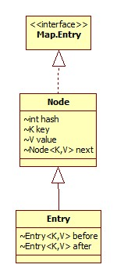

LinkedHashMap是HashMap的子类，内部使用双链表进行顺序的维护，内部类Entry为HashMap的Node的子类，类图:



# 构造器

三参数构造器:

```java
public LinkedHashMap(int initialCapacity, float loadFactor, boolean accessOrder) {
    super(initialCapacity, loadFactor);
    this.accessOrder = accessOrder;
}
```

如果accessOrder为true，那么表示将顺序记录为访问顺序，否则为插入顺序，默认为false。而正是这一参数并对removeEldestEntry方法进行覆盖便可以快速实现一个简单的LRU缓存。

# put

put操作其实和父类HashMap采用相同的实现，在HashMap部分也提到了afterNodeAccess和afterNodeInsertion方法其实是空实现，而在LinkedHashMap中对其进行了实现，Linked的特性也是在这里进行了体现。

## newNode

LinkedhHashMap对此方法进行了覆盖:

```java
Node<K,V> newNode(int hash, K key, V value, Node<K,V> e) {
    LinkedHashMap.Entry<K,V> p = new LinkedHashMap.Entry<K,V>(hash, key, value, e);
    linkNodeLast(p);
    return p;
}
```

linkNodeLast方法负责双链表的连接:

```java
private void linkNodeLast(LinkedHashMap.Entry<K,V> p) {
    LinkedHashMap.Entry<K,V> last = tail;
    tail = p;
    if (last == null)
        head = p;
    else {
        p.before = last;
        last.after = p;
    }
}
```

## afterNodeAccess

顾名思义，此方法应该在一次访问之后被调用，那么什么算是一次访问呢?LInkedHashMap对此做出了定义:

- put/putAll/putIfAbsent
- get/getOrDefault
- compute/computeIfAbsent/computeIfPresent
- merge

```java
void afterNodeAccess(Node<K,V> e) { // move node to last
    LinkedHashMap.Entry<K,V> last;
    if (accessOrder && (last = tail) != e) {
        LinkedHashMap.Entry<K,V> p =
            (LinkedHashMap.Entry<K,V>)e, b = p.before, a = p.after;
        p.after = null;
        if (b == null)
            head = a;
        else
            b.after = a;
        if (a != null)
            a.before = b;
        else
            last = b;
        if (last == null)
            head = p;
        else {
            p.before = last;
            last.after = p;
        }
        tail = p;
        ++modCount;
    }
}
```

双链表的节点位置交换过程。

## afterNodeInsertion

```java
void afterNodeInsertion(boolean evict) { // possibly remove eldest
    LinkedHashMap.Entry<K,V> first;
    if (evict && (first = head) != null && removeEldestEntry(first)) {
        K key = first.key;
        removeNode(hash(key), key, null, false, true);
    }
}
```

evict参数如果为false，表示处于创建模式，在反序列化时才会处于创建模式，**而反序列化时当然不能进行节点淘汰**，这便是此参数的意义。

正如前面提到过的，removeEldestEntry是实现LRU的关键:

```java
protected boolean removeEldestEntry(Map.Entry<K,V> eldest) {
    return false;
}
```

即默认不进行移除，可以看出，传给removeEldestEntry方法的是每个bin的第一个元素，因为无论参数accessOrder为true与否，**第一个必定是最老(最先被插入或最久未被使用)的**。

# get

```java
public V get(Object key) {
    Node<K,V> e;
    if ((e = getNode(hash(key), key)) == null)
        return null;
    if (accessOrder)
        afterNodeAccess(e);
    return e.value;
}
```

HashMap的get加afterNodeAccess触发的过程。

# 性能

与HashMap相比，LinkedHashMap由于在插入是需要进行额外的双链表链接工作，所以在插入性能上必定不如HashMap，但在遍历时，LinkedHashMap的性能反而更高，因为只需遍历链表即可，而HashMap需要遍历bin和链表(或红黑树)。