# SelectionKey

SelectionKey的类图如下:

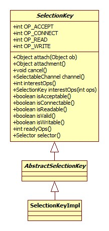

注意，SelectionKey使用AtomicReferenceFieldUpdater进行原子更新attachment，这货就像是Channel和Selector结合的结晶。

## 兴趣设置

SelectionKeyImpl.interestOps:

```java
public SelectionKey interestOps(int ops) {
    ensureValid();
    return nioInterestOps(ops);
}
```

nioInterestOps利用Channel来实现:

```java
public SelectionKey nioInterestOps(int ops) {
    channel.translateAndSetInterestOps(ops, this);
    interestOps = ops;
    return this;
}
```

这里服务器和客户端有不同的实现。

### 客户端

SocketChannelImpl.translateAndSetInterestOps:

```java
public void translateAndSetInterestOps(int ops, SelectionKeyImpl sk) {
    int newOps = 0;
    if ((ops & SelectionKey.OP_READ) != 0)
        newOps |= Net.POLLIN;
    if ((ops & SelectionKey.OP_WRITE) != 0)
        newOps |= Net.POLLOUT;
    if ((ops & SelectionKey.OP_CONNECT) != 0)
        newOps |= Net.POLLCONN;
    sk.selector.putEventOps(sk, newOps);
}
```

### 服务器

ServerSocketChannelImpl.translateAndSetInterestOps:

```java
public void translateAndSetInterestOps(int ops, SelectionKeyImpl sk) {
    int newOps = 0;
    if ((ops & SelectionKey.OP_ACCEPT) != 0)
        newOps |= PollArrayWrapper.POLLIN;
    sk.selector.putEventOps(sk, newOps);
}
```

从这里我们可以得出结论: Java中的accept事件其实就是epoll的POLLIN，ServerSocket/Socket，ServerSocketChannel/SocketChannel本身是有Java抽象出来的概念，在底层系统实现中都是一个文件描述符。

epoll支持的所有事件参考Linux man page:

[Linux Programmer's Manual EPOLL_CTL(2)](http://man7.org/linux/man-pages/man2/epoll_ctl.2.html)

EPollSelectorImpl.putEventOps:

```java
public void putEventOps(SelectionKeyImpl ski, int ops) {
    SelChImpl ch = ski.channel;
    pollWrapper.setInterest(ch.getFDVal(), ops);
}
```

在Linux的实现中pollWrapper是一个EPollArrayWrapper类型，为epoll_event结构体的封装。setInterest方法的实际实现由setUpdateEvents完成:

```java
private void setUpdateEvents(int fd, byte events, boolean force) {
    if (fd < MAX_UPDATE_ARRAY_SIZE) {
        if ((eventsLow[fd] != KILLED) || force) {
            eventsLow[fd] = events;
        }
    } else {
        Integer key = Integer.valueOf(fd);
        if (!isEventsHighKilled(key) || force) {
            eventsHigh.put(key, Byte.valueOf(events));
        }
    }
}
```

可以看出，兴趣(epoll事件)的保存有两种方式:

- 如果文件描述符小于MAX_UPDATE_ARRAY_SIZE，那么保存在byte数组。
- 如果文件描述符大于MAX_UPDATE_ARRAY_SIZE，那么保存在Map<Integer,Byte>中。

官方的解释是性能原因。那么问题来了，MAX_UPDATE_ARRAY_SIZE是什么?

```java
private static final int MAX_UPDATE_ARRAY_SIZE = AccessController.doPrivileged(
        new GetIntegerAction("sun.nio.ch.maxUpdateArraySize", Math.min(OPEN_MAX, 64*1024)));
```

属性值默认肯定是没有设置的，OPEN_MAX的取值:

```java
private static final int OPEN_MAX = IOUtil.fdLimit();
```

fdLimit为native方法:

```c
JNIEXPORT jint JNICALL Java_sun_nio_ch_IOUtil_fdLimit(JNIEnv *env, jclass this) {
    struct rlimit rlp;
    if (getrlimit(RLIMIT_NOFILE, &rlp) < 0) {
        JNU_ThrowIOExceptionWithLastError(env, "getrlimit failed");
        return -1;
    }
    //如果为负值或大于Java int最大值，那么取int最大值
    if (rlp.rlim_max < 0 || rlp.rlim_max > java_lang_Integer_MAX_VALUE) {
        return java_lang_Integer_MAX_VALUE;
    } else {
        return (jint)rlp.rlim_max;
    }
}
```

getrlimit为Linux系统调用，用于获得系统对于资源的限制，第一个参数用以指定需要获取哪个资源，RLIMIT_NOFILE即文件描述符。

返回结果中的rlim_max表示硬限制(hard limit)。参考Linux man page:

[Linux Programmer's Manual GETRLIMIT(2)](http://man7.org/linux/man-pages/man2/setrlimit.2.html)

可以得出结论:

这里的兴趣设置只是暂时保存在Java中，而没有真正的设置到epoll中，相当于一个缓存，那么在什么时候设置到epoll中呢?参见Selector-select-poll一节。

## 取消

cancel方法用于通道到Selector的注册，AbstractSelectionKey.cancel:

```java
public final void cancel() {
    synchronized (this) {
        if (valid) {
            valid = false;
            ((AbstractSelector)selector()).cancel(this);
        }
    }
}
```

AbstractSelector.cancel:

```java
void cancel(SelectionKey k) {                   
    synchronized (cancelledKeys) {
        cancelledKeys.add(k);
    }
}
```

这里将有效的标志位设为了false，cancelledKeys是一个Set，可以看出，cancel方法的调用并不会导致Selector的立即响应，参见Selector-select一节。正因为如此，假设我们将一个key取消后立即(在这两个过程之间没有发生select操作)再次注册，那么会导致CancelledKeyException，抛出的位置在SelectionKeyImpl的interestOps方法。

# Selector

官方的定义是SelectableChannel的多路复用器。类图:

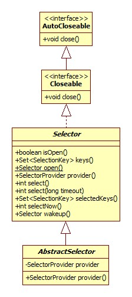

AbstractSelector存在的意义是允许不同的服务提供者以平台相关的方式进行创建，比如在Windows平台上，完整的继承体系是这样:

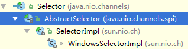

## 创建

我们通常用下列方式进行创建:

```java
 Selector selector = Selector.open();
```

源码:

```java
public static Selector open() throws IOException {
    return SelectorProvider.provider().openSelector();
}
```

SelectorProvider定义了Selector的提供者。类图:

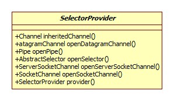

在Windows上的完整继承体系:

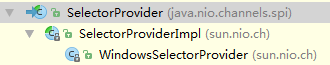

SelectorProvider的查找顺序如下:

- VM属性java.nio.channels.spi.SelectorProvider。

- 加载 系统服务，即jar包/META-INF/services文件夹下，这个默认是没有的。

- 默认方式:

  ```java
  provider = sun.nio.ch.DefaultSelectorProvider.create();
  ```

  在Windows上的实现便是:

  ```java
  public static SelectorProvider create() {
    return new WindowsSelectorProvider();
  }
  ```

  Linux实现:

  ```java
  public static SelectorProvider create() {
    String osname = AccessController
        .doPrivileged(new GetPropertyAction("os.name"));
    if (osname.equals("SunOS"))
        return createProvider("sun.nio.ch.DevPollSelectorProvider");
    if (osname.equals("Linux"))
        return createProvider("sun.nio.ch.EPollSelectorProvider");
    return new sun.nio.ch.PollSelectorProvider();
  }
  ```

  下面我们以Linux基准。

EPollSelectorProvider.openSelector:

```java
public AbstractSelector openSelector() throws IOException {
    return new EPollSelectorImpl(this);
}
```

## 通道注册

register方法在AbstractSelector中定义，SelectorImpl中实现:

```java
protected final SelectionKey register(AbstractSelectableChannel ch,int ops,Object attachment) {
    SelectionKeyImpl k = new SelectionKeyImpl((SelChImpl)ch, this);
    k.attach(attachment);
    synchronized (publicKeys) {
        implRegister(k);
    }
    k.interestOps(ops);
    return k;
}
```

publicKeys为一个Set，保存着注册在当前Selector的key，EPollSelectorImpl.implRegister:

```java
protected void implRegister(SelectionKeyImpl ski) {
    SelChImpl ch = ski.channel;
    int fd = Integer.valueOf(ch.getFDVal());
    //文件描述符到key的映射
    fdToKey.put(fd, ski);
    pollWrapper.add(fd);
    //Set
    keys.add(ski);
}
```

### 文件描述符

方法里的fd为一个int形式的文件描述符的值，这到底是个什么东西呢?通道内有一个fdVal属性，即为此值，在其构造器中初始化:

```java
SocketChannelImpl(SelectorProvider sp) {
    this.fd = Net.socket(true);
    this.fdVal = IOUtil.fdVal(fd);
}
```

IOUtil的fdVal为native实现:

```c
jint fdval(JNIEnv *env, jobject fdo) {
    return (*env)->GetIntField(env, fdo, fd_fdID);
}
```

获得其实就是FileDescriptor的int型字段fd。回顾Socket的创建或是下面通道-open一节，可以发现这个值其实就是系统调用socket返回的值，此值便是**套接字描述符**，其实就是系统为每个进程维护的文件描述符表(数组)的下标(索引)，并且是递增的。为什么要这么设计呢，因为使用套接字的时候不可避免的需要用到IP协议 版本，远程地址等一系列属性，套接字描述符为这些属性的获取、设置与传递提供了便利。参考:

[Linux的SOCKET编程详解](http://blog.csdn.net/hguisu/article/details/7445768/)

### 事件占位

EPollArrayWrapper.add:

```java
void add(int fd) {
    synchronized (updateLock) {
        assert !registered.get(fd);
        setUpdateEvents(fd, (byte)0, true);
    }
}
```

setUpdateEvents方法参见SelectionKey-兴趣设置，叫占位的原因就是真正的事件设置由SelectionKey完成。

## select

返回就绪的通道数，阻塞方法。SelectorImpl.select调用了select(0)方法:

```java
public int select(long timeout) {
    //epoll_wait的timeout参数为-1表示阻塞，0表示立即返回
    return lockAndDoSelect((timeout == 0) ? -1 : timeout);
}
```

SelectorImpl.lockAndDoSelect:

```java
private int lockAndDoSelect(long timeout) {
    synchronized (this) {
        synchronized (publicKeys) {
            synchronized (publicSelectedKeys) {
                return doSelect(timeout);
            }
        }
    }
}
```

EPollSelectorImpl.doSelect:

```java
protected int doSelect(long timeout) {
    processDeregisterQueue();
    try {
        begin();
        pollWrapper.poll(timeout);
    } finally {
        end();
    }
    processDeregisterQueue();
    int numKeysUpdated = updateSelectedKeys();
    if (pollWrapper.interrupted()) {
        // Clear the wakeup pipe
        pollWrapper.putEventOps(pollWrapper.interruptedIndex(), 0);
        synchronized (interruptLock) {
            pollWrapper.clearInterrupted();
            IOUtil.drain(fd0);
            interruptTriggered = false;
        }
    }
    return numKeysUpdated;
}
```

Linux epoll实现总共只有三个函数:

- int epoll_create(int size)，创建epoll文件描述符(epoll也占用一个文件描述符)，自Linux2.6内核以后size参数被忽略。
- int epoll_ctl(int epfd, int op,int fd, struct epoll_event *event)，为文件描述符设置感兴趣的事件，epfd即epoll_create的返回值，op共有三种取值:
  - EPOLL_CTL_ADD: 注册新的fd到epfd中。
  - EPOLL_CTL_MOD: 修改已经注册的fd的监听事件。
  - EPOLL_CTL_DEL: 从epfd中删除一个fd。
- int epoll_wait(int epfd, structepoll_event * events, int maxevents, int timeout)，即select操作，将结果保存到第二个参数events中。

### 取消事件处理

明显可以看出，pollWrapper.poll(timeout)是select操作的核心，也是可能发生阻塞的地方，在poll操作的两侧各有一次取消事件处理的入口(processDeregisterQueue):

```java
void processDeregisterQueue() throws IOException {
    // Precondition: Synchronized on this, keys, and selectedKeys
    Set<SelectionKey> cks = cancelledKeys();
    synchronized (cks) {
        if (!cks.isEmpty()) {
            Iterator<SelectionKey> i = cks.iterator();
            while (i.hasNext()) {
                SelectionKeyImpl ski = (SelectionKeyImpl)i.next();
                try {
                    implDereg(ski);
                } catch (SocketException se) {
                    throw new IOException("Error deregistering key", se);
                } finally {
                    i.remove();
                }
            }
        }
    }
}
```

遍历+移除的过程，取消的核心逻辑位于EPollSelectorImpl.implDereg:

```java
protected void implDereg(SelectionKeyImpl ski) {
    assert (ski.getIndex() >= 0);
    SelChImpl ch = ski.channel;
    int fd = ch.getFDVal();
    fdToKey.remove(Integer.valueOf(fd));
    pollWrapper.remove(fd);
    ski.setIndex(-1);
    keys.remove(ski);
    selectedKeys.remove(ski);
    //从Channel的key集合中移除
    deregister((AbstractSelectionKey)ski);
    SelectableChannel selch = ski.channel();
    //如果通道已关闭且没有注册到任何Selector中
    if (!selch.isOpen() && !selch.isRegistered())
        ((SelChImpl)selch).kill();
}
```

如果判断通道有没有注册到Selector中呢，其实很简单, AbstractSelectableChannel.isRegistered:

```java
public final boolean isRegistered() {
    synchronized (keyLock) {
        return keyCount != 0;
    }
}
```

keyCount被addKey方法增加，参考通道-Selector注册一节。

### poll

EPollArrayWrapper.poll:

```java
int poll(long timeout) throws IOException {
    updateRegistrations();
    updated = epollWait(pollArrayAddress, NUM_EPOLLEVENTS, timeout, epfd);
    //中断检测
    for (int i=0; i<updated; i++) {
        if (getDescriptor(i) == incomingInterruptFD) {
            interruptedIndex = i;
            interrupted = true;
            break;
        }
    }
    return updated;
}
```

#### 兴趣(事件)处理

这里与SelectionKey-兴趣设置一节相呼应。Java其实对epoll兴趣的注册提供了缓存机制，每一次的select/poll调用都会导致之前缓存的兴趣被注册。

EPollArrayWrapper.updateRegistrations:

```java
private void updateRegistrations() {
    synchronized (updateLock) {
        int j = 0;
        while (j < updateCount) {
            int fd = updateDescriptors[j];
            short events = getUpdateEvents(fd);
            boolean isRegistered = registered.get(fd);
            int opcode = 0;
            if (events != KILLED) {
                if (isRegistered) {
                    opcode = (events != 0) ? EPOLL_CTL_MOD : EPOLL_CTL_DEL;
                } else {
                    opcode = (events != 0) ? EPOLL_CTL_ADD : 0;
                }
                if (opcode != 0) {
                    epollCtl(epfd, opcode, fd, events);
                    if (opcode == EPOLL_CTL_ADD) {
                        registered.set(fd);
                    } else if (opcode == EPOLL_CTL_DEL) {
                        registered.clear(fd);
                    }
                }
            }
            j++;
        }
        updateCount = 0;
    }
}
```

整个逻辑一目了然，Java使用了BitSet来保存文件描述符是否被注册过。epollCtl即epoll_ctl函数，注意EPOLL_CTL_MOD会清除之前的兴趣标志位。

epfd是在EPollArrayWrapper的构造器中被初始化，相关源码:

```java
// creates the epoll file descriptor
epfd = epollCreate();
```

#### 事件数组

epollWait即对epoll_wait的包装，结果保存在地址为pollArrayAddress的数组中，此数组在EPollArrayWrapper构造器中被初始化，源码:

```java
int allocationSize = NUM_EPOLLEVENTS * SIZE_EPOLLEVENT;
AllocatedNativeObject pollArray = new AllocatedNativeObject(allocationSize, true);
long pollArrayAddress = pollArray.address();
```

AllocatedNativeObject其实代表了一块连续的指定字节大小的堆外内存。SIZE_EPOLLEVENT代表了一个epoll事件的大小(字节数)，NUM_EPOLLEVENTS代表返回的最大事件数:

```java
private static final int SIZE_EPOLLEVENT = sizeofEPollEvent();
private static final int NUM_EPOLLEVENTS  = Math.min(OPEN_MAX, 8192);
```

sizeofEPollEvent的native实现也很简单:

```c
JNIEXPORT jint JNICALL Java_sun_nio_ch_EPollArrayWrapper_sizeofEPollEvent(JNIEnv* env, jclass this) {
    return sizeof(struct epoll_event);
}
```

#### 中断检测

结合下面wakeup一节，很容易理解poll方法的中断检测部分做了什么。

### 就绪事件更新

EPollSelectorImpl.updateSelectedKeys:

```java
private int updateSelectedKeys() {
    int entries = pollWrapper.updated;
    int numKeysUpdated = 0;
    for (int i=0; i<entries; i++) {
        int nextFD = pollWrapper.getDescriptor(i);
        SelectionKeyImpl ski = fdToKey.get(Integer.valueOf(nextFD));
        // ski is null in the case of an interrupt
        if (ski != null) {
            int rOps = pollWrapper.getEventOps(i);
            if (selectedKeys.contains(ski)) {
                if (ski.channel.translateAndSetReadyOps(rOps, ski)) {
                    numKeysUpdated++;
                }
            } else {
                ski.channel.translateAndSetReadyOps(rOps, ski);
                if ((ski.nioReadyOps() & ski.nioInterestOps()) != 0) {
                    selectedKeys.add(ski);
                    numKeysUpdated++;
                }
            }
        }
    }
    return numKeysUpdated;
}
```

逻辑很清晰，就是一个更新SelectionKey的就绪事件并添加到selectedKeys集合的过程，同时可以发现这里并没有key移除的代码，这也是为什么我们需要在使用完之后进行手动移除的原因。

我们来看一下是如何获取就绪事件的文件描述符和ops的。

```java
int getDescriptor(int i) {
    int offset = SIZE_EPOLLEVENT * i + FD_OFFSET;
    return pollArray.getInt(offset);
}
```

实际上是通过Unsafe根据地址来进行获取的，关键在于描述符的地址。epoll_event的定义如下:

```c
typedef union epoll_data {
    void    *ptr;
    int      fd;
    uint32_t u32;
    uint64_t u64;
} epoll_data_t;

struct epoll_event {
    uint32_t     events;    /* Epoll events */
    epoll_data_t data;      /* User data variable */
};
```

FD_OFFSET等于DATA_OFFSET，后者由native方法offsetofData获得:

```c
JNIEXPORT jint JNICALL Java_sun_nio_ch_EPollArrayWrapper_offsetofData(JNIEnv* env, jclass this) {
    return offsetof(struct epoll_event, data);
}
```

offsetof为Linux系统调用，返回结构体里指定字段的偏移。epoll_data_t为一个联合体，就可以理解了。

getEventOps的实现很类似:

```java
int getEventOps(int i) {
    int offset = SIZE_EPOLLEVENT * i + EVENT_OFFSET;
    return pollArray.getInt(offset);
}
```

EVENT_OFFSET为0.

和SelectionKey-兴趣设置一节一样，这里服务器和客户端的处理也是不一样的。

#### 服务器

ServerSocketChannelImpl.translateReadyOps(initialOps为0):

```java
public boolean translateReadyOps(int ops, int initialOps, SelectionKeyImpl sk) {
    int intOps = sk.nioInterestOps();
    int oldOps = sk.nioReadyOps();
    int newOps = initialOps;
    if ((ops & PollArrayWrapper.POLLNVAL) != 0) {
        // This should only happen if this channel is pre-closed while a
        // selection operation is in progress
        // ## Throw an error if this channel has not been pre-closed
        return false;
    }
    //pollhup和pollerr将导致感兴趣的事件的触发
    if ((ops & (PollArrayWrapper.POLLERR | PollArrayWrapper.POLLHUP)) != 0) {
        newOps = intOps;
        sk.nioReadyOps(newOps);
        return (newOps & ~oldOps) != 0;
    }
    //检测OP_ACCEPT
    if (((ops & PollArrayWrapper.POLLIN) != 0) &&
        ((intOps & SelectionKey.OP_ACCEPT) != 0))
            newOps |= SelectionKey.OP_ACCEPT;
    sk.nioReadyOps(newOps);
    return (newOps & ~oldOps) != 0;
}
```

#### 客户端

略。

### 中断处理

即EPollSelectorImpl.doSelect方法中的这一部分内容:

```java
if (pollWrapper.interrupted()) {
    //这一步的目的是删除就绪结果中中断文件描述符的相关结果
    pollWrapper.putEventOps(pollWrapper.interruptedIndex(), 0);
    synchronized (interruptLock) {
        //EPollArrayWrapper interrupted设为false
        pollWrapper.clearInterrupted();
        IOUtil.drain(fd0);
        //可以再次响应中断
        interruptTriggered = false;
    }
}
```

drain为native实现:

```c
JNIEXPORT jboolean JNICALL Java_sun_nio_ch_IOUtil_drain(JNIEnv *env, jclass cl, jint fd) {
    char buf[128];
    int tn = 0;
    for (;;) {
        int n = read(fd, buf, sizeof(buf));
        tn += n;
        if ((n < 0) && (errno != EAGAIN))
            JNU_ThrowIOExceptionWithLastError(env, "Drain");
        if (n == (int)sizeof(buf))
            continue;
        return (tn > 0) ? JNI_TRUE : JNI_FALSE;
    }
}
```

正如方法名的含义，这一步的目的是将管道中剩余的所有数据读取出来，防止下一次select时再次被作为就绪事件返回。到这里有个疑问: 删除结果集中的相关标志位是在updateSelectedKeys之后进行的，也就是说updateSelectedKeys方法里仍可以得到中断结果。其实解决方式就是这一句:

```java
if (ski != null)
```

中断文件描述符必然找不到与之对应的SelectionKey.

## wakeup

EPollSelectorImpl.wakeup:

```java
public Selector wakeup() {
    synchronized (interruptLock) {
        //interruptTriggered保证了相邻两次wakeup调用只有一次有效
        if (!interruptTriggered) {
            pollWrapper.interrupt();
            interruptTriggered = true;
        }
    }
    return this;
}
```

EPollArrayWrapper.interrupt:

```java
public void interrupt() {
    interrupt(outgoingInterruptFD);
}
```

outgoingInterruptFD由initInterrupt方法设置:

```java
void initInterrupt(int fd0, int fd1) {
    outgoingInterruptFD = fd1;
    incomingInterruptFD = fd0;
    epollCtl(epfd, EPOLL_CTL_ADD, fd0, EPOLLIN);
}
```

而initInterrupt方法在EPollSelectorImpl的构造器中被调用:

```java
EPollSelectorImpl(SelectorProvider sp) {
    long pipeFds = IOUtil.makePipe(false);
    fd0 = (int) (pipeFds >>> 32);
    fd1 = (int) pipeFds;
    pollWrapper = new EPollArrayWrapper();
    pollWrapper.initInterrupt(fd0, fd1);
}
```

这里巧妙地使用了管道来唤醒Selector(epoll_wait)，epoll监听管道读的一端，当要唤醒epoll_wait时，向管道写入数据即可。管道是Linux中一种进程间通信的机制，但仅支持单向的通信，参考:

[linux管道的那点事](http://blog.chinaunix.net/uid-27034868-id-3394243.html)

[How to interrupt epoll_pwait with an appropriate signal? [duplicate]](http://stackoverflow.com/questions/9028934/how-to-interrupt-epoll-pwait-with-an-appropriate-signal)

makePipe用于将两个文件描述符组合成为一个管道，返回的long型中高32位为读文件描述符，低32位为写文件描述符:

```c
JNIEXPORT jlong JNICALL Java_sun_nio_ch_IOUtil_makePipe(JNIEnv *env, jobject this, jboolean blocking) {
    int fd[2];
    if (pipe(fd) < 0) {
        JNU_ThrowIOExceptionWithLastError(env, "Pipe failed");
        return 0;
    }
    //设置文件描述符的阻塞模式
    if (blocking == JNI_FALSE) {
        if ((configureBlocking(fd[0], JNI_FALSE) < 0)
            || (configureBlocking(fd[1], JNI_FALSE) < 0)) {
            JNU_ThrowIOExceptionWithLastError(env, "Configure blocking failed");
            close(fd[0]);
            close(fd[1]);
            return 0;
        }
    }
    return ((jlong) fd[0] << 32) | (jlong) fd[1];
}
```

pipe为Linux系统调用。这样initInterrupt方法中的逻辑就可以理解了。

interrupt(outgoingInterruptFD)一行为native调用:

```c
JNIEXPORT void JNICALL
Java_sun_nio_ch_EPollArrayWrapper_interrupt(JNIEnv *env, jobject this, jint fd) {
    int fakebuf[1];
    fakebuf[0] = 1;
    if (write(fd, fakebuf, 1) < 0) {
        JNU_ThrowIOExceptionWithLastError(env,"write to interrupt fd failed");
    }
}
```

果然，写了一个int数字进去，剩下的参见上面select一节。

## 关闭

AbstractSelector.close:

```java
public final void close() throws IOException {
    boolean open = selectorOpen.getAndSet(false);
    if (!open)
        return;
    implCloseSelector();
}
```

SelectorImpl.implCloseSelector:

```java
public void implCloseSelector() throws IOException {
    wakeup();
    synchronized (this) {
        synchronized (publicKeys) {
            synchronized (publicSelectedKeys) {
                implClose();
            }
        }
    }
}
```

EPollSelectorImpl.implClose:

```java
protected void implClose() throws IOException {
    if (closed)
        return;
    closed = true;
    // prevent further wakeup
    synchronized (interruptLock) {
        interruptTriggered = true;
    }
    FileDispatcherImpl.closeIntFD(fd0);
    FileDispatcherImpl.closeIntFD(fd1);
    //关闭epoll
    pollWrapper.closeEPollFD();
    // it is possible
    selectedKeys = null;
    // Deregister channels
    Iterator<SelectionKey> i = keys.iterator();
    while (i.hasNext()) {
        SelectionKeyImpl ski = (SelectionKeyImpl)i.next();
        deregister(ski);
        SelectableChannel selch = ski.channel();
        if (!selch.isOpen() && !selch.isRegistered())
            ((SelChImpl)selch).kill();
        i.remove();
    }
    fd0 = -1;
    fd1 = -1;
}
```

一目了然。

# 通道

FileChannel我们已经见识过了，下面再来见识一下网络通道。两者的继承体系有相同的部分，从AbstractInterruptibleChannel开始分家，我们的类图就从AbstractInterruptibleChannel开始。

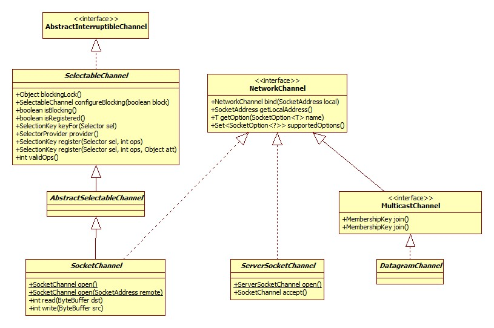

对于通道部分，仍以Windows作为参考，因为这样便于与Socket的底层实现进行对比。

## open

以ServerSocketChannel为例:

```java
public static ServerSocketChannel open() throws IOException {
    return SelectorProvider.provider().openServerSocketChannel();
}
```

实际上构造了一个	ServerSocketChannelImpl对象，构造方法:

```java
ServerSocketChannelImpl(SelectorProvider sp) {
    super(sp);
    this.fd =  Net.serverSocket(true);
    this.fdVal = IOUtil.fdVal(fd);
    this.state = ST_INUSE;
}
```

Net.serverSocket:

```java
static FileDescriptor serverSocket(boolean stream) {
    return IOUtil.newFD(socket0(isIPv6Available(), stream, true));
}
```

可见，此处其实创建了一个与之关联的ServerSocket对象。socket0实现位于Net.c中，同样是对Windows API socket的调用。IOUtil.newFD负责文件描述符的创建，并将其与socket0返回的地址相关联。

## bind

ServerSocketChannelImpl.bind简略版源码:

```java
@Override
public ServerSocketChannel bind(SocketAddress local, int backlog){
    synchronized (lock) {
        Net.bind(fd, isa.getAddress(), isa.getPort());
        Net.listen(fd, backlog < 1 ? 50 : backlog);
        synchronized (stateLock) {
            localAddress = Net.localAddress(fd);
        }
    }
    return this;
}
```

和Socket一样，同样是分为bind和listen两个步骤，分别对应Net的native方法bind0和listen。bind在底层实现其实是 两个操作: bind和设置端口占用的排他性。bind即Windows函数bind，位于jdk\src\windows\native\java\net\net_util_md.c:

```c
JNIEXPORT int JNICALL
NET_Bind(int s, struct sockaddr *him, int len) {
    int rv;
    rv = bind(s, him, len);
    if (rv == SOCKET_ERROR) {
       //...
    }
    return rv;
}
```

排他性设置由net_util_md.c的NET_SetSockOpt函数实现，简略版源码:

```c
JNIEXPORT int JNICALL
NET_SetSockOpt(int s, int level, int optname, const void *optval,int optlen){
    int rv;
    int parg;
    int plen = sizeof(parg);
    rv = setsockopt(s, level, optname, optval, optlen);
    if (rv == SOCKET_ERROR) {
        //...
    }
    return rv;
}
```

其实和Socket都是一套API.

## configureBlocking

由ServerSocketChannelImpl.implConfigureBlocking实现:

```java
protected void implConfigureBlocking(boolean block) throws IOException {
    IOUtil.configureBlocking(fd, block);
}
```

底层实现便是Windows的ioctlsocket函数，ServerSocket中，被用以实现带超时参数的accept，并未被用于实现非阻塞IO。

## selector注册

AbstractSelectableChannel.register简略版源码:

```java
public final SelectionKey register(Selector sel, int ops,Object att) {
    synchronized (regLock) {
        SelectionKey k = findKey(sel);
        if (k != null) {
            k.interestOps(ops);
            k.attach(att);
        }
        if (k == null) {
            // New registration
            synchronized (keyLock) {
                if (!isOpen())
                    throw new ClosedChannelException();
                k = ((AbstractSelector)sel).register(this, ops, att);
                //加入数组
                addKey(k);
            }
        }
        return k;
    }
}
```

方法将首先检查当前通道是否已经向给定的Selector注册过了 ，AbstractSelectableChannel内部维护有一个SelectionKey数组，findKey方法便是遍历此数组逐一比较其Selector的过程。

SelectableChannel.regist注释上提到，此方法可能会被阻塞如果当前有另一个线程阻塞在select上，这是怎么实现的呢?

SelectorImpl.register方法需要对publicKeys加锁:

```java
synchronized (publicKeys) {
    implRegister(k);
}
```

而执行select操作的lockAndDoSelect方法同样需要对此属性加锁:

```java
synchronized (publicKeys) {
    synchronized (publicSelectedKeys) {
        return doSelect(timeout);
    }
}
```

epoll_wait的阻塞并不会释放锁。

## 读

从类图中可以看出，只有SocketChannel才具有读写功能，ServerSocketChannel并不具备，这和Socket和ServerSocket的关系是一样的。

源码实现与FileChannle大体类似，但是有两点值得注意:

- 线程安全性，读的核心代码全部位于以下线程同步块中:

  ```java
  synchronized (readLock) {
    //code...
  }
  ```

  而写代码为writeLock，这也就验证了Channel线程安全的定义，同时说明**SocketChannel支持写和读之间的并行，但不能写与写、读与读之间并行**，这一特性其实是与TCP/IP协议相关的，所以，很容易可以推测FileChannel仅支持单线程读写，FileChannelImpl.read部分源码:

  ```java
  synchronized(positionLock) {//code...}
  ```

- 源码使用了字段readerThread来唤醒被阻塞的线程，那么这里的阻塞到底指的什么呢?其实从系统层面上来说，一个读的过程可以分为两部分:

  - 从网络、文件读取。
  - 内核将读到的数据从内核空间拷贝到用户空间交于用户程序使用。

  Java的阻塞IO与非阻塞IO(NIO)是针对第一个阶段而言的，第二个阶段仍是阻塞的。


Java阻塞IO与非阻塞IO的表现可总结 如下: 

Linux上的Java实现实际上是对系统调用read/write的封装，Java层面表现出来的特性其实是系统调用的反应。以写为例，在什么情况下会发生阻塞呢?对于TCP/IP协议栈，操作系统会为每个Socket维护一个发送缓冲区和一个接收缓冲区，所有待发送的数据应首先被放置到发送缓冲区中，但内核并不保证缓冲区中的数据一定会被发送出去，发送缓冲区的情况决定了写操作是否会被阻塞。

那么这个缓冲区一般有多大呢?在Linux上可以通过以下两个命令进行查看:

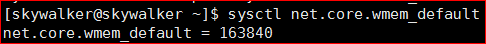

最大大小:

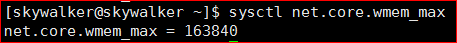

一般取值就在默认和最大之间，在我的ArchLinux虚拟机上两者是一样的，即160KB。

写操作在阻塞和非阻塞下的不同表现可总结如下:

- 如果发送缓冲区满，那么阻塞写将会阻塞，而非阻塞写返回0.
- 如果发送缓冲区不满，那么阻塞写会阻塞直到**发送缓冲区能够放下所有的待写数据**，而非阻塞写将返回**能够放下的字节数**。

对于阻塞写，还有一个非常有意思的细节，如果我们在写时如果连接已经断开，那么将会把发送缓冲填满并返回填入的字节数，**在第二次写的时候才会报错**，这个问题在实际中遇到了。

而读操作**只要接收缓冲区中有数据就会返回，而不会等到接收缓冲区满**，不同表现总结如下:

- 如果读缓冲为空，那么阻塞读将会阻塞，非阻塞读会返回0.

读的特性可利用以下代码结合Linux nc命令很容易证明:

```java
@Test
public void nioRead() {
    SocketChannel channel = SocketChannel.open();
    channel.configureBlocking(false);
     //Linux nc监听地址
    channel.connect(new InetSocketAddress("192.168.80.128", 10010));
    while (channel.isConnectionPending()) {
        channel.finishConnect();
    }
    ByteBuffer buffer = ByteBuffer.allocate(10);
    int readed = channel.read(buffer);
    System.out.println(readed);
}
```

这里有一个以前没注意过的细节，对于非阻塞IO其connect方法也是非阻塞，也就是说，很有可能当我们调用read方法时连接还没有完成，所以我们需要循环调用isConnectionPending直到完成。参考:

 [Unix/Linux中的read和write函数](http://www.cnblogs.com/xiehongfeng100/p/4619451.html)

[Linux IO模式及 select、poll、epoll详解](https://segmentfault.com/a/1190000003063859)

## accept

ServerSocketChannelImpl.accept简略版源码:

```java
public SocketChannel accept() {
    synchronized (lock) {
        FileDescriptor newfd = new FileDescriptor();
        InetSocketAddress[] isaa = new InetSocketAddress[1];
        accept0(this.fd, newfd, isaa);
        IOUtil.configureBlocking(newfd, true);
        InetSocketAddress isa = isaa[0];
        sc = new SocketChannelImpl(provider(), newfd, isa);
        return sc;
    }
}
```

accept0为native方法，可以看出，其负责设置了新的文件描述符，创建ScoketChannel对象，注意，默认为阻塞模式。底层实现仍为accept函数，和ServerSocket一样。

## connect

Linux connect系统调用。

## socket

此方法用于获取通道对应的Socket对象，为什么要特别说明这个方法呢?这是因为想到了一个很有意思的情景:

如果我们将通道设置为非阻塞模式，而又创建 一个BufferedOutputStream进行输出，正如以下代码所示:

```java
new BufferedOutputStream(channel.socket().getOutputStream());
```

众所周知BufferedOutputStream一般是用在阻塞场景下，那么当阻塞遇见非阻塞会发生什么呢?

SocketChannelImpl.socket:

```java
public Socket socket() {
    synchronized (stateLock) {
        if (socket == null)
            socket = SocketAdaptor.create(this);
        return socket;
    }
}
```

SocketAdaptor.create方法实际上创建了一个SocketAdaptor对象，SocketAdaptor位于sun.nio.ch包下，是Socket的子类，这货和我们在Socket部分提到的真正的实现类有什么区别呢?来看一看此类的注释说明:

> Make a socket channel look like a socket.
>
> Otherwise an adapter socket should look enough like a real java.net.Socket to fool most of the
> developers most of the time.

尼玛，这货是将一个通道弄得看起来像一个真的Socket，WTF!

getOutputStream方法由Channels.newOutputStream实现，而Channels类是一个nio相关的工具类，提供字节流、字符流和通道之间的相互转换，类图:


newOutputStream方法实现:

```java
public static OutputStream newOutputStream(final WritableByteChannel ch) {

    return new OutputStream() {
        private ByteBuffer bb = null;
        private byte[] bs = null;       // Invoker's previous array
        private byte[] b1 = null;
        public synchronized void write(int b) throws IOException {
           if (b1 == null)
                b1 = new byte[1];
            b1[0] = (byte)b;
            this.write(b1);
        }
        public synchronized void write(byte[] bs, int off, int len)
            throws IOException {
            if ((off < 0) || (off > bs.length) || (len < 0) ||
                ((off + len) > bs.length) || ((off + len) < 0)) {
                throw new IndexOutOfBoundsException();
            } else if (len == 0) {
                return;
            }
            ByteBuffer bb = ((this.bs == bs) ? this.bb : ByteBuffer.wrap(bs));
            bb.limit(Math.min(off + len, bb.capacity()));
            bb.position(off);
            this.bb = bb;
            this.bs = bs;
            Channels.writeFully(ch, bb);
        }
        public void close() throws IOException {
            ch.close();
        }
    };
}
```

可以看出，返回的其实是一个OutputStream的匿名子类，核心位于writeFully方法:

```java
private static void writeFully(WritableByteChannel ch, ByteBuffer bb) {
    if (ch instanceof SelectableChannel) {
        SelectableChannel sc = (SelectableChannel)ch;
        synchronized (sc.blockingLock()) {
            if (!sc.isBlocking())
                throw new IllegalBlockingModeException();
            writeFullyImpl(ch, bb);
        }
    } else {
        writeFullyImpl(ch, bb);
    }
}
```

关键就在于条件判断`if (!sc.isBlocking())`，也就是说，如果给定的通道处于非阻塞模式，那么直接抛出异常，这就很好的印证了流"阻塞"的语义，其实这里在做的就是用通道模仿出流的行为。

## 关闭

SocketChannel和FileChannel一样都是AbstractInterruptibleChannel的子类，所以close方法的实现是一样的:

```java
public final void close(){
    synchronized (closeLock) {
        if (!open)
            return;
        open = false;
        implCloseChannel();
    }
}
```

这里只是修改了开启标志位，很容易想到，SocketChannel关闭的核心是以下两步:

- 取消注册的key.
- 如果有线程阻塞在读或写上。

AbstractSelectableChannel.implCloseChannel:

```java
protected final void implCloseChannel() {
    implCloseSelectableChannel();
    //取消所有的key
    synchronized (keyLock) {
        int count = (keys == null) ? 0 : keys.length;
        for (int i = 0; i < count; i++) {
            SelectionKey k = keys[i];
            if (k != null)
                k.cancel();
        }
    }
}
```

SocketChannelImpl.implCloseSelectableChannel:

```java
protected void implCloseSelectableChannel() {
    synchronized (stateLock) {
        isInputOpen = false;
        isOutputOpen = false;
        if (state != ST_KILLED)
            nd.preClose(fd);
        //如果有线程阻塞在写/读上，那么唤醒之，这么做的原因是在Linux上关闭文件描述符并不会导致线程被唤醒，所以
        //需要手动唤醒，这一点在FileChannel关闭中也提到了
        if (readerThread != 0)
            NativeThread.signal(readerThread);
        if (writerThread != 0)
            NativeThread.signal(writerThread);
        //如果当前Channel不再被Select使用，那么kill掉，为什么不直接Kill呢，因为对SelectionKey.cancel方法的
        //调用同样会导致kill被调用
        if (!isRegistered())
            kill();
    }
}
```

kill方法:

```java
public void kill() throws IOException {
    synchronized (stateLock) {
        if (state == ST_KILLED)
            return;
        if (state == ST_UNINITIALIZED) {
            state = ST_KILLED;
            return;
        }
        assert !isOpen() && !isRegistered();
        // Postpone the kill if there is a waiting reader
        // or writer thread. See the comments in read() for
        // more detailed explanation.
        if (readerThread == 0 && writerThread == 0) {
            nd.close(fd);
            state = ST_KILLED;
        } else {
            state = ST_KILLPENDING;
        }
    }
}
```

### 预关闭

源码中nd.preClose(fd)用于对文件描述符进行预关闭，native实现位于FileDispatcherImpl.c:

```c
JNIEXPORT void JNICALL
Java_sun_nio_ch_FileDispatcherImpl_preClose0(JNIEnv *env, jclass clazz, jobject fdo) {
    jint fd = fdval(env, fdo);
    if (preCloseFD >= 0) {
        if (dup2(preCloseFD, fd) < 0)
            JNU_ThrowIOExceptionWithLastError(env, "dup2 failed");
    }
}
```

dup2位为Linux系统调用，函数声明为:

```c
int dup2(int oldfd, int newfd);
```

作用为将oldfd拷贝给newfd的值，newfd原先指向的文件描述符将被关闭，preClose0方法中的preCloseFD是一个已经关闭的描述符，这样可以防止由于内核对文件描述符的重用造成的读到其它描述符指向的内容的问题，这里可以参考FileChannel-关闭一节中的相关说明，dup2参考Linux man page:

[Linux Programmer's Manual DUP(2)](http://man7.org/linux/man-pages/man2/dup.2.html)

我们可以用如下方式对文件描述符进行验证，假设有命令`nc -l -p 10010`对10010端口进行监听，我们使用简单的Java连接此端口，使用ps命令得到此nc的进程号，在/proc/进程号/fd便是此进程拥有的文件描述符，如下图(ls -lh):

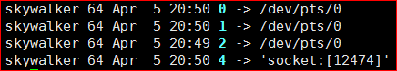

0,1,2是Unix中标准的文件描述符号，其意义如下:

| 文件描述符 | 用途   | POSIX名称       | stdio流 |
| ----- | ---- | ------------- | ------ |
| 0     | 标准输入 | STDIN_FILENO  | stdin  |
| 1     | 标准输出 | STDOUT_FILENO | stdout |
| 2     | 标准错误 | STDERR_FILENO | stderr |

参考: [每天进步一点点——Linux中的文件描述符与打开文件之间的关系](http://blog.csdn.net/cywosp/article/details/38965239)

那么socket后面的数字又是指的什么呢(如果在Redhat7上执行同样的命令，可以看到socket行为红色闪烁，这表示为找不到所连接的文件)。

这个数字其实是文件描述符的inode号，链接实际上指向/proc/net/tcp(6)或udp下的一行记录(所以找不到文件)，以inode号12884为例，执行命令: `cat /proc/net/tcp | grep 12884`:

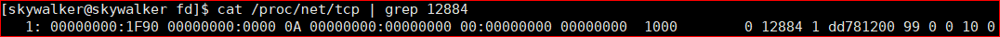

每一栏是什么意思执行命令`head -1 /proc/net/tcp`即可:


### 关闭

nd.close(fd)用以真正的关闭一个文件描述符，native由FileDispatcherImpl.c实现:

```c
static void closeFileDescriptor(JNIEnv *env, int fd) {
    if (fd != -1) {
        int result = close(fd);
        if (result < 0)
            JNU_ThrowIOExceptionWithLastError(env, "Close failed");
    }
}
```

close为Linux系统调用，引自man page的说法:

> **close**() closes a file descriptor, so that it no longer refers to any file and may be reused. 

所以close方法被调用后，文件描述符将被重用。

### 线程安全

SocketChannelImpl.kill方法中很值得玩味的一个细节:

```java
if (readerThread == 0 && writerThread == 0) {
    nd.close(fd);
    state = ST_KILLED;
} else {
    state = ST_KILLPENDING;
}
```

当有线程正在当前文件描述符上读/写时，并不会马上调用close方法，而是**延迟关闭**。为什么呢?

结合read方法部分源码:

```java
synchronized (stateLock) {
    if (!isOpen()) {
        return 0;
    }
    readerThread = NativeThread.current();
}
//here!
for (;;) {
    n = IOUtil.read(fd, buf, -1, nd);
    if ((n == IOStatus.INTERRUPTED) && isOpen()) {
        continue;
    }
    return IOStatus.normalize(n);
}
```

如果我们不采用延迟关闭，而是直接调用close方法，有三个线程分别执行以下操作:

- 关闭通道(1)。
- 读(2)。
- 资源申请(打开文件描述符, 3)。

假设它们的执行出现以下时序:

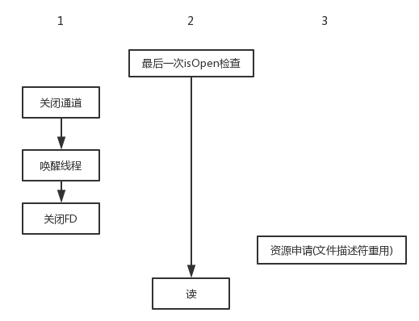

可以看出，这样读线程便读到了其它文件的数据。解决的办法便是推迟，由读(或写)线程调用readerCleanup方法最终完成文件描述符的关闭:

```java
private void readerCleanup() throws IOException {
    synchronized (stateLock) {
        readerThread = 0;
        if (state == ST_KILLPENDING)
            kill();
    }
}
```

### 总结

可能会有疑问，为啥普通的OIO socket关闭如此的简单粗暴?因为那是线程不安全的，相当于把保证线程安全的锅甩给了我们，而我们的使用场景又无需保证这一点(比如说，每个线程持有自己的连接)。:haha

# 如何让NIO跑满CPU

我们通过几个不正常的情况来更加深入的了解NIO的实现原理，这里的NIO特指select操作所在的线程，"跑满"准确来说是让一个CPU核心满载，因为假设只有一个select线程。

## 事件忽略

假设我们的select代码如下所示:

```java
while (true) {
    if (selector.select() > 0) {
        Set<SelectionKey> keys = selector.selectedKeys();
        Iterator<SelectionKey> iterator = keys.iterator();
        SelectionKey key;
        while (iterator.hasNext()) {
            key = iterator.next();
            if (key.isAcceptable()) {
                //nothing
            }
            iterator.remove();
        }
    }
}
```

然后我们再用一个普通的Socket去连接此服务监听的端口，触发accept事件:

```java
new Socket().connect(new InetSocketAddress(8080));
```

然后即可以看到一个CPU已跑满。这其实与epoll的两种事件触发机制有关:

- 水平触发(LT): 当被监控的文件描述符发生感兴趣的事件时，epoll将会一直通知你，直到事件被处理。比如对于读事件来说，epoll将会一直通知你直到把事件产生的Socket的读缓冲读完。
- 边沿触发(ET): 仅当事件发生变化时才会通知你。

Java采用水平触发且不可更改，所以在上面的代码中，accept一直没有处理(调用ServerSocketChannel的accept方法)，epoll也就不会阻塞而是一直通知你。

同时可以看出，我们只是在客户端一侧关闭了Socket连接，服务器没有(也没有机会有)取消epoll注册的操作，那epoll是如何处理这类连接(文件描述符)的呢?其实它会自动取消注册，参考Linux man page-Questions and answers Q6:

[Linux Programmer's Manual EPOLL(7)](http://man7.org/linux/man-pages/man7/epoll.7.html)

## SelectionKey不移除

将上面的代码改为:

```java
while (true) {
    if (selector.select() > 0) {
        Set<SelectionKey> keys = selector.selectedKeys();
        Iterator<SelectionKey> iterator = keys.iterator();
        SelectionKey key;
        while (iterator.hasNext()) {
            key = iterator.next();
            if (key.isAcceptable()) {
                channel.accept();
            }
        }
    }
}
```

还是用事件忽略中的客户端连接代码，进行两次连接，第一次不会出现问题，第二次将导致CPU满载，且selector.select()始终返回0.

问题的出现原因在于EPollSelectorImpl.updateSelectedKeys的这一部分:

```java
if (selectedKeys.contains(ski)) {
    if (ski.channel.translateAndSetReadyOps(rOps, ski)) {
        numKeysUpdated++;
    }
} 
```

可见，如果selectedKeys集合中已含有指定的key，那么只有在translateAndSetReadyOps返回true的情况下才会导致就绪事件数加一。

ServerSocketChannelImpl.translateReadyOps部分源码:

```java
public boolean translateReadyOps(int ops, int initialOps, SelectionKeyImpl sk) {
    int intOps = sk.nioInterestOps(); // Do this just once, it synchronizes
    int oldOps = sk.nioReadyOps();
    int newOps = initialOps;
    sk.nioReadyOps(newOps);
    return (newOps & ~oldOps) != 0;
}
```

由于两次都是accept事件，所以此方法返回false，这就致使虽然有accept事件，但最终返回的就绪事件数仍为0.

## 可写事件

OP_WRITE的注册同样会导致满载，将代码修改为:

```java
while (true) {
    if (selector.select() > 0) {
        Set<SelectionKey> keys = selector.selectedKeys();
        Iterator<SelectionKey> iterator = keys.iterator();
        SelectionKey key;
        while (iterator.hasNext()) {
            key = iterator.next();
            if (key.isAcceptable()) {
                SocketChannel client = channel.accept();
                client.configureBlocking(false);
                client.register(selector, SelectionKey.OP_WRITE);
            }
            iterator.remove();
        }
    }
}
```

问题的关键是理解在什么情况下可写事件会触发，对于Java使用的水平触发(LT)，**只要发送缓冲区不满，就是可写的**，可以想象，多数应用的多数情况下都会是可写的，所以正确的OP_WRITE使用姿势是: 当需要写的时候再去注册OP_WRITE事件。

这里再跑个题，为什么Java要求注册到Selector的通道必须是非阻塞的(如果尝试注册阻塞的，会抛出IllegalBlockingModeException)，前提是epoll LT模式同时支持阻塞和非阻塞，但ET仅支持非阻塞。

一般来说，我们的IO操作都是在select线程中完成的，我的理解是如果交由其它线程完成，那么其它线程IO完成和select线程下一次select这两个操作之间的顺序无法保证，很有可能出现当select线程进行下一次select时上一次通知的IO事件仍未被处理，这就造成了无谓的事件通知，况且这里的IO操作为从内核空间到用户空间的内存拷贝，完全取决于内存的性能，多线程并没有多大的意义。

有了上面这个前提，以写为例，考虑这样一种情形: 假设发送缓冲区目前剩余50个字节大小，但是我们需要写入200个字节，对于阻塞写便会一直保持阻塞直到200字节能够完全放入到发送缓冲区，这无疑影响了其它IO事件的处理。

# 空循环bug

