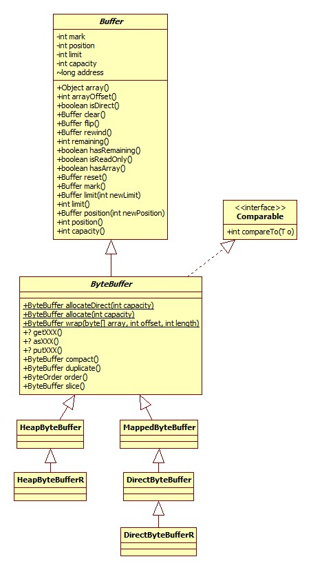

# Buffer

说到nio就离不开Buffer体系，类图:



这里以ByteBuffer为例，其实**对于布尔类型的其它所有基本类型，都与一种Buffer与之对应，比如还有ShortBuffer**。

图中的getXXX指的是获得各种数据类型的便利方法，比如getChar，getInt，putXXX也是一样。asXXX指到其它类型Buffer的转换方法，比如asCharBuffer。

注意，只有ByteBuffer才拥有getXXX, putXXX, asXXX等向其它类型转换的方法，也只有ByteBuffer可以获取direct类型的buffer。

## 获取

### allocate

得到heap buffer，源码:

```java
public static ByteBuffer allocate(int capacity) {
    return new HeapByteBuffer(capacity, capacity);
}
```

HeapByteBuffer构造器:

```java
HeapByteBuffer(int cap, int lim) { 	
    super(-1, 0, lim, cap, new byte[cap], 0);
}
```

可以看出，heap buffer的底层其实就是byte数组，构造完成之后各属性的状态如下:

- mark: 0
- pos: 0
- limit: capacity
- offset: 0

### allocateDirect

获取direct buffer，只有ByteBuffer才可以:

```java
public static ByteBuffer allocateDirect(int capacity) {
    return new DirectByteBuffer(capacity);
}
```

DirectByteBuffer构造器:

```java
DirectByteBuffer(int cap) { 
    super(-1, 0, cap, cap);
    boolean pa = VM.isDirectMemoryPageAligned();
    int ps = Bits.pageSize();
    long size = Math.max(1L, (long)cap + (pa ? ps : 0));
    Bits.reserveMemory(size, cap);
    long base = 0;
    try {
        base = unsafe.allocateMemory(size);
    } catch (OutOfMemoryError x) {
        Bits.unreserveMemory(size, cap);
        throw x;
    }
    unsafe.setMemory(base, size, (byte) 0);
    if (pa && (base % ps != 0)) {
        // Round up to page boundary
        address = base + ps - (base & (ps - 1));
    } else {
        address = base;
    }
    cleaner = Cleaner.create(this, new Deallocator(base, size, cap));
    att = null;
}
```

