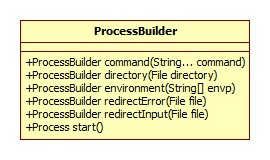
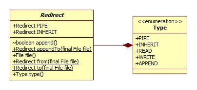
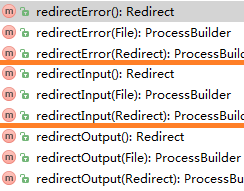
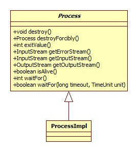
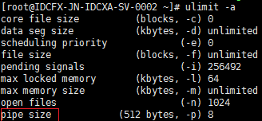

# 命令执行

我们以以下代码为例:

```java
Runtime runtime = Runtime.getRuntime();
String cmd = "ls -l";
Process process = runtime.exec(cmd);
```

实际调用了下面的exec方法:

```java
public Process exec(String command, String[] envp, File dir) {
    StringTokenizer st = new StringTokenizer(command);
    String[] cmdarray = new String[st.countTokens()];
    for (int i = 0; st.hasMoreTokens(); i++)
        cmdarray[i] = st.nextToken();
    return exec(cmdarray, envp, dir);
}
```

第二个参数为环境变量数组，其格式为key=value，第三个参数为命令的执行路径，如果为null，那么便为当前Java进程的工作路径，即user.dir。

StringTokenizer默认以空格、换行符、制表符，换页符(\f)为分隔单位，所以这里将命令`ls -l`分割为了ls和-l两部分。

```java
public Process exec(String[] cmdarray, String[] envp, File dir) {
    return new ProcessBuilder(cmdarray)
        .environment(envp)
        .directory(dir)
        .start();
}
```

其实是用ProcessBuilder实现，此类在JDK1.5时加入。

# ProcessBuilder



## start

start方法简略版源码:

```java
 public Process start() throws IOException {
    String[] cmdarray = command.toArray(new String[command.size()]);
    cmdarray = cmdarray.clone();
    String dir = directory == null ? null : directory.toString();
    return ProcessImpl.start(cmdarray,
                             environment,
                             dir,
                             redirects,
                             redirectErrorStream);
}
```

## Redirect

redirects是一个ProcessBuilder内部的Redirect数组，Redirect为ProcessBuilder的嵌套类，定义了系统的进程的输入或输出:



且redirects数组的大小必定为3，分别代表输入、输出和错误，此数组是lazy-init的，只有当调用其redirects()方法获取整个数组或要设置重定向时才会进行初始化，redirects()源码:

```java
private Redirect[] redirects() {
    if (redirects == null)
        redirects = new Redirect[] {Redirect.PIPE, Redirect.PIPE, Redirect.PIPE};
    return redirects;
}
```

可以看到，默认都是管道类型，这其实很容易理解，每个命令的执行都会导致一个系统进程的创建，我们从进程获得输出，输入必定要通过管道的方式。

## 重定向

其实共有三组方法:



没有参数的表示获取。

### 获取

我们以redirectError为例:

```java
public Redirect redirectError() {
    return (redirects == null) ? Redirect.PIPE : redirects[2];
}
```

### 设置

以redirectInput为例:

```java
public ProcessBuilder redirectInput(File file) {
    //对redirects数组赋值
    return redirectInput(Redirect.from(file));
}
```

from方法其实是对File的包装:

```java
public static Redirect from(final File file) {
    return new Redirect() {
            public Type type() { return Type.READ; }
            public File file() { return file; }
            public String toString() {
                return "redirect to read from file \"" + file + "\"";
            }
        };
}
```

## 输出整合

下面两个方法分别对redirectErrorStream属性进行读取和设置:


如果被设置为true，那么错误输出将会被merge到标准输出。

## 继承 

即Redirect.Type.INHERIT类型。那什么是继承呢?其实就是将启动的进程的输入或输出或错误输出设置为当前Java虚拟机的输入、输出与错误输出。

inheritIO方法源码:

```java
public ProcessBuilder inheritIO() {
    Arrays.fill(redirects(), Redirect.INHERIT);
    return this;
}
```

其实相当于这样:

```java
pb.redirectInput(Redirect.INHERIT).redirectOutput(Redirect.INHERIT).redirectError(Redirect.INHERIT);
```

# Process

代表系统的一个进程。



## start

ProcessImpl在不同的系统上有不同的实现，我们以Linux为准，所做的是将命令、参数以及环境转为byte数组，并初始化文件描述符数组，初始化的逻辑如下:

```java
int[] std_fds;
if (redirects == null) {
    std_fds = new int[] { -1, -1, -1 };
} else {
    std_fds = new int[3];
    if (redirects[0] == Redirect.PIPE)
        std_fds[0] = -1;
    else if (redirects[0] == Redirect.INHERIT)
         //在nio部分提到过，在Unix下0为标准输入，1为标准输出，2为错误输出
        std_fds[0] = 0;
    else {
        f0 = new FileInputStream(redirects[0].file());
        std_fds[0] = fdAccess.get(f0.getFD());
    }
}	
```

最后构造了一个UNIXProcess对象，UNIXProcess构造器源码:

```java
UNIXProcess(final byte[] prog,
            final byte[] argBlock, final int argc,
            final byte[] envBlock, final int envc,
            final byte[] dir,
            final int[] fds,
            final boolean redirectErrorStream) {
    pid = forkAndExec(launchMechanism.value,
                      helperpath,
                      prog,
                      argBlock, argc,
                      envBlock, envc,
                      dir,
                      fds,
                      redirectErrorStream);
    doPrivileged(new PrivilegedExceptionAction<Void>() {
        public Void run() throws IOException {
            initStreams(fds);
            return null;
        }});
}
```

### 运行模式

枚举LaunchMechanism的定义为:

```java
private static enum LaunchMechanism {
    FORK(1),
    VFORK(3);
    private int value;
    LaunchMechanism(int x) {value = x;}
};
```

fork和vfork其实是Linux中两种子进程的启动方式，关于它们的区别可参考:

[fork vfork函数区别](http://blog.csdn.net/buaalei/article/details/5348382)

字段launchMechanism在静态代码块中初始化:

```java
static {
    launchMechanism = AccessController.doPrivileged(
            new PrivilegedAction<LaunchMechanism>() {
        public LaunchMechanism run() {
            String s = System.getProperty(
                "jdk.lang.Process.launchMechanism", "vfork");
            return LaunchMechanism.valueOf(s.toUpperCase());
        }
    });
}
```

在Linux上默认使用vfork，即无需拷贝拷贝父进程的数据，子进程执行时父进程必须等待。

forkAndExec方法为native实现，由vfork系统调用实现。

### 流初始化

共可以获得三种流，方法名如下图:


其中errorStream对应子进程的错误输出流，inputStream对应子进程的标准输出流(未重定向的前提下)，outputStream对应子进程的标准输入流(未重定向的前提下)。

UNIXProcess.initStreams:

```java
void initStreams(int[] fds) throws IOException {
    stdin = (fds[0] == -1) ?
        ProcessBuilder.NullOutputStream.INSTANCE :
        new ProcessPipeOutputStream(fds[0]);
    stdout = (fds[1] == -1) ?
        ProcessBuilder.NullInputStream.INSTANCE :
        new ProcessPipeInputStream(fds[1]);
    stderr = (fds[2] == -1) ?
        ProcessBuilder.NullInputStream.INSTANCE :
        new ProcessPipeInputStream(fds[2]);
    processReaperExecutor.execute(new Runnable() {
        public void run() {
            int exitcode = waitForProcessExit(pid);
            UNIXProcess.this.processExited(exitcode);
        }});
}
```

上面提到的三个方法实际上就是返回这里的三个字段中的一个。注意forkAndExec方法会改变fds的值，在这里-1表示在ProcessBuilder中我们指定了重定向，比如我们将子进程的输出指定到一个文件，那么这里的stdin就是NullOutputStream。ProcessBuilder.NullOutputStream:

```java
static class NullOutputStream extends OutputStream {
    static final NullOutputStream INSTANCE = new NullOutputStream();
    private NullOutputStream() {}
    public void write(int b) throws IOException {
        throw new IOException("Stream closed");
    }
}
```

### 等待结束

即initStreams方法中的:

```java
processReaperExecutor.execute(new Runnable() {
    public void run() {
        int exitcode = waitForProcessExit(pid);
        UNIXProcess.this.processExited(exitcode);
    }
});
```

processReaperExecutor为Java线程池，所以这里使用了单独的线程来进行等待。waitForProcessExit为native实现，通过Linux waitpid及其相关系统调用实现，可参考Linux man或:

[Linux中waitpid()函数的用法](http://blog.csdn.net/roland_sun/article/details/32084825)

UNIXProcess.processExited:

```java
void processExited(int exitcode) {
    synchronized (this) {
        this.exitcode = exitcode;
        hasExited = true;
        //唤醒所有正在等待的线程
        notifyAll();
    }
    if (stdout instanceof ProcessPipeInputStream)
        ((ProcessPipeInputStream) stdout).processExited();
    if (stderr instanceof ProcessPipeInputStream)
        ((ProcessPipeInputStream) stderr).processExited();
    if (stdin instanceof ProcessPipeOutputStream)
        ((ProcessPipeOutputStream) stdin).processExited();
}
```

我们来看一下processExited方法做了什么，以ProcessPipeInputStream为例:

```java
synchronized void processExited() {
    try {
        InputStream in = this.in;
        if (in != null) {
            InputStream stragglers = drainInputStream(in);
            in.close();
            this.in = stragglers;
        }
    } catch (IOException ignored) { }
}
```

drainInputStream方法的作用检测输入流(即子进程的输出)中是否还有数据未被读取，如果有将其读取出来并包装为ByteArrayInputStream返回，否则 返回NullInputStream。

### 为什么会阻塞

回想之前在实际项目中遇到的问题: **如果我们不读取输入流(子进程的输出)的数据，那么waitFor方法将一直不能返回**。

原因就在于在没有重定向的情况下进程和子进程之间使用管道进行通信，而管道的大小也是有一定的限制的，写满之后write调用便会阻塞。

管道的大小可通过命令`ulimit -a`查看，如下图:



512字节。

## waitFor

UNIXProcess.waitFor:

```java
public synchronized int waitFor() {
    while (!hasExited) {
        wait();
    }
    return exitcode;
}
```

wait就是Object的wait方法，结合Process-start-等待结束即可 。

## destroy

destroy()和destroyForcibly()方法其实都是对私有方法destroy(boolean force)的调用，只不过前者参数为false，后者为 true:

```java
private void destroy(boolean force) {
    synchronized (this) {
        if (!hasExited)
            destroyProcess(pid, force);
    }
    try { stdin.close();  } catch (IOException ignored) {}
    try { stdout.close(); } catch (IOException ignored) {}
    try { stderr.close(); } catch (IOException ignored) {}
}
```

正如jdk的注释中所说，这里其实有潜在的竞争条件，即在!hasExited检查通过之后子进程执行完毕，同时有可能Linux会对进程号进行回收，从而导致进程误杀的情况，只不过概率相当小。

destroyProcess为native方法:

```c
JNIEXPORT void JNICALL
Java_java_lang_UNIXProcess_destroyProcess(JNIEnv *env,
                                          jobject junk,
                                          jint pid,
                                          jboolean force) {
    int sig = (force == JNI_TRUE) ? SIGKILL : SIGTERM;
    kill(pid, sig);
}
```

kill即Linux系统调用。

## exitValue

获取返回值:

```java
public synchronized int exitValue() {
    if (!hasExited) {
        throw new IllegalThreadStateException("process hasn't exited");
    }
    return exitcode;
}
```

## isAlive

jdk1.8加入的方法:

```java
@Override
public synchronized boolean isAlive() {
    return !hasExited;
}
```

