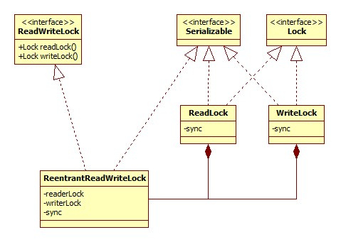
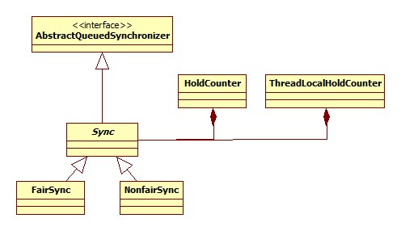

# 类图

## ReadWriteLock



## Sync

ReentrantReadWriteLock内部的Sync的类图如下:



# 构造

默认构造器:

```java
public ReentrantReadWriteLock() {
	this(false);
}
```

含参构造器:

```java
public ReentrantReadWriteLock(boolean fair) {
	sync = fair ? new FairSync() : new NonfairSync();
	readerLock = new ReadLock(this);
	writerLock = new WriteLock(this);
}
```

写锁和读锁的构造器是一个套路，以读锁为例:

```java
protected ReadLock(ReentrantReadWriteLock lock) {
	sync = lock.sync;
}
```

可以看出，**读写锁内部的sync其实就是ReentrantReadWriteLock的sync**。

# 读锁

## lock

ReadLock.lock:

```java
public void lock() {
	sync.acquireShared(1);
}
```

AbstractQueuedSynchronizer.acquireShared:

```java
public final void acquireShared(int arg) {
	if (tryAcquireShared(arg) < 0)
		doAcquireShared(arg);
}
```

tryAcquireShared方法的实现位于Sync:

```java
protected final int tryAcquireShared(int unused) {
	Thread current = Thread.currentThread();
	int c = getState();
	if (exclusiveCount(c) != 0 &&
		getExclusiveOwnerThread() != current)
		return -1;
	int r = sharedCount(c);
	if (!readerShouldBlock() &&
		r < MAX_COUNT &&
		compareAndSetState(c, c + SHARED_UNIT)) {
		if (r == 0) {
			firstReader = current;
			firstReaderHoldCount = 1;
		} else if (firstReader == current) {
			firstReaderHoldCount++;
		} else {
			HoldCounter rh = cachedHoldCounter;
			if (rh == null || rh.tid != getThreadId(current))
				cachedHoldCounter = rh = readHolds.get();
			else if (rh.count == 0)
				readHolds.set(rh);
			rh.count++;
		}
		return 1;
	}
	return fullTryAcquireShared(current);
}
```

以下进行分部分说明。

### 排它锁/写锁检测

如果另一个线程已经持有写锁/排它锁，那么读锁的获得将会马上失败。此部分源码:

```java
Thread current = Thread.currentThread();
int c = getState();
if (exclusiveCount(c) != 0 && getExclusiveOwnerThread() != current)
	return -1;
```

getState值在此处被当做两个short来使用，高16位值代表读锁的持有次数，低16位代表写锁的的持有次数。

```java
static final int SHARED_SHIFT   = 16;
static final int SHARED_UNIT    = (1 << SHARED_SHIFT);
static final int MAX_COUNT      = (1 << SHARED_SHIFT) - 1;
static final int EXCLUSIVE_MASK = (1 << SHARED_SHIFT) - 1;

static int sharedCount(int c)    { return c >>> SHARED_SHIFT; }

static int exclusiveCount(int c) { return c & EXCLUSIVE_MASK; }
```

这就说明，**读锁会被写锁阻塞**。

### 应该阻塞?

对应于readerShouldBlock方法，对于公平锁和非公平锁有两种不同的语义。

#### 非公平锁

NonfairSync.readerShouldBlock:

```java
final boolean readerShouldBlock() {
	return apparentlyFirstQueuedIsExclusive();
}
```

AbstractQueuedSynchronizer.apparentlyFirstQueuedIsExclusive:

```java
final boolean apparentlyFirstQueuedIsExclusive() {
	Node h, s;
	return (h = head) != null && (s = h.next)  != null &&
		!s.isShared() && s.thread != null;
}
```

可以看出，此方法在非公平锁的情况下主要是**检测当前锁队列中第一个元素是不是写锁(排它锁)，如果是，那么当前线程主动放弃竞争锁的机会，这样做是为了防止出现写锁饥饿的现象**。

#### 公平锁

FairSync.readerShouldBlock:

```java
final boolean readerShouldBlock() {
	return hasQueuedPredecessors();
}
```

AbstractQueuedSynchronizer.hasQueuedPredecessors:

```java
public final boolean hasQueuedPredecessors() {
	Node t = tail; // Read fields in reverse initialization order
	Node h = head;
	Node s;
	return h != t &&
		((s = h.next) == null || s.thread != Thread.currentThread());
}
```

这个就很好理解了，锁队列中前面如果还有其它等待锁的线程，那么就应该阻塞。

### 快速尝试

如果满足所有的条件(没有写锁、不应该阻塞，没有达到读锁可重入次数的上限)，那么便会进行一次快速尝试，如果失败，再进行入队(锁队列)的复杂操作。

快速尝试其实就是一个CAS操作，源码见上面，再次不再 赘述。

### 完全尝试

所谓的完全尝试便是在死循环里执行快速尝试，直到成功为止。

### 入队等待

上面提到的快速尝试和完全尝试都是在当前没有其它线程持有写锁的情况下，如果写锁被其它线程持有，那么只能将当前线程加入到锁队列排队。

## unlock

ReadLock.unlock:

```java
public void unlock() {
	sync.releaseShared(1);
}
```

AbstractQueuedSynchronizer.releaseShared:

```java
public final boolean releaseShared(int arg) {
	if (tryReleaseShared(arg)) {
		doReleaseShared();
		return true;
	}
	return false;
}
```

Sync.tryReleaseShared:

```java
protected final boolean tryReleaseShared(int unused) {
	Thread current = Thread.currentThread();
	if (firstReader == current) {
		// assert firstReaderHoldCount > 0;
		if (firstReaderHoldCount == 1)
			firstReader = null;
		else
			firstReaderHoldCount--;
	} else {
		HoldCounter rh = cachedHoldCounter;
		if (rh == null || rh.tid != getThreadId(current))
			rh = readHolds.get();
		int count = rh.count;
		if (count <= 1) {
			readHolds.remove();
			if (count <= 0)
				throw unmatchedUnlockException();
		}
		--rh.count;
	}
	for (;;) {
		int c = getState();
		int nextc = c - SHARED_UNIT;
		if (compareAndSetState(c, nextc))
			return nextc == 0;
	}
}
```

ReadWriteLock采用了ThreadLocal来记录线程重入读锁的次数，这么做的原因是允许多个线程同时拥有读锁。

# 写锁

## lock

源码:

```java
public void lock() {
	sync.acquire(1);
}
```

AbstractQueuedSynchronizer.acquire:

```java
public final void acquire(int arg) {
	if (!tryAcquire(arg) && acquireQueued(addWaiter(Node.EXCLUSIVE), arg))
		selfInterrupt();
}
```

此方法在说明ReentrantLock的时候已经见过了。

Sync.tryAcquire:

```java
protected final boolean tryAcquire(int acquires) {
	Thread current = Thread.currentThread();
	int c = getState();
	int w = exclusiveCount(c);
	if (c != 0) {
		// (Note: if c != 0 and w == 0 then shared count != 0)
		if (w == 0 || current != getExclusiveOwnerThread())
			return false;
		if (w + exclusiveCount(acquires) > MAX_COUNT)
			throw new Error("Maximum lock count exceeded");
		// Reentrant acquire
		setState(c + acquires);
		return true;
	}
	if (writerShouldBlock() ||
		!compareAndSetState(c, c + acquires))
		return false;
	setExclusiveOwnerThread(current);
	return true;
}
```

很明显，申请写锁的套路是这样的: **如果有其它线程持有读锁或写锁，那么失败，否则尝试进行写锁获取**。

writerShouldBlock方法对应读锁里的readerShouldBlock方法，后者可以参见前面读锁-应该阻塞?一节。而对于writerShouldBlock来说同样分为两种情况，即公平锁与非公平锁。公平锁的实现目的与readerShouldBlock相同，即判断等待队列中是否有先到的等待者。

而readerShouldBlock的非公平锁实现的目的在于防止写锁出现饥饿的情况，对于writerShouldBlock来说就不需要作此考量，所以NonfairSync.writerShouldBlock直接返回false。

## unlock

写锁的释放无非是一个减少重入次数、更改锁拥有线程以及通知后继的过程，不再赘述。