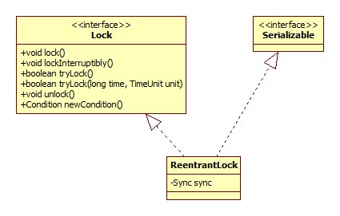
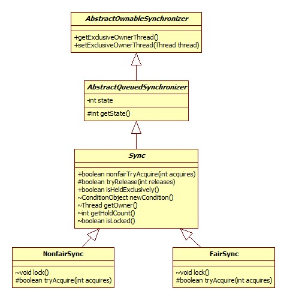
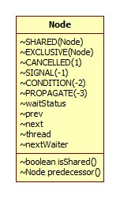
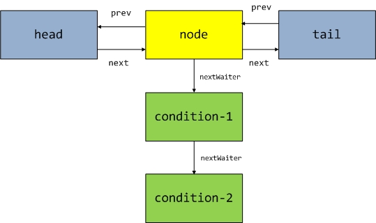

# ReentrantLock

## 类图

如下:



## Sync

观察ReentrantLock关键方法的源码可以发现，其实现是委托给内部类Sync实现的，所以逻辑的关键便在于此类。例子:

```java
public void lock() {
    sync.lock();
}
```

### 类图



很明显，锁的公平性便是由NonFairSync和FairSync实现的，从ReentrantLock的构造器可以印证这一点:

```java
public ReentrantLock(boolean fair) {
    sync = fair ? new FairSync() : new NonfairSync();
}
```

锁的公平性指的是**等待时间最长的线程最有机会获得锁，但是这样会导致性能的下降，因为此时对于线程的调度和操作系统的调度是矛盾的**。参考:

[ReentrantLock(重入锁)以及公平性](http://ifeve.com/reentrantlock-and-fairness/)

## 非公平锁

### lock

NonfairSync.lock:

```java
final void lock() {
    if (compareAndSetState(0, 1))
        setExclusiveOwnerThread(Thread.currentThread());
    else
        acquire(1);
}
```

#### 快速尝试

AbstractQueuedSynchronizer.compareAndSetState:

```java
protected final boolean compareAndSetState(int expect, int update) {
    return unsafe.compareAndSwapInt(this, stateOffset, expect, update);
}
```

AbstractQueuedSynchronizer内部有一个state变量:

```java
/**
 * The synchronization state.
 */
private volatile int state;
```

其记录了**线程重入此锁的次数**，如果为0，那么表示现在没有线程持有此锁，此时使用一个CAS操作即可快速完成锁的申请，这便是*快速尝试*。

setExclusiveOwnerThread方法用以记录是哪个线程当前持有锁。

如果快速尝试失败(即锁已被某个线程持有)，那么将调用AbstractQueuedSynchronizer.acquire()方法:

```java
public final void acquire(int arg) {
    if (!tryAcquire(arg) && acquireQueued(addWaiter(Node.EXCLUSIVE), arg))
        selfInterrupt();
}
```

#### 是否重入

NonfairSync.tryAcquire:

```java
protected final boolean tryAcquire(int acquires) {
    return nonfairTryAcquire(acquires);
}
```

Sync.nonfairTryAcquire:

```java
final boolean nonfairTryAcquire(int acquires) {
    final Thread current = Thread.currentThread();
    //获取重入次数
    int c = getState();
    //再次检查是否没有线程持有当前锁
    if (c == 0) {
        if (compareAndSetState(0, acquires)) {
            setExclusiveOwnerThread(current);
            return true;
        }
    }
    //是否当前线程正在重入
    else if (current == getExclusiveOwnerThread()) {
        int nextc = c + acquires;
        //支持的最大重入次数: Ingteger.MAX_VALUE
        if (nextc < 0) // overflow
            throw new Error("Maximum lock count exceeded");
        setState(nextc);
        return true;
    }
    return false;
}
```

很明显了，这里体现的便是**重入**。

#### 锁队列

如果锁正在被其它线程持有，那么只能进入队列等待锁。

##### 原理

JDK使用的是CLH队列的一种变种。什么是CLH队列?可以参考:

[JAVA并发编程学习笔记之CLH队列锁](http://blog.csdn.net/aesop_wubo/article/details/7533186)

队列的节点在AbstractQueuedSynchronizer的嵌套类Node中定义，其类图:



注: 大写的表示常量。

Node节点形成这样的结构:


nextWaiter用于组成Condition等待队列。众所周知，**Condition只能用在已经获得锁的情况下**，所以Condition等待队列不同于锁队列，Condition队列结构如下图:



##### 源码

###### 入队

入队实际上就是创建一个新的节点并将其设为tail的过程。

AbstractQueuedSynchronizer.addWaiter():

```java
private Node addWaiter(Node mode) {
    Node node = new Node(Thread.currentThread(), mode);
    // Try the fast path of enq; backup to full enq on failure
    Node pred = tail;
    if (pred != null) {
        node.prev = pred;
        if (compareAndSetTail(pred, node)) {
            pred.next = node;
            return node;
        }
    }
    enq(node);
    return node;
}
```

可见，此处同样使用了快速尝试的思想，如果CAS尝试失败，那么再调用enq方法，源码:

```java
private Node enq(final Node node) {
    for (;;) {
        Node t = tail;
        if (t == null) { // Must initialize
            //可见，head其实是一个"空的Node"
            if (compareAndSetHead(new Node()))
                tail = head;
        } else {
            node.prev = t;
            if (compareAndSetTail(t, node)) {
                t.next = node;
                return t;
            }
        }
    }
}
```

其实还是CAS操作，加了一个死循环，直到成功为止。

###### 锁获取/等待

当前线程被加入到锁队列之后，整下的便是排队等候了。锁队列中当前节点可以获得锁的条件便是**上一个节点(prev)释放了锁**。

AbstractQueuedSynchronizer.acquireQueued:

```java
final boolean acquireQueued(final Node node, int arg) {
    boolean failed = true;
    try {
        boolean interrupted = false;
        for (;;) {
            final Node p = node.predecessor();
            //前一个是head，那么表示当前节点即是等待时间最长的线程，并立即尝试获得锁
            if (p == head && tryAcquire(arg)) {
                setHead(node);
                p.next = null; // help GC
                failed = false;
                return interrupted;
            }
            //执行到这里说明当前节点不是等待时间最长的节点或者锁竞争失败
            if (shouldParkAfterFailedAcquire(p, node) &&
                parkAndCheckInterrupt())
                interrupted = true;
        }
    } finally {
        if (failed)
            cancelAcquire(node);
    }
}
```

从这里可以看出，当当前节点就是等待时间最长的节点(队首节点)时，仍然需要调用tryAcquire竞争锁，而与此同时新来的线程有可能同时调用tryAcquire方法与之竞争，这便是非公平性的体现。

shouldParkAfterFailedAcquire方法用于检测当前线程是否应该休眠，源码:

```java
private static boolean shouldParkAfterFailedAcquire(Node pred, Node node) {
    int ws = pred.waitStatus;
    if (ws == Node.SIGNAL)
        /*
         * This node has already set status asking a release
         * to signal it, so it can safely park.
         */
        return true;
    //上一个节点已经被取消，所以需要"跳过"前面所有已经被取消的节点
    if (ws > 0) {
        do {
            node.prev = pred = pred.prev;
        } while (pred.waitStatus > 0);
        pred.next = node;
    } else {
        /*
         * waitStatus must be 0 or PROPAGATE.  Indicate that we
         * need a signal, but don't park yet.  Caller will need to
         * retry to make sure it cannot acquire before parking.
         */
        compareAndSetWaitStatus(pred, ws, Node.SIGNAL);
    }
    return false;
}
```

从这里可以看出，**当前一个节点的status为Signal时，当前节点(线程)便进入挂起状态，等待前一个节点释放锁，前一个节点释放锁时，会唤醒当前节点，那时当前节点会再次进行锁竞争**。

再来看一下是如何挂起线程的，AbstractQueuedSynchronizer.parkAndCheckInterrupt:

```java
private final boolean parkAndCheckInterrupt() {
    LockSupport.park(this);
    return Thread.interrupted();
}
```

LockSupport相当于一个工具类，只有静态方法，私有构造器。

LockSupport.park:

```java
public static void park(Object blocker) {
    Thread t = Thread.currentThread();
    setBlocker(t, blocker);
    //native
    UNSAFE.park(false, 0L);
    setBlocker(t, null);
}
```

此时，线程便会阻塞(休眠)在UNSAFE.park(false, 0L);这一句，直到有以下三种情形发生:

- unpark方法被调用

- interrupt方法被调用

- The call spuriously (that is, for no reason) returns.

  其实说的就是Spurious wakeup: 虚假唤醒。虚假唤醒指的便是阻塞的线程被"莫名其妙"的唤醒，这是多核处理器中不可避免的问题，参见:

  [Spurious wakeup](https://en.wikipedia.org/wiki/Spurious_wakeup)

  其实经常写的:

  ```java
  while (!condition)
    await();
  ```

  便是为了防止此问题。

从acquireQueued方法的源码中可以看出，即使发生了上面所说的三个条件，也只是将变量interrupted设为了true而已，这也就是为什么lock方法会"义无反顾"地在这里等待锁的原因了。

###### 自中断

当获得锁成功后，会将自己中断:

AbstractQueuedSynchronizer.selfInterrupt:

```java
static void selfInterrupt() {
    Thread.currentThread().interrupt();
}
```

### lockInterruptibly

此方法将在以下两种情况下返回:

- 获得锁
- 被中断

AbstractQueuedSynchronizer.acquireInterruptibly:

```java
public final void acquireInterruptibly(int arg) throws InterruptedException {
    if (Thread.interrupted())
        throw new InterruptedException();
    if (!tryAcquire(arg))
        doAcquireInterruptibly(arg);
}
```

tryAcquire方法前面已经说过了，这里不再赘述。

AbstractQueuedSynchronizer.doAcquireInterruptibly:

```java
private void doAcquireInterruptibly(int arg) throws InterruptedException {
    final Node node = addWaiter(Node.EXCLUSIVE);
    boolean failed = true;
    try {
        for (;;) {
            final Node p = node.predecessor();
            if (p == head && tryAcquire(arg)) {
                setHead(node);
                p.next = null; // help GC
                failed = false;
                return;
            }
            if (shouldParkAfterFailedAcquire(p, node) &&
                parkAndCheckInterrupt())
                //看这里!
                throw new InterruptedException();
        }
    } finally {
        if (failed)
            cancelAcquire(node);
    }
}
```

和lock方法相比其实只有一行不一样，这便是lockInterruptibly可以相应中断的原因了。

### tryLock

此方法只是尝试一下现在能不能获得锁，不管结果怎样马上返回。

源码就是Sync.nonfairTryAcquire方法，前面已经说过了。

### tryLock带时间参数

AbstractQueuedSynchronizer.tryAcquireNanos:

```java
public final boolean tryAcquireNanos(int arg, long nanosTimeout) throws InterruptedException {
    if (Thread.interrupted())
        throw new InterruptedException();
    return tryAcquire(arg) || doAcquireNanos(arg, nanosTimeout);
}
```

doAcquireNanos:

```java
private boolean doAcquireNanos(int arg, long nanosTimeout) throws InterruptedException {
    if (nanosTimeout <= 0L)
        return false;
    final long deadline = System.nanoTime() + nanosTimeout;
    final Node node = addWaiter(Node.EXCLUSIVE);
    boolean failed = true;
    try {
        for (;;) {
            final Node p = node.predecessor();
            if (p == head && tryAcquire(arg)) {
                setHead(node);
                p.next = null; // help GC
                failed = false;
                return true;
            }
            nanosTimeout = deadline - System.nanoTime();
            if (nanosTimeout <= 0L)
                return false;
            if (shouldParkAfterFailedAcquire(p, node) && nanosTimeout > spinForTimeoutThreshold)
                //挂起指定的时间
                LockSupport.parkNanos(this, nanosTimeout);
            if (Thread.interrupted())
                throw new InterruptedException();
        }
    } finally {
        if (failed)
            cancelAcquire(node);
    }
}
```

spinForTimeoutThreshold为1000纳秒，可以看出，如果给定的等待时间大于1000纳秒，才会进行线程休眠，否则将会一直轮询。

### unlock

调用了AbstractQueuedSynchronizer.release:

```java
public final boolean release(int arg) {
    if (tryRelease(arg)) {
        Node h = head;
        if (h != null && h.waitStatus != 0)
            unparkSuccessor(h);
        return true;
    }
    return false;
}
```

#### 锁释放

Sync.tryRelease:

```java
protected final boolean tryRelease(int releases) {
    int c = getState() - releases;
    if (Thread.currentThread() != getExclusiveOwnerThread())
        throw new IllegalMonitorStateException();
    boolean free = false;
    if (c == 0) {
        free = true;
        setExclusiveOwnerThread(null);
    }
    setState(c);
    return free;
}
```

由于锁释放的时候必定拥有锁，所以可以放心大胆的搞。如果当前线程已经不再持有此锁，那么返回true。

#### 节点唤醒

如果当前线程已经不再持有此锁(即tryRelease返回true)，那么将会唤醒锁队列中的下一个或多个节点。

unparkSuccessor: 

```java
 private void unparkSuccessor(Node node) {
    int ws = node.waitStatus;
    if (ws < 0)
        compareAndSetWaitStatus(node, ws, 0);

    Node s = node.next;
    if (s == null || s.waitStatus > 0) {
        s = null;
        for (Node t = tail; t != null && t != node; t = t.prev)
            if (t.waitStatus <= 0)
                s = t;
    }
    if (s != null)
        LockSupport.unpark(s.thread);
}
```

可以看出，先是检查下一个节点(next)，如果没有被取消，那么唤醒它即可，如果已经被取消，那么将倒着从后面查找。

## 公平锁

原理和非公平锁大同小异，在这里只说下是如何体现其公平性的。

FairSync.lock:

```java
final void lock() {
    acquire(1);
}
```

最终执行的是FairSync.tryAcquire:

```java
protected final boolean tryAcquire(int acquires) {
    final Thread current = Thread.currentThread();
    int c = getState();
    if (c == 0) {
        //这里
        if (!hasQueuedPredecessors() &&
            compareAndSetState(0, acquires)) {
            setExclusiveOwnerThread(current);
            return true;
        }
    }
    else if (current == getExclusiveOwnerThread()) {
        int nextc = c + acquires;
        if (nextc < 0)
            throw new Error("Maximum lock count exceeded");
        setState(nextc);
        return true;
    }
    return false;
}
```

关键便是!hasQueuedPredecessors这个条件，这就保证了**队列前面的节点一定会先获得锁**。