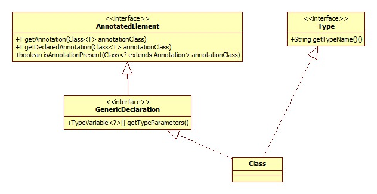

核心便是Class类，类图如下:



# 方法获取

我们以getDeclaredMethods为例:

```java
@CallerSensitive
public Method[] getDeclaredMethods() throws SecurityException {
    return copyMethods(privateGetDeclaredMethods(false));
}
```

privateGetDeclaredMethods:

```java
private Method[] privateGetDeclaredMethods(boolean publicOnly) {
    Method[] res;
    ReflectionData<T> rd = reflectionData();
    if (rd != null) {
        res = publicOnly ? rd.declaredPublicMethods : rd.declaredMethods;
        if (res != null) return res;
    }
    // No cached value available; request value from VM
    res = Reflection.filterMethods(this, getDeclaredMethods0(publicOnly));
    if (rd != null) {
        if (publicOnly) {
            rd.declaredPublicMethods = res;
        } else {
            rd.declaredMethods = res;
        }
    }
    return res;
}
```

publicOnly为false便说明需要获取各种访问级别的方法。

## 缓存

为加快方法获取的性能，这里会对反射的结果进行缓存。缓存以Class内部类ReflectionData对象的形式进行保存:

```java
private static class ReflectionData<T> {
    volatile Field[] declaredFields;
    volatile Field[] publicFields;
    volatile Method[] declaredMethods;
    volatile Method[] publicMethods;
    volatile Constructor<T>[] declaredConstructors;
    volatile Constructor<T>[] publicConstructors;
    // Intermediate results for getFields and getMethods
    volatile Field[] declaredPublicFields;
    volatile Method[] declaredPublicMethods;
    volatile Class<?>[] interfaces;
    // Value of classRedefinedCount when we created this ReflectionData instance
    final int redefinedCount;
    ReflectionData(int redefinedCount) {
        this.redefinedCount = redefinedCount;
    }
}
```

reflectionData方法:

```java
private ReflectionData<T> reflectionData() {
    SoftReference<ReflectionData<T>> reflectionData = this.reflectionData;
    int classRedefinedCount = this.classRedefinedCount;
    ReflectionData<T> rd;
    if (useCaches && reflectionData != null && (rd = reflectionData.get()) != null &&
        rd.redefinedCount == classRedefinedCount) {
        return rd;
    }
    // else no SoftReference or cleared SoftReference or stale ReflectionData
    // -> create and replace new instance
    return newReflectionData(reflectionData, classRedefinedCount);
}
```

与之相关的两个属性定义:

```java
private volatile transient SoftReference<ReflectionData<T>> reflectionData;
// Incremented by the VM on each call to JVM TI RedefineClasses()
// that redefines this class or a superclass.
private volatile transient int classRedefinedCount = 0;
```

从这里可以看出，每次JVM对当前类或其父类重新加载时都会导致classRedefinedCount的增加。Class使用了软引用进行缓存，**只要虚拟机进行Full GC，便会对软引用指向的对象进行回收**，所以软引用的对象的生存周期是当前至下一次Full GC。

变量useCaches决定了是否对反射结果进行缓存，其取值由方法checkInitted决定，相关源码:

```java
String val = System.getProperty("sun.reflect.noCaches");
if (val != null && val.equals("true")) {
    useCaches = false;
}
```

有意思的细节: 这里使用字符串比较判断是否为true，而不是使用Boolean.getBoolean方法，这样是为了**避免Boolean类的初始化**，因为JVM规范定义了对类的静态方法的调用将导致类的初始化。

注意reflectionData方法判断缓存是否有效的条件里的这一个:

```java
rd.redefinedCount == classRedefinedCount
```

这就是说，只有缓存保存的类加载次数与类保存的相一致时缓存才是有效的。

## 过滤

当没有缓存或缓存已失效或被回收时，便需要向JVM请求获得相关信息，这里是通过native方法getDeclaredMethods0实现，类Reflection位于sun.reflect包下，JDK这样解释其功能: 将敏感的或是JVM内部的对象(属性或方法)过滤出去。

## 拷贝

copyMethods实现:

```java
private static Method[] copyMethods(Method[] arg) {
    Method[] out = new Method[arg.length];
    ReflectionFactory fact = getReflectionFactory();
    for (int i = 0; i < arg.length; i++) {
        out[i] = fact.copyMethod(arg[i]);
    }
    return out;
}
```

跳过复杂的调用关系，真正进行拷贝的其实就是Method的copy方法:

```java
Method copy() {
    if (this.root != null)
        throw new IllegalArgumentException("Can not copy a non-root Method");
    Method res = new Method(clazz, name, parameterTypes, returnType,
                            exceptionTypes, modifiers, slot, signature,
                            annotations, parameterAnnotations, annotationDefault);
    res.root = this;
    // Might as well eagerly propagate this if already present
    res.methodAccessor = methodAccessor;
    return res;
}
```

可以看出，每次返回的都是一个全新的Method对象，新对象的root属性指向原对象，一个Method对象及其副本共享一个methodAccessor，methodAccessor对象可以看做是对JVM相应方法的引用。

那这里为什么要进行拷贝呢?