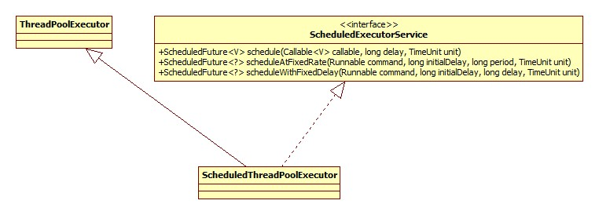
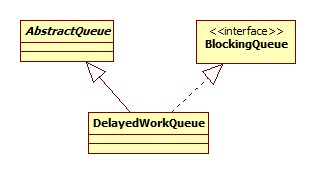
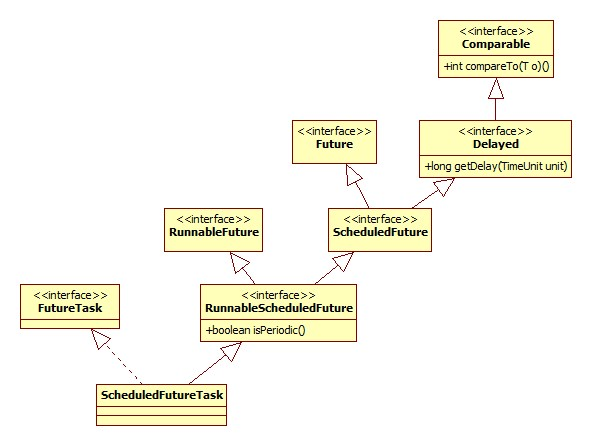

# 创建

我们一般使用下面的方式进行创建:

```java
public static ScheduledExecutorService newSingleThreadScheduledExecutor() {
    return new DelegatedScheduledExecutorService(new ScheduledThreadPoolExecutor(1));
}
```

DelegatedScheduledExecutorService实际上是对ScheduledExecutorService接口方法的转发，目的是只将ScheduledExecutorService接口的public方法暴露出来，这其实就是门面模式。

显然这里的核心便是ScheduledThreadPoolExecutor了:



ScheduledThreadPoolExecutor构造器:

```java
public ScheduledThreadPoolExecutor(int corePoolSize) {
    super(corePoolSize, Integer.MAX_VALUE, 0, NANOSECONDS, new DelayedWorkQueue());
}
```

所以，默认情况下创建的是corePoolSize为1的线程池，而maximumPoolSize却为int最大值!

其工作队列DelayedWorkQueue是ScheduledThreadPoolExecutor的嵌套类:



# 单次调度

```java
public <V> ScheduledFuture<V> schedule(Callable<V> callable, long delay, TimeUnit unit) {
    RunnableScheduledFuture<V> t = decorateTask(callable,
        new ScheduledFutureTask<V>(callable, triggerTime(delay, unit)));
    delayedExecute(t);
    return t;
}
```

## 触发时间计算

```java
private long triggerTime(long delay, TimeUnit unit) {
    return triggerTime(unit.toNanos((delay < 0) ? 0 : delay));
}
long triggerTime(long delay) {
     return now() + ((delay < (Long.MAX_VALUE >> 1)) ? delay : overflowFree(delay));
}
```

now方法即返回当前纳秒表示的时间，所以触发时间就是当前时间加延时。

## 任务包装

Callable任务被包装成了ScheduledFutureTask对象，其是ScheduledThreadPoolExecutor的内部类:



decorateTask是一个模板方法，空实现。

## 调度

核心便是delayedExecute方法:

```java
private void delayedExecute(RunnableScheduledFuture<?> task) {
    if (isShutdown())
        reject(task);
    else {
        super.getQueue().add(task);
        if (isShutdown() &&
            !canRunInCurrentRunState(task.isPeriodic()) &&
            remove(task))
            task.cancel(false);
        else
            ensurePrestart();
    }
}
```

isShutdown方法在父类ThreadPoolExecutor中实现，利用的便是我们已经提到过的状态记录的方法。

### 工作队列

DelayedWorkQueue的类图位于上面创建一节中，其实此队列便是调度实现的核心，此队列实际上用数组实现了一个小顶堆，

