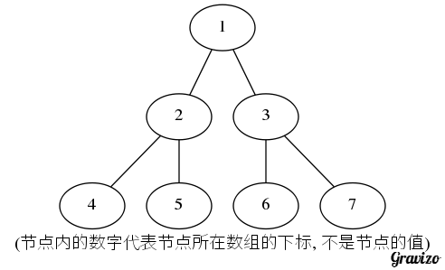

# 创建

我们一般使用下面的方式进行创建:

```java
public static ScheduledExecutorService newSingleThreadScheduledExecutor() {
    return new DelegatedScheduledExecutorService(new ScheduledThreadPoolExecutor(1));
}
```

DelegatedScheduledExecutorService实际上是对ScheduledExecutorService接口方法的转发，目的是只将ScheduledExecutorService接口的public方法暴露出来，这其实就是门面模式。

显然这里的核心便是ScheduledThreadPoolExecutor了:


ScheduledThreadPoolExecutor构造器:

```java
public ScheduledThreadPoolExecutor(int corePoolSize) {
    super(corePoolSize, Integer.MAX_VALUE, 0, NANOSECONDS, new DelayedWorkQueue());
}
```

所以，默认情况下创建的是corePoolSize为1的线程池，而maximumPoolSize却为int最大值!

其工作队列DelayedWorkQueue是ScheduledThreadPoolExecutor的嵌套类:


# 单次调度

```java
public <V> ScheduledFuture<V> schedule(Callable<V> callable, long delay, TimeUnit unit) {
    RunnableScheduledFuture<V> t = decorateTask(callable,
        new ScheduledFutureTask<V>(callable, triggerTime(delay, unit)));
    delayedExecute(t);
    return t;
}
```

## 触发时间计算

```java
private long triggerTime(long delay, TimeUnit unit) {
    return triggerTime(unit.toNanos((delay < 0) ? 0 : delay));
}
long triggerTime(long delay) {
     return now() + ((delay < (Long.MAX_VALUE >> 1)) ? delay : overflowFree(delay));
}
```

now方法即返回当前纳秒表示的时间，所以触发时间就是当前时间加延时。

## 任务包装

Callable任务被包装成了ScheduledFutureTask对象，其是ScheduledThreadPoolExecutor的内部类:


decorateTask是一个模板方法，空实现。

## 调度

核心便是delayedExecute方法:

```java
private void delayedExecute(RunnableScheduledFuture<?> task) {
    if (isShutdown())
        reject(task);
    else {
        super.getQueue().add(task);
        if (isShutdown() &&
            !canRunInCurrentRunState(task.isPeriodic()) &&
            remove(task))
            task.cancel(false);
        else
            ensurePrestart();
    }
}
```

isShutdown方法在父类ThreadPoolExecutor中实现，利用的便是我们已经提到过的状态记录的方法。

### 工作队列

DelayedWorkQueue的类图位于上面创建一节中，其实此队列便是调度实现的核心，此队列实际上用数组实现了一个小顶堆，其add方法实际上通过offer方法实现:

```java
public boolean offer(Runnable x) {
    RunnableScheduledFuture<?> e = (RunnableScheduledFuture<?>)x;
    final ReentrantLock lock = this.lock;
    lock.lock();
    try {
        int i = size;
        //扩容
        if (i >= queue.length)
            grow();
        size = i + 1;
        //队列为empty
        if (i == 0) {
            queue[0] = e;
            setIndex(e, 0);
        } else {
            siftUp(i, e);
        }
        if (queue[0] == e) {
            leader = null;
            available.signal();
        }
    } finally {
        lock.unlock();
    }
    return true;
}
```

queue便是用以实现小顶堆的数组:

```java
private RunnableScheduledFuture<?>[] queue = new RunnableScheduledFuture<?>[INITIAL_CAPACITY];
```

初始大小为16.

堆首先是一棵完全二叉树，按照如下的顺序将其节点存储到数组中:



满足以下的性质:

- 任一节点的父节点的数组下标为i / 2.
- 节点的左子节点的下标为i * 2, 右子节点的下标为i * 2 + 1.
- 添加节点时将节点放在数组的最后一个位置，然后不断的将此节点的值与其父节点比较，如果不满足堆的条件，交换之.
- 堆排序的时间复杂度: O(NlongN).

#### 扩容

```java
private void grow() {
    int oldCapacity = queue.length;
    int newCapacity = oldCapacity + (oldCapacity >> 1); // grow 50%
    if (newCapacity < 0) // overflow
        newCapacity = Integer.MAX_VALUE;
    queue = Arrays.copyOf(queue, newCapacity);
}
```

1.5倍扩容，最大取int最大值。

#### 上移

即使堆再次平衡的过程:

```java
private void siftUp(int k, RunnableScheduledFuture<?> key) {
    while (k > 0) {
        int parent = (k - 1) >>> 1;
        RunnableScheduledFuture<?> e = queue[parent];
        if (key.compareTo(e) >= 0)
            break;
        queue[k] = e;
        setIndex(e, k);
        k = parent;
    }
    queue[k] = key;
    setIndex(key, k);
}
```

很容易理解，就是一个和父节点交换，直到父节点的延时时间小于当前任务。

### 状态检查

将任务提交到队列后会再次对线程池当前的状态进行检查，相关源码:

```java
super.getQueue().add(task);
if (isShutdown() && !canRunInCurrentRunState(task.isPeriodic()) && remove(task)) {
    task.cancel(false);
}
```

isShutdown成立的条件是当前状态不是运行状态，isPeriodic方法用以判断任务是否是持续任务:

```java
public boolean isPeriodic() {
    return period != 0;
}
```

period是ScheduledFutureTask的属性，其不同的取值意义如下:

- 正值: 按固定的时间间隔调度
- 负值: 按固定的时间延迟进行调度
- 零: 单次任务

canRunInCurrentRunState:

```java
boolean canRunInCurrentRunState(boolean periodic) {
    return isRunningOrShutdown(periodic ?
                                continueExistingPeriodicTasksAfterShutdown :
                                executeExistingDelayedTasksAfterShutdown);
}
```

ThreadPoolExecutor.isRunningOrShutdown:

```java
final boolean isRunningOrShutdown(boolean shutdownOK) {
    int rs = runStateOf(ctl.get());
    return rs == RUNNING || (rs == SHUTDOWN && shutdownOK);
}
```

这里判断的是在当前的状态下是否可以执行任务，SHUTDOWN态是由于shutdown方法被调用所致，不是shutdownNow。

continueExistingPeriodicTasksAfterShutdown和executeExistingDelayedTasksAfterShutdown属性ScheduledThreadPoolExecutor为我们留下了setter方法，你懂的。

### 任务移除

如果当前已不能进行任务执行，那么便将刚提交的任务从堆中移除，核心的实现为DelayedWorkQueue的同名方法:

```java
public boolean remove(Object x) {
    final ReentrantLock lock = this.lock;
    lock.lock();
    try {
        int i = indexOf(x);
        if (i < 0)
            return false;
        setIndex(queue[i], -1);
        int s = --size;
        RunnableScheduledFuture<?> replacement = queue[s];
        queue[s] = null;
        if (s != i) {
            siftDown(i, replacement);
            if (queue[i] == replacement)
                //不能进行下移，再试试上移?
                siftUp(i, replacement);
        }
        return true;
    } finally {
        lock.unlock();
    }
}
```

关键在于条件判断`if (s != i)`，即被移除的节点不是最后(数组的最后)一个节点，在这种情况下会导致数组i处出现一个空位，所以在这里进行了先下移再上移的尝试，以使用最末节点或其它节点填补此空位，同时数组大小减一。

### 任务取消

ScheduledFutureTask.cancel:

```java
public boolean cancel(boolean mayInterruptIfRunning) {
    boolean cancelled = super.cancel(mayInterruptIfRunning);
    if (cancelled && removeOnCancel && heapIndex >= 0)
        remove(this);
    return cancelled;
}
```

父类FutureTask的cancel方法已经见过了，removeOnCancel为ScheduledThreadPoolExecutor的属性，默认为false，其实这里调用remove是不必要的，因为已经被调用过了。

# 任务等待


