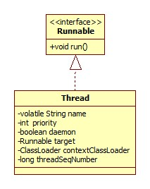

# 构造器

我们以喜闻乐见的为例:

```java
public Thread(Runnable target) {
    init(null, target, "Thread-" + nextThreadNum(), 0);
}
```

第一个参数为线程组，最后一个为栈大小。init方法就是一些内部属性的赋值操作。

# 启动

```java
public synchronized void start() {
    if (threadStatus != 0)
        throw new IllegalThreadStateException();
    boolean started = false;
    start0();
    started = true;
}
```

核心 便在于native方法start0.