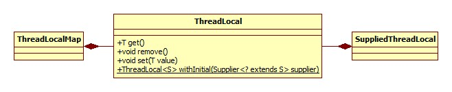

# get

```java
public T get() {
    Thread t = Thread.currentThread();
    ThreadLocalMap map = getMap(t);
    if (map != null) {
        ThreadLocalMap.Entry e = map.getEntry(this);
        if (e != null) {
            @SuppressWarnings("unchecked")
            T result = (T)e.value;
            return result;
        }
    }
    return setInitialValue();
}
```

getMap实现:

```java
ThreadLocalMap getMap(Thread t) {
    return t.threadLocals;
}
```

可以看出，其实ThreadLocalMap作为线程Thread的属性而存在:

```java
ThreadLocal.ThreadLocalMap threadLocals = null;
```

##  Map创建

先来看一下线程的ThreadLocalMap属性不存在的情况，setInitialValue方法:

```java
private T setInitialValue() {
    T value = initialValue();
    Thread t = Thread.currentThread();
    ThreadLocalMap map = getMap(t);
    if (map != null)
        map.set(this, value);
    else
        createMap(t, value);
    return value;
}
```

initialValue方法便是我们第一次访问用以获得初始化值的方法:

```java
protected T initialValue() {
    return null;
}
```

所以，这便解释了我们在使用ThreadLocal时为什么要创建一个ThreadLocal的子类并覆盖此方法。

```java
void createMap(Thread t, T firstValue) {
    t.threadLocals = new ThreadLocalMap(this, firstValue);
}
```

构造参数为初始增加的一个键值对，从这里可以看出，**ThreadLocalMap以ThreadLocal对象为键**。

### ThreadLocalMap

其声明如下:

```java
static class ThreadLocalMap {}
```

那么问题来了，这里为什么要重新实现一个Map，而不用已有的HashMap等类呢?基于以下几点考虑:

- 所有方法均为private。
- 内部类Entry继承自WeakReference，当内存紧张时可以对ThreadLocal变量进行回收，注意这里并没有结合ReferenceQueue使用。

构造器源码:

```java
ThreadLocalMap(ThreadLocal<?> firstKey, Object firstValue) {
    table = new Entry[INITIAL_CAPACITY];
    int i = firstKey.threadLocalHashCode & (INITIAL_CAPACITY - 1);
    table[i] = new Entry(firstKey, firstValue);
    size = 1;
    setThreshold(INITIAL_CAPACITY);
}
```

setThreshold:

```java
private void setThreshold(int len) {
    threshold = len * 2 / 3;
}
```

和HashMap的套路一样，只不过这里负载因子写死了，2 / 3，强调一下，**不是3 / 4 !!!**

# set

```java
public void set(T value) {
    Thread t = Thread.currentThread();
    ThreadLocalMap map = getMap(t);
    if (map != null)
        map.set(this, value);
    else
        createMap(t, value);
}
```

正如注释中所说，我们在使用ThreadLocal时应该去覆盖initialValue方法，而不是set。显然这里的核心便是ThreadLocalMap的set方法:

```java
private void set(ThreadLocal<?> key, Object value) {
    Entry[] tab = table;
    int len = tab.length;
    int i = key.threadLocalHashCode & (len-1);
    for (Entry e = tab[i]; e != null; e = tab[i = nextIndex(i, len)]) {
        ThreadLocal<?> k = e.get();
        //bin里的第一个节点即为所需key，更新value
        if (k == key) {
            e.value = value;
            return;
        }
        if (k == null) {
            replaceStaleEntry(key, value, i);
            return;
        }
    }
    tab[i] = new Entry(key, value);
    int sz = ++size;
    if (!cleanSomeSlots(i, sz) && sz >= threshold)
        rehash();
}
```

# 注意

ThreadLocalMap的底层实现貌似是基于一个叫做"Knuth  Algorithm"的算法，在这里不再细究其实现细节，但有几个地方值得注意。

## 扩容

不同于Map接口的实现，ThreadLocalMap的扩容似乎没有上限限制，resize方法部分源码可以证明:

```java
private void resize() {
    Entry[] oldTab = table;
    int oldLen = oldTab.length;
    int newLen = oldLen * 2;
    Entry[] newTab = new Entry[newLen];
    //...
}
```

## 哈希冲突

不同于喜闻乐见的HashMap用链表 + 红黑树的方式解决哈希冲突，这里用的应该是线性探查法，即如果根据哈希值计算得来的位置不为空，那么将继续尝试下一个位置。

这一点可以从resize方法的下列源码得到证明:

```java
int h = k.threadLocalHashCode & (newLen - 1);
while (newTab[h] != null)
    h = nextIndex(h, newLen);
newTab[h] = e;
```

## 哈希值

ThreadLocalMap使用的哈希值源自ThreadLocal的下列属性:

```java
private final int threadLocalHashCode = nextHashCode();
private static int nextHashCode() {
    return nextHashCode.getAndAdd(HASH_INCREMENT);
}
```

而nextHashCode属性则是AtomicInteger类型，HASH_INCREMENT定义:

```java
private static final int HASH_INCREMENT = 0x61c88647;
```

## 清除

由于ThreadLocalMap的key(即ThreadLocal)为弱引用，所以当其被回收时，势必需要将value置为null以便于进行垃圾回收。那么这个清除的时机又是什么呢?

答案是get, set, remove都有可能。

# Lambda支持

jdk8支持使用以下方式进行初始化:

```java
ThreadLocal<String> local = ThreadLocal.withInitial(() -> "hello");
```

withInitial源码:

```java
public static <S> ThreadLocal<S> withInitial(Supplier<? extends S> supplier) {
    return new SuppliedThreadLocal<>(supplier);
}
```

SuppliedThreadLocal是ThreadLocal的内部类，也是其子类：

```java
static final class SuppliedThreadLocal<T> extends ThreadLocal<T> {
    private final Supplier<? extends T> supplier;
    SuppliedThreadLocal(Supplier<? extends T> supplier) {
        this.supplier = Objects.requireNonNull(supplier);
    }
    @Override
    protected T initialValue() {
        return supplier.get();
    }
}
```

一目了然。