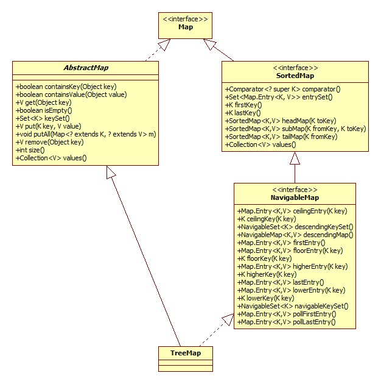

类图:



TreeMap的构造器可以接受一个Comparator参数用以决定key的顺序，如果没有指定，那么尝试将key强转为Comparable，如果转换失败那就抛出异常了。

# put

```java
public V put(K key, V value) {
    Entry<K,V> t = root;
    if (t == null) {
        compare(key, key); // type (and possibly null) check
        root = new Entry<>(key, value, null);
        size = 1;
        modCount++;
        return null;
    }
    int cmp;
    Entry<K,V> parent;
    // split comparator and comparable paths
    Comparator<? super K> cpr = comparator;
    //按Comparator查找
    if (cpr != null) {
        do {
            parent = t;
            cmp = cpr.compare(key, t.key);
            if (cmp < 0)
                t = t.left;
            else if (cmp > 0)
                t = t.right;
            else
                return t.setValue(value);
        } while (t != null);
    }
    else {
        if (key == null)
            throw new NullPointerException();
            //强转为Comparable
            Comparable<? super K> k = (Comparable<? super K>) key;
        do {
            parent = t;
            cmp = k.compareTo(t.key);
            if (cmp < 0)
                t = t.left;
            else if (cmp > 0)
                t = t.right;
            else
                return t.setValue(value);
        } while (t != null);
    }
    Entry<K,V> e = new Entry<>(key, value, parent);
    if (cmp < 0)
        parent.left = e;
    else
        parent.right = e;
    //修复红黑树
    fixAfterInsertion(e);
    size++;
    modCount++;
    return null;
}
```

红黑树首先是一棵二叉查找树，put方法首先便是在树中进行搜索寻找合适的插入位置，然后修复红黑树。

# get

即put的反过程，参考put即可。

# entrySet

默认按照key的升序进行迭代:

```java
public Set<Map.Entry<K,V>> entrySet() {
    EntrySet es = entrySet;
    return (es != null) ? es : (entrySet = new EntrySet());
}
```

我们重点关注EntrySet是如何获得下一个节点的:

```java
static <K,V> TreeMap.Entry<K,V> successor(Entry<K,V> t) {
    if (t == null)
        return null;
    else if (t.right != null) {
        Entry<K,V> p = t.right;
        while (p.left != null)
            p = p.left;
        return p;
    } else {
        Entry<K,V> p = t.parent;
        Entry<K,V> ch = t;
        while (p != null && ch == p.right) {
            ch = p;
            p = p.parent;
        }
        return p;
    }
}
```

很明显。