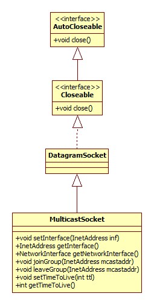
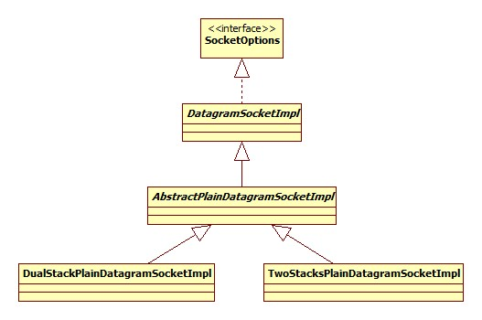
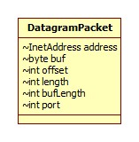

一个简单的Server/Client交互过程参见udp包。从中可以看出其实对于UDP来说，服务器和客户端代码其实是一样的。在此我们将"服务器"简单的理解为数据的接收方。

# 类图

## DatagramSocket



## DatagramSocketImpl




# 数据接收

示例代码:

```java
DatagramSocket server = new DatagramSocket(8080);
byte[] buffer = new byte[1024];
DatagramPacket packet = new DatagramPacket(buffer, 1024);
server.receive(packet);
System.out.println("Server接收到: " + new String(buffer, 0, packet.getLength()));
```

## Socket创建

创建和TCP相似，真正的实现位于DualStackPlainDatagramSocketImpl.datagramSocketCreate，简略版源码:

```java
protected void datagramSocketCreate() {
    int newfd = socketCreate(false /* v6Only */);
    fdAccess.set(fd, newfd);
}
```

socketCreate为native方法，Windows实现位于DualStackPlainDatagramSocketImpl.c的Java_java_net_DualStackPlainDatagramSocketImpl_socketCreate方法，简略版源码:

```java
fd = (int) socket(AF_INET6, SOCK_DGRAM, 0);
rv = setsockopt(fd, IPPROTO_IPV6, IPV6_V6ONLY, (char *) &opt, sizeof(opt));
```

结合TCP的创建过程可以发现，两者的创建都是通过Windows API socket方法完成，区别在于第二个参数，TCP是SOCK_STREAM而UDP是SOCK_DGRAM。

## 端口绑定

和TCP一个套路。

## 数据包

Java使用DatagramPacket作为UDP数据的载体，而**UDP正是根据数据包中保存的源端口和目的端口在网络中进行传输**。源IP和目的IP由IP层提供。其类图如下(仅包含属性):


而包含的方法便是这些属性的getter/setter。

数据包有两个非常重要的用法:

- length属性，它表示**需要发送或实际接收到的数据大小**。这在进行数据接收的时候非常关键。
- 当进行数据接收时，对方客户端的IP和端口会被设置到其address和port属性，这样便可以获得客户端的地址了。

## 接收

DualStackPlainDatagramSocketImpl.receive0:

```java
protected synchronized void receive0(DatagramPacket p) throws IOException {
    int nativefd = checkAndReturnNativeFD();
    socketReceiveOrPeekData(nativefd, p, timeout, connected, false /*receive*/);
}
```

不用想，socketReceiveOrPeekData是native方法，对应Windows/Linux上的recvfrom函数，相比于recv，recvfrom多了两个参数: 远程IP和端口。

为什么方法名叫ReceiveOrPeek呢?猜测和系统的UDP实现有关:

> 收到一个UDP包后，验证没有错误后，放入一个包队列中，队列中的每一个元素就是一个完整的UDP包。当应用程序通过recvfrom()读取时，OS把相应的一个完整UDP包取出，然后拷贝到用户提供的内存中，物理用户提供的内存大小是多少，OS都会完整取出一个UDP包。如果用户提供的内存小于这个UDP包的大小，那么在填充慢内存后，UDP包剩余的部分就会被丢弃，以后再也无法取回。

# 数据发送

由DualStackPlainDatagramSocketImpl的send方法完成对native方法 socketSend的调用，最终由Windows API sendto()完成数据的真正发送。

# 广播消息

即MulticastSocket，与DatagramSocket相比重点在于增加的join/leaveGroup，get/setTimeToLive方法。所谓的加入或是离开组中的组其实是一个特殊的IP地址，参考: [组播地址](http://baike.baidu.com/link?url=8BT8unPjpaEj_Pyx63809zbFHhAL1kiYOSVa6ZrWlqf84YdFUGN0DBBxevDS_eGUDE1Xknp5rIjqAS5ecZ8OsihmR1uQfH_NwABi9NqJXhbyuPb3Ji5TMeO92LMiZEmv)

而TTL即设置数据包可以跨过多少个网络:

> 当ttl的值为0时，指定数据报应停留在本地主机；当ttl的值为1时，指定数据报发送到本地局域网；当ttl的值为32时，意味着只能发送到本站点的网络上；当ttl的值为64时，意味着数据报应保留在本地区；当ttl的值为128时，意味着数据报应保留在本大洲；当ttl的值为255时，意味着数据报可发送到所有地方；在默认情况下，该ttl的值为1.

从源码可以看出，加入/离开组其实是对Windows  setsockopt方法IP_ADD_MEMBERSHIP和IP_DROP_MEMBERSHIP两个选项的设置。