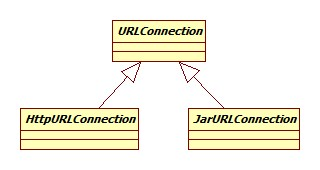
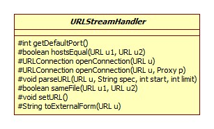
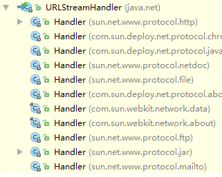
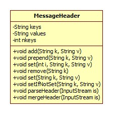
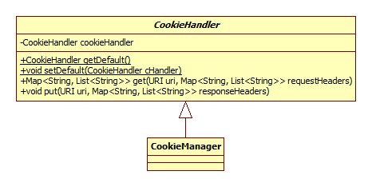
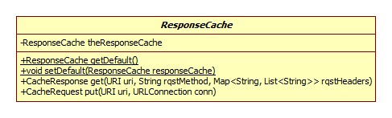
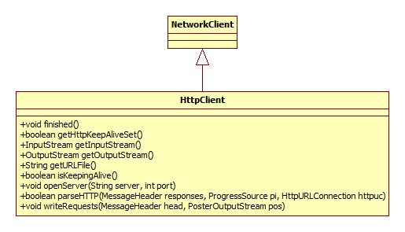
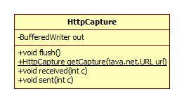
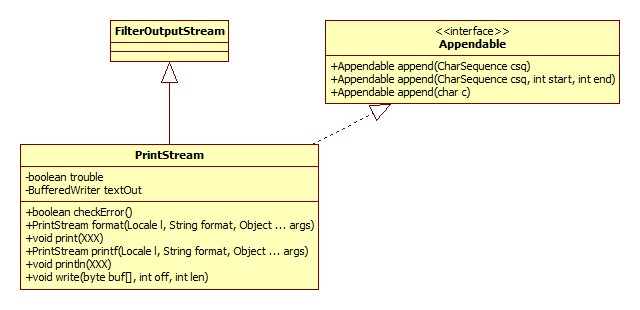

类图:



我们以urlconnection包的简单对百度首页的读取来开启我们的源码阅读旅程。

# 连接建立

相关源码:

```java
//http://www.baidu.com
URL realUrl = new URL(urlName);
URLConnection conn = realUrl.openConnection();
conn.setRequestProperty("accept", "*/*");
conn.setRequestProperty("connection", "Keep-Alive");
conn.setRequestProperty("user-agent", "Mozilla/4.0 (compatible; MSIE 6.0; Windows NT 5.1; SV1)");
// 建立实际的连接
conn.connect();
```

## URL构建

URL负责协议的解析以及相应的协议处理器的创建，协议解析的过程其实就是一个字符串的处理过程。协议处理器即URLStreamHandler，类图:



其子类如下图所示:



每种协议的处理器便在sun.net.www.protocol.xxx中，URL获取处理器就是一个手动拼接类名，用反射生成实例的过程。

## 创建连接对象

URL.openConnection:

```java
public URLConnection openConnection() {
    return handler.openConnection(this);
}
```

注意此处并未执行真正的连接操作，从上一节可以看出，这里的Handler应该是sun.net.www.protocol.http.Handler:

```java
protected java.net.URLConnection openConnection(URL u, Proxy p) {
    //p为空
    return new HttpURLConnection(u, p, this);
}
```

这里的HttpURLConnection同样位于sun.net.www.protocol.http包下，构造器源码:

```java
protected HttpURLConnection(URL u, Proxy p, Handler handler) {
    super(u);
    requests = new MessageHeader();
    responses = new MessageHeader();
    userHeaders = new MessageHeader();
    this.handler = handler;
    instProxy = p;
    if (instProxy instanceof sun.net.ApplicationProxy) {
        /* Application set Proxies should not have access to cookies
         * in a secure environment unless explicitly allowed. */
        try {
            cookieHandler = CookieHandler.getDefault();
        } catch (SecurityException se) { /* swallow exception */ }
    } else {
        cookieHandler = java.security.AccessController.doPrivileged(
            new java.security.PrivilegedAction<CookieHandler>() {
            public CookieHandler run() {
                return CookieHandler.getDefault();
            }
        });
    }
    cacheHandler = java.security.AccessController.doPrivileged(
        new java.security.PrivilegedAction<ResponseCache>() {
            public ResponseCache run() {
            return ResponseCache.getDefault();
        }
    });
}
```

### 消息头

可以看出，这里使用MessageHeader作为请求响应头的保存，解析载体，其类图:



### Cookie处理器

CookieHandler实现了Cookie语义，类图:



不过因为默认并没有默认的CookieHandler可用，所以构造器里的cookieHandler为null。

### 缓存

ResponseCache实现了缓存的语义，类图:



cacheHandler属性同样为空。

## 请求头设置

URLConnection.setRequestProperty:

```java
public void setRequestProperty(String key, String value) {
    if (connected)
        throw new IllegalStateException("Already connected");
    if (key == null)
        throw new NullPointerException ("key is null");
    if (requests == null)
        requests = new MessageHeader();
    requests.set(key, value);
}
```

很明显是委托给MessageHeader实现的，从其类图可以看出，MessageHeader内部其实由key和value数组组成，这里的添加便是有则更新，没有则添加的过程。

## 连接

连接的过程为创建一个HttpClient对象，在其构造器中完成连接，类图:



HttpClient由HttpURLConnection的getNewHttpClient完成构造:

```java
protected HttpClient getNewHttpClient(URL url, Proxy p, int connectTimeout)  {
    return HttpClient.New(url, p, connectTimeout, this);
}
```

如果没有设置代理，那么p自然是空的，connectTimeout默认为-1，即永不超时。HttpClient构造器源码:

```java
protected HttpClient(URL url, Proxy p, int to) {
    proxy = (p == null) ? Proxy.NO_PROXY : p;
    this.host = url.getHost();
    this.url = url;
    port = url.getPort();
    if (port == -1) {
        //默认就是80
        port = getDefaultPort();
    }
    setConnectTimeout(to);
    capture = HttpCapture.getCapture(url);
    openServer();
}
```

openServer方法实现:

```java
@Override
public void openServer(String server, int port) throws IOException {
    serverSocket = doConnect(server, port);
    try {
        OutputStream out = serverSocket.getOutputStream();
        if (capture != null) {
            out = new HttpCaptureOutputStream(out, capture);
        }
        serverOutput = new PrintStream(new BufferedOutputStream(out),false, encoding);
    } catch (UnsupportedEncodingException e) {
        throw new InternalError(encoding+" encoding not found", e);
    }
    serverSocket.setTcpNoDelay(true);
}
```

doConnect方法所做的便是建立Socket连接，如果设置启用网络抓包，那么将SocketOutputStream包装为HttpCaptureOutputStream，什么是Java的抓包呢?

其实就是将URLConnectiont通信的请求和相应原封不动的保存到文件中。抓包通过VM参数`-Dsun.net.http.captureRules=data/capture.rules`启用，参数指向的是一个规则文件，每条规则占据一行，规则示例 :

```tex
www\.baidu\.com , baidu%d.log
```

表示对域名baidu.com进行抓包，抓到的包保存在工程下的格式为baidu%d.log的文件中。

Java中用类HttpCapture解析，存储抓包规则，类图:



HttpClient构造器中的:

```java
capture = HttpCapture.getCapture(url);
```

便用于检测是否适用于当前域名的规则:

```java
  public static HttpCapture getCapture(java.net.URL url) {
    //读取sun.net.http.captureRules指向的文件并解析
    if (!isInitialized()) {
        init();
    }
    if (patterns == null || patterns.isEmpty()) {
        return null;
    }
    String s = url.toString();
    for (int i = 0; i < patterns.size(); i++) {
        Pattern p = patterns.get(i);
        if (p.matcher(s).find()) {
            String f = capFiles.get(i);
            File fi;
            if (f.indexOf("%d") >= 0) {
                java.util.Random rand = new java.util.Random();
                do {
                    //用随机数替代%d
                    String f2 = f.replace("%d", Integer.toString(rand.nextInt()));
                    fi = new File(f2);
                } while (fi.exists());
            } else {
                fi = new File(f);
            }
            return new HttpCapture(fi, url);
        }
    }
    return null;
}
```

HttpCaptureOutputStream继承自io包的FilterOutputStream，作用很简单，就是**将发送的每一个字节转发给HttpCapture，由后者完成到文件的写入**。

### PrintStream

输出流最终被包装成了PrintStream，此类在io包并未进行说明。类图:



此类的特点可总结如下:

- 如果写入出错，并不会抛出异常，而是将内部的trouble属性设为true，我们可以通过checkError方法进行检测是否出错。

- 从类图中可以看出，虽然这是一个输出流，但却是用Writer实现的!此类对要写入的数据进行了平台相关的编码工作，最终写出的其实是字符!之所以这么实现需要结合JDK的历史(jdk1.0加入)进行考量，那时候还没有Writer接口(jdk1.1加入，正是为了修正这个逻辑问题)，这也是为什么System.out是个PrintStream。

  关于其写的是字符这一点可从源码中得到证明:

  ```java
  public void print(int i) {
    write(String.valueOf(i));
  }
  ```

- 自动刷新特性: 

  - 当println方法被调用。
  - autoFlush设为true时，如果检测到字符串中含有'\n'，刷新。
  - autoFlush设为true时，write(String str)方法也会导致刷新。

PrintWriter和PrintStream的实现方式以及API几乎完全一致，除了不会自动检测换行符并刷新。关于两者的黑历史参考:

[PrintStream vs PrintWriter](http://stackoverflow.com/questions/11372546/printstream-vs-printwriter)

# 请求发送

当与远程URL的连接建立后并不会马上发送请求，而是**等到需要获取响应时**。我们以获取全部响应头为例，sun.net.www.protocol.http.HttpURLConnection.getHeaderFields:

```java
@Override
public Map<String, List<String>> getHeaderFields() {
    try {
        getInputStream();
    } catch (IOException e) {}
    return getFilteredHeaderFields();
}
```

getInputStream方法调用了写请求writeRequests方法。最终实现位于HttpClient.writeRequests:

```java
public void writeRequests(MessageHeader head,PosterOutputStream pos) {
    requests = head;
    requests.print(serverOutput);
    serverOutput.flush();
}
```

MessageHeader.print:

```java
public synchronized void print(PrintStream p) {
    for (int i = 0; i < nkeys; i++)
        if (keys[i] != null) {
            p.print(keys[i] +
                (values[i] != null ? ": "+values[i]: "") + "\r\n");
        }
    p.print("\r\n");
    p.flush();
}
```

一目了然。

# 响应解析

其实就是获得输入流逐行解析的过程，不再向下展开。

# DNS解析

触发DNS解析的时机是HttpClient的New方法，默认的实现是Inet4AddressImpl的lookupAllHostAddr方法:

```java
public native InetAddress[]
        lookupAllHostAddr(String hostname) throws UnknownHostException;
```

native实现其实调用的是Linux的**getaddrinfo系统**调用，当然JDK在java层面也有对解析结果的缓存。

如何查看Linux的DNS服务器地址呢?

- 配置文件

  ```shell
  cat /etc/resolv.conf
  ```

  结果如下:

  ```html
  nameserver 10.0.0.2
  ```

- nslookup:

  ```shell
  nslookup baidu.com
  ```

  结果:

  ```html
  Server:		10.0.0.2
  Address:	10.0.0.2#53
  
  Non-authoritative answer:
  Name:	baidu.com
  Address: 220.181.57.216
  Name:	baidu.com
  Address: 123.125.115.110
  ```

  所以DNS便是10.0.0.2